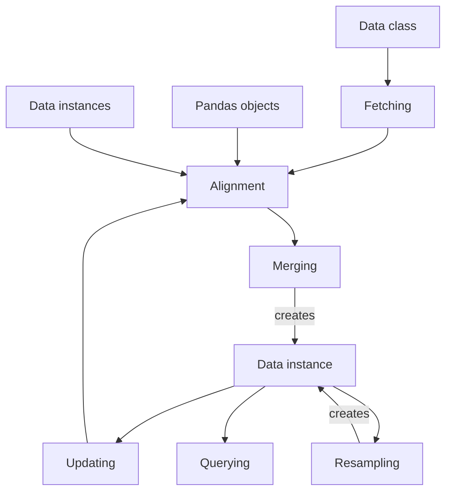

# Data

vectorbt works on Pandas and NumPy arrays, but where those arrays are coming from? Getting the 
financial data manually is a challenging task, especially when an exchange can return only one bunch 
of data at a time such that iteration over time ranges, concatenation of results, and alignment
of index and columns are effectively outsourced to the user. The task gets only trickier when multiple 
symbols are involved. 

To simplify and automate data retrieval and management, vectorbt implements the 
[Data](/api/data/base/#vectorbtpro.data.base.Data) class, which allows seamless handling of one or 
more symbols of data. It's a semi-abstract class, meaning you have to subclass it and define your
own logic at various places to be able to use its rich functionality to the full extent.

The steps discussed below can be visualized using the following graph:



(Reload the page if the diagram doesn't show up)

## Fetching

Class [Data](/api/data/base/#vectorbtpro.data.base.Data) implements an abstract class method 
[Data.fetch_symbol](/api/data/base/#vectorbtpro.data.base.Data.fetch_symbol) for generating, loading, or 
fetching one symbol of data from any data source. It has to be overridden and implemented by the 
user, and return a single Pandas or NumPy array given some set of parameters (for example, the starting 
date, the ending date, and the frequency).

Let's write a function that returns any symbol of data from Yahoo Finance using 
[yfinance](https://github.com/ranaroussi/yfinance):

```pycon
>>> import vectorbtpro as vbt
>>> from vectorbtpro.utils.datetime_ import to_tzaware_datetime, get_local_tz

>>> def get_yf_symbol(symbol, period='max', start=None, end=None, **kwargs):
...     import yfinance as yf
...     if start is not None:
...         start = to_tzaware_datetime(start, tz=get_local_tz())  # (1)!
...     if end is not None:
...         end = to_tzaware_datetime(end, tz=get_local_tz())
...     return yf.Ticker(symbol).history(
...         period=period, 
...         start=start, 
...         end=end, 
...         **kwargs)

>>> get_yf_symbol('BTC-USD', start='2020-01-01', end='2020-01-05')
                   Open         High          Low        Close       Volume  \\
Date                                                                          
2019-12-31  7294.438965  7335.290039  7169.777832  7193.599121  21167946112   
2020-01-01  7194.892090  7254.330566  7174.944336  7200.174316  18565664997   
2020-01-02  7202.551270  7212.155273  6935.270020  6985.470215  20802083465   
2020-01-03  6984.428711  7413.715332  6914.996094  7344.884277  28111481032   
2020-01-04  7345.375488  7427.385742  7309.514160  7410.656738  18444271275   

            Dividends  Stock Splits  
Date                                 
2019-12-31          0             0  
2020-01-01          0             0  
2020-01-02          0             0  
2020-01-03          0             0  
2020-01-04          0             0  
```

1. Convert to datetime using [to_tzaware_datetime](/api/utils/datetime_/#vectorbtpro.utils.datetime_.to_tzaware_datetime)

Managing data in a Pandas format is acceptable when we are dealing with one symbol, but what about 
multiple symbols? Remember how vectorbt wants us to provide each of the open price, high price, and other 
features as separate variables? Each of those variables must have symbols laid out as columns, 
which means that we would have to manually fetch all symbols and properly reorganize their data layout. 
Having some symbols with different index or columns would just add to our headache. 

Luckily, there is a class method [Data.fetch](/api/data/base/#vectorbtpro.data.base.Data.fetch) that solves 
most of the issues related to iterating over, fetching, and merging symbols. It takes from one to multiple 
symbols, fetches each one with [Data.fetch_symbol](/api/data/base/#vectorbtpro.data.base.Data.fetch_symbol), 
puts it into a dictionary, and passes this dictionary to [Data.from_data](/api/data/base/#vectorbtpro.data.base.Data.from_data) 
for post-processing and class instantiation.

Building upon our example, let's subclass [Data](/api/data/base/#vectorbtpro.data.base.Data)
and override the [Data.fetch_symbol](/api/data/base/#vectorbtpro.data.base.Data.fetch_symbol) method 
to call our `get_yf_symbol` function:

```pycon
>>> class YFData(vbt.Data):
...     @classmethod
...     def fetch_symbol(cls, symbol, **kwargs):
...         return get_yf_symbol(symbol, **kwargs)
```

!!! hint
    You can replace `get_yf_symbol` with any other function that returns any array-like data!

That's it, `YFData` is now a full-blown data class capable of pulling data from Yahoo Finance and 
storing it:

```pycon
>>> yf_data = YFData.fetch(
...     ['BTC-USD', 'ETH-USD'], 
...     start='2020-01-01', 
...     end='2020-01-05')
```

[=100% "Symbol 2/2"]{: .candystripe}

The pulled data is stored inside the [Data.data](/api/data/base/#vectorbtpro.data.base.Data.data)
dictionary with symbols being keys and values being Pandas objects returned by 
[Data.fetch_symbol](/api/data/base/#vectorbtpro.data.base.Data.fetch_symbol):

```pycon
>>> yf_data.data['ETH-USD']
                                 Open        High         Low       Close  \\
Date                                                                        
2019-12-31 00:00:00+00:00  132.612274  133.732681  128.798157  129.610855   
2020-01-01 00:00:00+00:00  129.630661  132.835358  129.198288  130.802002   
2020-01-02 00:00:00+00:00  130.820038  130.820038  126.954910  127.410179   
2020-01-03 00:00:00+00:00  127.411263  134.554016  126.490021  134.171707   
2020-01-04 00:00:00+00:00  134.168518  136.052719  133.040558  135.069366   

                                Volume  Dividends  Stock Splits  
Date                                                             
2019-12-31 00:00:00+00:00   8936866397          0             0  
2020-01-01 00:00:00+00:00   7935230330          0             0  
2020-01-02 00:00:00+00:00   8032709256          0             0  
2020-01-03 00:00:00+00:00  10476845358          0             0  
2020-01-04 00:00:00+00:00   7430904515          0             0 
```

### Exception handling

If [Data.fetch_symbol](/api/data/base/#vectorbtpro.data.base.Data.fetch_symbol) returned `None` or
an empty Pandas object or NumPy array, the symbol will be skipped entirely.
[Data.fetch](/api/data/base/#vectorbtpro.data.base.Data.fetch) will also catch any exception raised in 
[Data.fetch_symbol](/api/data/base/#vectorbtpro.data.base.Data.fetch_symbol) and skip the symbol if 
the argument `skip_on_error` is True (it's False by default!), otherwise, it will abort the procedure.

Generally, it's the task of [Data.fetch_symbol](/api/data/base/#vectorbtpro.data.base.Data.fetch_symbol) 
to handle issues. Whenever there is a lot of data points to fetch and the fetcher relies upon a loop to 
concatenate different data bunches together, the best approach is to show the user a warning whenever an 
exception is thrown and return the data fetched up to the most recent point in time, similarly to how 
this was implemented in [BinanceData](/api/data/custom/#vectorbtpro.data.custom.BinanceData) 
and [CCXTData](/api/data/custom/#vectorbtpro.data.custom.CCXTData). In such a case, vectorbt will replace 
the missing data points with NaN or drop them altogether, and keep track of the last index. You can then wait 
until your connection is stable and re-fetch the missing data using 
[Data.update](/api/data/base/#vectorbtpro.data.base.Data.update).

### Custom context

Along with the data, [Data.fetch_symbol](/api/data/base/#vectorbtpro.data.base.Data.fetch_symbol) can also
return a dictionary with custom keyword arguments acting as a context of the fetching operation.
This context can later be accessed in the symbol dictionary 
[Data.returned_kwargs](/api/data/base/#vectorbtpro.data.base.Data.returned_kwargs).
For instance, this context may include any information on why the fetching process failed, the 
length of the remaining data left to fetch, or which rows the fetched data represents when reading a local
file (as implemented by [CSVData](/api/data/custom/#vectorbtpro.data.custom.CSVData) for data updates).

Just for the sake of example, let's save the current timestamp:

```pycon
>>> import pandas as pd

>>> class YFData(vbt.Data):
...     @classmethod
...     def fetch_symbol(cls, symbol, **kwargs):
...         returned_kwargs = dict(timestamp=pd.Timestamp.now())
...         return get_yf_symbol(symbol, **kwargs), returned_kwargs

>>> yf_data = YFData.fetch('BTC-USD', start='2020-01-01', end='2020-01-05')
>>> yf_data.returned_kwargs
{'BTC-USD': {'timestamp': Timestamp('2022-02-15 23:45:16.867650')}}
```

## Alignment

Like most classes that hold data, the class [Data](/api/data/base/#vectorbtpro.data.base.Data) 
subclasses [Analyzable](../building-blocks/#analyzing), so we can perform Pandas indexing 
on the class instance itself to select rows and columns in all Pandas objects stored inside that instance.
Doing a single Pandas indexing operation on multiple Pandas objects with different labels is impossible, so 
what happens if we fetched symbol data from different date ranges or with different columns? Whenever 
[Data.fetch](/api/data/base/#vectorbtpro.data.base.Data.fetch) passes the (unaligned) data dictionary 
to [Data.from_data](/api/data/base/#vectorbtpro.data.base.Data.from_data), it does several things:

1. Converts any array-like data into a Pandas object
2. Removes rows with duplicate indices apart from the latest one
3. Calls [Data.prepare_tzaware_index](/api/data/base/#vectorbtpro.data.base.Data.prepare_tzaware_index)
to convert each object's index into a timezone-aware index using 
[DataFrame.tz_localize](https://pandas.pydata.org/docs/reference/api/pandas.DataFrame.tz_localize.html) 
and [DataFrame.tz_convert](https://pandas.pydata.org/docs/reference/api/pandas.DataFrame.tz_convert.html)
4. Calls [Data.align_index](/api/data/base/#vectorbtpro.data.base.Data.align_index) to align the index labels
of all objects based on some rule. By default, it builds the union of all indexes, sorts the resulting index, 
and sets the missing data points in any object to NaN.
5. Calls [Data.align_columns](/api/data/base/#vectorbtpro.data.base.Data.align_columns) to align the column 
labels of all objects based on some rule - a similar procedure to aligning indexes.
6. Having the same index and columns across all objects, it builds a [wrapper](../building-blocks/#wrapping)
7. Finally, it passes all information to the class constructor for instantiation

Let's illustrate this workflow in practice:

```pycon
>>> yf_data = YFData.fetch(
...     ['BTC-USD', 'ETH-USD'], 
...     start=vbt.symbol_dict({  # (1)!
...         'BTC-USD': '2020-01-01', 
...         'ETH-USD': '2020-01-03'
...     }),
...     end=vbt.symbol_dict({
...         'BTC-USD': '2020-01-03', 
...         'ETH-USD': '2020-01-05'
...     }))
UserWarning: Symbols have mismatching index. Setting missing data points to NaN.
```

1. Use [symbol_dict](/api/data/base/#vectorbtpro.data.base.symbol_dict) to specify any argument per symbol

[=100% "Symbol 2/2"]{: .candystripe}

```pycon
>>> yf_data.data['BTC-USD']
                                  Open         High          Low        Close  \\
Date                                                                            
2019-12-31 00:00:00+00:00  7294.438965  7335.290039  7169.777832  7193.599121   
2020-01-01 00:00:00+00:00  7194.892090  7254.330566  7174.944336  7200.174316   
2020-01-02 00:00:00+00:00  7202.551270  7212.155273  6935.270020  6985.470215   
2020-01-03 00:00:00+00:00          NaN          NaN          NaN          NaN   
2020-01-04 00:00:00+00:00          NaN          NaN          NaN          NaN   

                                 Volume  Dividends  Stock Splits  
Date                                                              
2019-12-31 00:00:00+00:00  2.116795e+10        0.0           0.0  
2020-01-01 00:00:00+00:00  1.856566e+10        0.0           0.0  
2020-01-02 00:00:00+00:00  2.080208e+10        0.0           0.0  
2020-01-03 00:00:00+00:00           NaN        NaN           NaN  
2020-01-04 00:00:00+00:00           NaN        NaN           NaN  

>>> yf_data.data['ETH-USD']
                                 Open        High         Low       Close  \\
Date                                                                        
2019-12-31 00:00:00+00:00         NaN         NaN         NaN         NaN   
2020-01-01 00:00:00+00:00         NaN         NaN         NaN         NaN   
2020-01-02 00:00:00+00:00  130.820038  130.820038  126.954910  127.410179   
2020-01-03 00:00:00+00:00  127.411263  134.554016  126.490021  134.171707   
2020-01-04 00:00:00+00:00  134.168518  136.052719  133.040558  135.069366   

                                 Volume  Dividends  Stock Splits  
Date                                                              
2019-12-31 00:00:00+00:00           NaN        NaN           NaN  
2020-01-01 00:00:00+00:00           NaN        NaN           NaN  
2020-01-02 00:00:00+00:00  8.032709e+09        0.0           0.0  
2020-01-03 00:00:00+00:00  1.047685e+10        0.0           0.0  
2020-01-04 00:00:00+00:00  7.430905e+09        0.0           0.0 
```

Notice how we ended up with the same index and columns across all Pandas objects. We can now
use this data in any vectorbt function without fearing any indexing errors.

!!! hint
    To change the alignment behavior, use the `tz_localize`, `tz_convert`, `missing_index`,
    and `missing_columns` arguments supported by [Data.from_data](/api/data/base/#vectorbtpro.data.base.Data.from_data),
    but also fetching and updating methods.

## Updating

Updating is a regular fetching operation that can be used both to update the existing data points and 
to add new ones. It requires specifying the first timestamp or row index of the update, and assumes that 
the data points prior to this timestamp or row index remain unchanged.

Similarly to [Data.fetch_symbol](/api/data/base/#vectorbtpro.data.base.Data.fetch_symbol), updating
must be manually implemented by overriding a method 
[Data.update_symbol](/api/data/base/#vectorbtpro.data.base.Data.update_symbol). In contrast to the 
fetcher, the updater is an **instance** method and can access the data fetched earlier. 
For instance, it can access the keyword arguments initially passed to the fetcher, 
accessible in the symbol dictionary [Data.fetch_kwargs](/api/data/base/#vectorbtpro.data.base.Data.fetch_kwargs).
Those arguments can be used as default arguments or be overridden by any argument passed directly
to the updater. Every data instance has also a symbol dictionary 
[Data.last_index](/api/data/base/#vectorbtpro.data.base.Data.last_index), which holds the last 
fetched index per symbol. We can use this index as the starting point of the update.

Let's build a new `YFData` class that can also perform updates to the stored data:

```pycon
>>> class YFData(vbt.Data):
...     @classmethod
...     def fetch_symbol(cls, symbol, **kwargs):
...         return get_yf_symbol(symbol, **kwargs)
...
...     def update_symbol(self, symbol, **kwargs):
...         defaults = self.select_symbol_kwargs(symbol, self.fetch_kwargs)  # (1)!
...         defaults['start'] = self.last_index[symbol]  # (2)!
...         kwargs = vbt.merge_dicts(defaults, kwargs)  # (3)!
...         return self.fetch_symbol(symbol, **kwargs)  # (4)!
```

1. Get keyword arguments initially passed to [Data.fetch_symbol](/api/data/base/#vectorbtpro.data.base.Data.fetch_symbol)
for this particular symbol
2. Override the default value for the starting date. Note that changing the keys won't affect 
[Data.fetch_kwargs](/api/data/base/#vectorbtpro.data.base.Data.fetch_kwargs), 
but be careful with mutable values!
3. Override the default arguments with new arguments in `kwargs` using [merge_dicts](/api/utils/config/#vectorbtpro.utils.config.merge_dicts)
4. Pass the final arguments to [Data.fetch_symbol](/api/data/base/#vectorbtpro.data.base.Data.fetch_symbol)

Once the [Data.update_symbol](/api/data/base/#vectorbtpro.data.base.Data.update_symbol) method is implemented,
we can call the method [Data.update](/api/data/base/#vectorbtpro.data.base.Data.update) to iterate over
each symbol and update its data. Under the hood, this method also aligns the index and column labels
of all the returned Pandas objects, appends the new data to the old data through concatenation along rows, 
and updates the last index of each symbol for the use in the next data update. Finally, it produces a new 
instance of [Data](/api/data/base/#vectorbtpro.data.base.Data) by using 
[Configured.replace](/api/utils/config/#vectorbtpro.utils.config.Configured.replace).

!!! important
    Updating data never overwrites the existing data instance but always returns a new instance.
    Remember that most classes in vectorbt are read-only to enable caching and avoid side effects.

First, we'll fetch the same data as previously:

```pycon
>>> yf_data = YFData.fetch(
...     ['BTC-USD', 'ETH-USD'], 
...     start=vbt.symbol_dict({
...         'BTC-USD': '2020-01-01', 
...         'ETH-USD': '2020-01-03'
...     }),
...     end=vbt.symbol_dict({
...         'BTC-USD': '2020-01-03', 
...         'ETH-USD': '2020-01-05'
...     }))
UserWarning: Symbols have mismatching index. Setting missing data points to NaN.
```

[=100% "Symbol 2/2"]{: .candystripe}

Even though both DataFrames end with the same date, our `YFData` instance knows that the `BTC-USD`
symbol is 2 rows behind the `ETH-USD` symbol:

```pycon
>>> yf_data.last_index
{'BTC-USD': Timestamp('2020-01-02 00:00:00+0000', tz='UTC'),
 'ETH-USD': Timestamp('2020-01-04 00:00:00+0000', tz='UTC')}
```

We can also access the keyword arguments passed to the initial fetching operation:

```pycon
>>> yf_data.fetch_kwargs
{'BTC-USD': {'start': '2020-01-01', 'end': '2020-01-03'},
 'ETH-USD': {'start': '2020-01-03', 'end': '2020-01-05'}}
```

The `start` argument of each symbol will be replaced by its respective entry in 
[Data.last_index](/api/data/base/#vectorbtpro.data.base.Data.last_index), while the 
`end` argument can be overridden by any date that we specify during the update.

!!! note
    Without specifying the end date, vectorbt will update only the latest data point of each symbol.

Let's update both symbols up to the same date:

```pycon
>>> yf_data_updated = yf_data.update(end='2020-01-06')  # (1)!

>>> yf_data_updated.data['BTC-USD']
                                  Open         High          Low        Close  \\
Date                                                                            
2019-12-31 00:00:00+00:00  7294.438965  7335.290039  7169.777832  7193.599121   
2020-01-01 00:00:00+00:00  7194.892090  7254.330566  7174.944336  7200.174316   
2020-01-02 00:00:00+00:00  7202.551270  7212.155273  6935.270020  6985.470215   
2020-01-03 00:00:00+00:00  6984.428711  7413.715332  6914.996094  7344.884277   
2020-01-04 00:00:00+00:00  7345.375488  7427.385742  7309.514160  7410.656738   
2020-01-05 00:00:00+00:00  7410.451660  7544.497070  7400.535645  7411.317383   

                                 Volume  Dividends  Stock Splits  
Date                                                              
2019-12-31 00:00:00+00:00  2.116795e+10        0.0           0.0  
2020-01-01 00:00:00+00:00  1.856566e+10        0.0           0.0  
2020-01-02 00:00:00+00:00  2.080208e+10        0.0           0.0  
2020-01-03 00:00:00+00:00  2.811148e+10        0.0           0.0  
2020-01-04 00:00:00+00:00  1.844427e+10        0.0           0.0  
2020-01-05 00:00:00+00:00  1.972507e+10        0.0           0.0  

>>> yf_data_updated.data['ETH-USD']
                                 Open        High         Low       Close  \\
Date                                                                        
2019-12-31 00:00:00+00:00         NaN         NaN         NaN         NaN   
2020-01-01 00:00:00+00:00         NaN         NaN         NaN         NaN   
2020-01-02 00:00:00+00:00  130.820038  130.820038  126.954910  127.410179   
2020-01-03 00:00:00+00:00  127.411263  134.554016  126.490021  134.171707   
2020-01-04 00:00:00+00:00  134.168518  136.052719  133.040558  135.069366   
2020-01-05 00:00:00+00:00  135.072098  139.410202  135.045624  136.276779   

                                 Volume  Dividends  Stock Splits  
Date                                                              
2019-12-31 00:00:00+00:00           NaN        NaN           NaN  
2020-01-01 00:00:00+00:00           NaN        NaN           NaN  
2020-01-02 00:00:00+00:00  8.032709e+09        0.0           0.0  
2020-01-03 00:00:00+00:00  1.047685e+10        0.0           0.0  
2020-01-04 00:00:00+00:00  7.430905e+09        0.0           0.0  
2020-01-05 00:00:00+00:00  7.526675e+09        0.0           0.0 
```

1. Same date for both symbols

Each symbol has been updated separately based on their `last_index` value: the symbol `BTC-USD` has 
received new rows ranging from `2020-01-02` to `2020-01-05`, while the symbol `ETH-USD` has only received 
new rows between `2020-01-04` to `2020-01-05`. We can now see that both symbols have been successfully synced 
up to the same ending date:

```pycon
>>> yf_data_updated.last_index
{'BTC-USD': Timestamp('2020-01-05 00:00:00+0000', tz='UTC'),
 'ETH-USD': Timestamp('2020-01-05 00:00:00+0000', tz='UTC')}
```

If the last index of the data update lies before the current `last_index` (that is, we want to update
any data in the middle), all the data after the new last index will be disregarded:

```pycon
>>> yf_data_updated = yf_data_updated.update(start='2020-01-01', end='2020-01-02')

>>> yf_data_updated.data['BTC-USD']
                                  Open         High          Low        Close  \\
Date                                                                            
2019-12-31 00:00:00+00:00  7294.438965  7335.290039  7169.777832  7193.599121   
2020-01-01 00:00:00+00:00  7194.892090  7254.330566  7174.944336  7200.174316   

                                 Volume  Dividends  Stock Splits  
Date                                                              
2019-12-31 00:00:00+00:00  2.116795e+10        0.0           0.0  
2020-01-01 00:00:00+00:00  1.856566e+10        0.0           0.0 

>>> yf_data_updated.data['ETH-USD']
                                 Open        High         Low       Close  \\
Date                                                                        
2019-12-31 00:00:00+00:00  132.612274  133.732681  128.798157  129.610855   
2020-01-01 00:00:00+00:00  129.630661  132.835358  129.198288  130.802002   

                                 Volume  Dividends  Stock Splits  
Date                                                              
2019-12-31 00:00:00+00:00  8.936866e+09        0.0           0.0  
2020-01-01 00:00:00+00:00  7.935230e+09        0.0           0.0 
```

!!! note
    The last data point of an update is considered to be the most up-to-date point, thus
    no data stored previously can come after it.

### Concatenation

By default, the returned data instance contains the whole data - the old data with the new data
concatenated together. To return only the updated data, disable `concat`:

```pycon
>>> yf_data_new = yf_data.update(end='2020-01-06', concat=False)

>>> yf_data_new.data['BTC-USD']
                                  Open         High          Low        Close  \\
Date                                                                            
2020-01-02 00:00:00+00:00  7202.551270  7212.155273  6935.270020  6985.470215   
2020-01-03 00:00:00+00:00  6984.428711  7413.715332  6914.996094  7344.884277   
2020-01-04 00:00:00+00:00  7345.375488  7427.385742  7309.514160  7410.656738   
2020-01-05 00:00:00+00:00  7410.451660  7544.497070  7400.535645  7411.317383   

                                 Volume  Dividends  Stock Splits  
Date                                                              
2020-01-02 00:00:00+00:00  2.080208e+10        0.0           0.0  
2020-01-03 00:00:00+00:00  2.811148e+10        0.0           0.0  
2020-01-04 00:00:00+00:00  1.844427e+10        0.0           0.0  
2020-01-05 00:00:00+00:00  1.972507e+10        0.0           0.0  

>>> yf_data_new.data['ETH-USD']
                                 Open        High         Low       Close  \\
Date                                                                        
2020-01-02 00:00:00+00:00  130.820038  130.820038  126.954910  127.410179   
2020-01-03 00:00:00+00:00  127.411263  134.554016  126.490021  134.171707   
2020-01-04 00:00:00+00:00  134.168518  136.052719  133.040558  135.069366   
2020-01-05 00:00:00+00:00  135.072098  139.410202  135.045624  136.276779   

                                 Volume  Dividends  Stock Splits  
Date                                                              
2020-01-02 00:00:00+00:00  8.032709e+09        0.0           0.0  
2020-01-03 00:00:00+00:00  1.047685e+10        0.0           0.0  
2020-01-04 00:00:00+00:00  7.430905e+09        0.0           0.0  
2020-01-05 00:00:00+00:00  7.526675e+09        0.0           0.0 
```

The returned data instance skips two timestamps: `2019-12-31` and `2020-01-01`,
which weren't changed during that update. But even though the symbol `ETH-USD` only received 
new rows between `2020-01-04` to `2020-01-05`, it contains the old data for `2020-01-02` and
`2020-01-03` as well, why so? Those timestamps were updated in the `BTC-USD` dataset, and because the
index across all symbols must be aligned, we need to include some old data to avoid setting NaNs.

## Querying

After the data has been fetched and a new [Data](/api/data/base/#vectorbtpro.data.base.Data) instance has 
been created, querying the data is straight-forward using the 
[Data.data](/api/data/base/#vectorbtpro.data.base.Data.data) dictionary or the method 
[Data.get](/api/data/base/#vectorbtpro.data.base.Data.get).

Get one symbol of data with all features packed together:

```pycon
>>> yf_data = YFData.fetch(
...     ['BTC-USD', 'ETH-USD'], 
...     start='2020-01-01', 
...     end='2020-01-05')
```

[=100% "Symbol 2/2"]{: .candystripe}

```pycon
>>> yf_data.get(symbols='BTC-USD')
                                  Open         High          Low        Close  \\
Date                                                                            
2019-12-31 00:00:00+00:00  7294.438965  7335.290039  7169.777832  7193.599121   
2020-01-01 00:00:00+00:00  7194.892090  7254.330566  7174.944336  7200.174316   
2020-01-02 00:00:00+00:00  7202.551270  7212.155273  6935.270020  6985.470215   
2020-01-03 00:00:00+00:00  6984.428711  7413.715332  6914.996094  7344.884277   
2020-01-04 00:00:00+00:00  7345.375488  7427.385742  7309.514160  7410.656738   

                                Volume  Dividends  Stock Splits  
Date                                                             
2019-12-31 00:00:00+00:00  21167946112          0             0  
2020-01-01 00:00:00+00:00  18565664997          0             0  
2020-01-02 00:00:00+00:00  20802083465          0             0  
2020-01-03 00:00:00+00:00  28111481032          0             0  
2020-01-04 00:00:00+00:00  18444271275          0             0 
```

Get multiple columns of one symbol of data:

```pycon
>>> yf_data.get(columns=['High', 'Low'], symbols='BTC-USD')
                                  High          Low
Date                                               
2019-12-31 00:00:00+00:00  7335.290039  7169.777832
2020-01-01 00:00:00+00:00  7254.330566  7174.944336
2020-01-02 00:00:00+00:00  7212.155273  6935.270020
2020-01-03 00:00:00+00:00  7413.715332  6914.996094
2020-01-04 00:00:00+00:00  7427.385742  7309.514160
```

Get one column of multiple symbols of data:

```pycon
>>> yf_data.get(columns='Close')
symbol                         BTC-USD     ETH-USD
Date                                              
2019-12-31 00:00:00+00:00  7193.599121  129.610855
2020-01-01 00:00:00+00:00  7200.174316  130.802002
2020-01-02 00:00:00+00:00  6985.470215  127.410179
2020-01-03 00:00:00+00:00  7344.884277  134.171707
2020-01-04 00:00:00+00:00  7410.656738  135.069366
```

Notice how symbols have become columns in the returned DataFrame? This is the format so much loved by vectorbt.

Get multiple columns of multiple symbols of data:

```pycon
>>> open_price, close_price = yf_data.get(columns=['Open', 'Close'])  # (1)!

>>> open_price
symbol                         BTC-USD     ETH-USD
Date                                              
2019-12-31 00:00:00+00:00  7294.438965  132.612274
2020-01-01 00:00:00+00:00  7194.892090  129.630661
2020-01-02 00:00:00+00:00  7202.551270  130.820038
2020-01-03 00:00:00+00:00  6984.428711  127.411263
2020-01-04 00:00:00+00:00  7345.375488  134.168518

>>> close_price
symbol                         BTC-USD     ETH-USD
Date                                              
2019-12-31 00:00:00+00:00  7193.599121  129.610855
2020-01-01 00:00:00+00:00  7200.174316  130.802002
2020-01-02 00:00:00+00:00  6985.470215  127.410179
2020-01-03 00:00:00+00:00  7344.884277  134.171707
2020-01-04 00:00:00+00:00  7410.656738  135.069366
```

1. Tuple with DataFrames, one per column

!!! hint
    As you might have noticed, vectorbt returns different formats depending upon when there is one or 
    multiple columns/symbols captured by the data instance. To produce a consisting format irrespective
    of the number of columns/symbols, pass `columns`/`symbols` as a list or any other collection.

    For example, running `yf_data.get(columns='Close')` when there is only one symbol will produce a Series 
    instead of a DataFrame. To force vectorbt to always return a DataFrame, pass `columns=['Close']`.

## Symbols

Class [Data](/api/data/base/#vectorbtpro.data.base.Data) implements various symbol dictionaries
that hold data per symbol, but also methods that let us manipulate that data.

We can view the list of symbols using the 
[Data.symbols](/api/data/base/#vectorbtpro.data.base.Data.symbols) property:

```pycon
>>> yf_data.symbols
['BTC-USD', 'ETH-USD']
```

Additionally, there is a flag [Data.single_symbol](/api/data/base/#vectorbtpro.data.base.Data.single_symbol)
that is True if this instance holds only one symbol of data. This has implications on [Querying](#querying)
as we discussed in the hints above.

```pycon
>>> yf_data.single_symbol
False
```

### Dicts

Each data instance holds at least 4 symbol dictionaries:

1. [Data.data](/api/data/base/#vectorbtpro.data.base.Data.data) with the Pandas objects
2. [Data.fetch_kwargs](/api/data/base/#vectorbtpro.data.base.Data.fetch_kwargs) with the keyword arguments
passed to the fetcher
3. [Data.returned_kwargs](/api/data/base/#vectorbtpro.data.base.Data.returned_kwargs) with the keyword arguments
returned by the fetcher
4. [Data.last_index](/api/data/base/#vectorbtpro.data.base.Data.last_index) with the last fetched index

Each symbol dictionary is a regular dictionary of type 
[symbol_dict](/api/data/base/#vectorbtpro.data.base.symbol_dict).

```pycon
>>> yf_data.last_index['BTC-USD']
Timestamp('2020-01-04 00:00:00+0000', tz='UTC')
```

!!! note
    Do not change the values of the above dictionaries in-place. Whenever working with keyword arguments,
    make sure to build a new dict after selecting a symbol: `dict(data.fetch_kwargs[symbol])` - this won't
    change the parent dict in case you want to modify the keyword arguments for some task.

### Selecting

One or more symbols can be selected using [Data.select](/api/data/base/#vectorbtpro.data.base.Data.select):

```pycon
>>> yf_data.select('BTC-USD')
<__main__.YFData at 0x7ff6a97f4b38>

>>> yf_data.select('BTC-USD').get()
                                  Open         High          Low        Close  \\
Date                                                                            
2019-12-31 00:00:00+00:00  7294.438965  7335.290039  7169.777832  7193.599121   
2020-01-01 00:00:00+00:00  7194.892090  7254.330566  7174.944336  7200.174316   
2020-01-02 00:00:00+00:00  7202.551270  7212.155273  6935.270020  6985.470215   
2020-01-03 00:00:00+00:00  6984.428711  7413.715332  6914.996094  7344.884277   
2020-01-04 00:00:00+00:00  7345.375488  7427.385742  7309.514160  7410.656738   

                                Volume  Dividends  Stock Splits  
Date                                                             
2019-12-31 00:00:00+00:00  21167946112          0             0  
2020-01-01 00:00:00+00:00  18565664997          0             0  
2020-01-02 00:00:00+00:00  20802083465          0             0  
2020-01-03 00:00:00+00:00  28111481032          0             0  
2020-01-04 00:00:00+00:00  18444271275          0             0  
```

The operation above produced a new `YFData` instance with only one symbol - `BTC-USD`.

!!! note
    Updating the data in a child instance won't affect the parent instance we copied from
    because updating creates a new Pandas object. But changing the data in-place will also propagate 
    the change to the parent instance. To make both instances fully independent, pass `copy_mode_='deep'` 
    (see [Configured.replace](/api/utils/config/#vectorbtpro.utils.config.Configured.replace)).

### Renaming

Symbols can be renamed using [Data.rename](/api/data/base/#vectorbtpro.data.base.rename):

```pycon
>>> yf_data.rename({
...     'BTC-USD': 'BTC/USD',
...     'ETH-USD': 'ETH/USD'
... }).get('Close')
symbol                         BTC/USD     ETH/USD
Date                                              
2019-12-31 00:00:00+00:00  7193.599121  129.610855
2020-01-01 00:00:00+00:00  7200.174316  130.802002
2020-01-02 00:00:00+00:00  6985.470215  127.410179
2020-01-03 00:00:00+00:00  7344.884277  134.171707
2020-01-04 00:00:00+00:00  7410.656738  135.069366
```

!!! warning
    Renaming symbols may (and mostly will) break their updating. Use this only for querying.

## Merging

As you might have already noticed, the process of aligning data is logically separated from the 
process of fetching data, enabling us to merge and align any data retrospectively.

### Pandas objects

To wrap any custom Pandas object with [Data](/api/data/base/#vectorbtpro.data.base.Data) or merge
multiple Pandas objects together, use the class method [Data.from_data](/api/data/base/#vectorbtpro.data.base.Data.from_data):

```pycon
>>> btc_usd = yf_data.get(symbols='BTC-USD')
>>> eth_usd = yf_data.get(symbols='ETH-USD')

>>> yf_data = vbt.YFData.from_data({'BTC-USD': btc_usd, 'ETH-USD': eth_usd})
>>> yf_data.get('Close')
symbol                         BTC-USD     ETH-USD
Date                                              
2019-12-31 00:00:00+00:00  7193.599121  129.610855
2020-01-01 00:00:00+00:00  7200.174316  130.802002
2020-01-02 00:00:00+00:00  6985.470215  127.410179
2020-01-03 00:00:00+00:00  7344.884277  134.171707
2020-01-04 00:00:00+00:00  7410.656738  135.069366
```

### Data instances

Instead of storing and managing all symbols as a single monolithic entity, we can manage them separately 
and merge into one data instance whenever this is actually needed. Such an approach may be particularly 
useful when symbols are distributed over multiple data classes, such as a mixture of remote and local data 
sources. For this, we can use the class method [Data.merge](/api/data/base/#vectorbtpro.data.base.Data.merge), 
which takes two or more data instances, merges their information, and forwards the merged information to
[Data.from_data](/api/data/base/#vectorbtpro.data.base.Data.from_data):

```pycon
>>> yf_data_btc = YFData.fetch(
...     'BTC-USD', 
...     start='2020-01-01', 
...     end='2020-01-03')
>>> yf_data_eth = YFData.fetch(
...     'ETH-USD', 
...     start='2020-01-03', 
...     end='2020-01-05')

>>> merged_yf_data = YFData.merge(yf_data_btc, yf_data_eth)

>>> merged_yf_data.get('Close')
symbol                         BTC-USD     ETH-USD
Date                                              
2019-12-31 00:00:00+00:00  7193.599121         NaN
2020-01-01 00:00:00+00:00  7200.174316         NaN
2020-01-02 00:00:00+00:00  6985.470215  127.410179
2020-01-03 00:00:00+00:00          NaN  134.171707
2020-01-04 00:00:00+00:00          NaN  135.069366
```

We called [Data](/api/data/base/#vectorbtpro.data.base.Data) on the class `YFData`, which 
automatically creates an instance of that class. Having an instance of `YFData`, we can update the data
the same way as we did before. But what if the data instances to be merged originate from different 
data classes? If we used `YFData` for merging [CCXTData](/api/data/custom/#vectorbtpro.data.custom.CCXTData) and 
[BinanceData](/api/data/custom/#vectorbtpro.data.custom.BinanceData) instances, we wouldn't be able to update 
the data objects anymore since the method `YFData.update_symbol` was implemented specifically for the symbols 
supported by Yahoo Finance. 

In such case, either use [Data](/api/data/base/#vectorbtpro.data.base.Data), which will raise an error when 
attempting to update, or create a subclass of it to handle updates using different data providers (which 
is fairly easy if you know which symbol belongs to which data class - just call the respective `fetch_symbol` 
or `update_symbol` method):

```pycon
>>> bn_data_btc = vbt.BinanceData.fetch(
...     'BTCUSDT', 
...     start='2020-01-01', 
...     end='2020-01-04')
>>> bn_data_btc.get('Close')
Open time
2020-01-01 00:00:00+00:00    7200.85
2020-01-02 00:00:00+00:00    6965.71
2020-01-03 00:00:00+00:00    7344.96
Freq: D, Name: Close, dtype: float64

>>> ccxt_data_eth = vbt.CCXTData.fetch(
...     'ETH/USDT', 
...     start='2020-01-03', 
...     end='2020-01-06')
>>> ccxt_data_eth.get('Close')
Open time
2020-01-03 00:00:00+00:00    134.35
2020-01-04 00:00:00+00:00    134.20
2020-01-05 00:00:00+00:00    135.37
Freq: D, Name: Close, dtype: float64

>>> class MergedData(vbt.Data):
...     @classmethod
...     def fetch_symbol(cls, symbol, **kwargs):
...         if symbol.startswith('BN_'):
...             return vbt.BinanceData.fetch_symbol(symbol[3:], **kwargs)
...         if symbol.startswith('CCXT_'):
...             return vbt.CCXTData.fetch_symbol(symbol[5:], **kwargs)
...         raise ValueError(f"Unknown symbol '{symbol}'")
...
...     def update_symbol(self, symbol, **kwargs):
...         fetch_kwargs = self.select_symbol_kwargs(symbol, self.fetch_kwargs)
...         fetch_kwargs['start'] = self.last_index[symbol]
...         kwargs = vbt.merge_dicts(fetch_kwargs, kwargs)
...         return self.fetch_symbol(symbol, **kwargs)

>>> merged_data = MergedData.merge(
...     bn_data_btc, 
...     ccxt_data_eth,
...     rename={
...         'BTCUSDT': 'BN_BTCUSDT', 
...         'ETH/USDT': 'CCXT_ETH/USDT'
...     },
...     missing_columns='drop'
... )
UserWarning: Symbols have mismatching index. Setting missing data points to NaN.
UserWarning: Symbols have mismatching columns. Dropping missing data points.

>>> merged_data = merged_data.update(end='2020-01-07')
>>> merged_data.get('Close')
symbol                     BN_BTCUSDT  CCXT_ETH/USDT
Open time                                           
2020-01-01 00:00:00+00:00     7200.85            NaN
2020-01-02 00:00:00+00:00     6965.71            NaN
2020-01-03 00:00:00+00:00     7344.96         134.35
2020-01-04 00:00:00+00:00     7354.11         134.20
2020-01-05 00:00:00+00:00     7358.75         135.37
2020-01-06 00:00:00+00:00     7758.00         144.15
```

We just created a flexible data class that can fetch, update, and manage symbols from multiple 
data providers. Great!

## Resampling

As a subclass of [Wrapping](/api/base/wrapping/#vectorbtpro.base.wrapping.Wrapping), each data instance
stores the normalized metadata of all Pandas objects stored in that instance. This metadata
can be used for resampling (i.e., changing the time frame) of all Pandas objects at once. Since 
many data classes, such as [CCXTData](/api/data/custom/#vectorbtpro.data.custom.CCXTData), have a 
fixed column layout, we can define the resampling function for each of their columns in a special 
config called "column config" (stored under [Data.column_config](/api/data/base/#vectorbtpro.data.base.Data.column_config)) 
and bind that config to the class itself for the use by all instances. Similar to field configs
in [Records](/api/records/base/#vectorbtpro.records.base.Records), this config also can be attached
to an entire data class or on any of its instances. Whenever a new instance is created, the config
of the class is copied over such that rewriting it wouldn't affect the class config.

Here's, for example, how the column config of [BinanceData](/api/data/custom/#vectorbtpro.data.custom.BinanceData) 
looks like:

```pycon
>>> print(vbt.BinanceData.column_config.prettify())
Config({
    'Close time': {
        'resample_func': <function BinanceData.<lambda> at 0x7f89cbac9e18>
    },
    'Quote volume': {
        'resample_func': <function BinanceData.<lambda> at 0x7f89cbac9ea0>
    },
    'Number of trades': {
        'resample_func': <function BinanceData.<lambda> at 0x7f89cbac9f28>
    },
    'Taker base volume': {
        'resample_func': <function BinanceData.<lambda> at 0x7f89cbaf3048>
    },
    'Taker quote volume': {
        'resample_func': <function BinanceData.<lambda> at 0x7f89cbaf30d0>
    }
})
```

Wondering where are the resampling functions for all the OHLCV columns? Those columns are universal, 
and recognized and resampled automatically.

Let's resample the entire daily BTC/USD data from Yahoo Finance to the monthly frequency:

```pycon
>>> full_yf_data = YFData.fetch("BTC-USD")

>>> ms_yf_data = full_yf_data.resample("MS")
>>> ms_yf_data.get("Close")
Date
2014-09-01 00:00:00+00:00      386.944000
2014-10-01 00:00:00+00:00      338.321014
2014-11-01 00:00:00+00:00      378.046997
...                                   ...
2022-01-01 00:00:00+00:00    38483.125000
2022-02-01 00:00:00+00:00    43193.234375
2022-03-01 00:00:00+00:00    39145.449219
Freq: MS, Name: Close, Length: 91, dtype: float64
```

Since vectorbt works with custom target indexes just as well as with frequencies,
we can provide a custom index to resample to:

```pycon
>>> resampler = vbt.Resampler.from_pd_date_range(
...     full_yf_data.wrapper.index,
...     start=full_yf_data.wrapper.index[0],
...     end=full_yf_data.wrapper.index[-1],
...     freq="Y"
... )
>>> y_yf_data = full_yf_data.resample(resampler)
>>> y_yf_data.get("Close")
2014-12-31 00:00:00+00:00      426.619995
2015-12-31 00:00:00+00:00      961.237976
2016-12-31 00:00:00+00:00    12952.200195
2017-12-31 00:00:00+00:00     3865.952637
2018-12-31 00:00:00+00:00     7292.995117
2019-12-31 00:00:00+00:00    28840.953125
2020-12-31 00:00:00+00:00    47178.125000
2021-12-31 00:00:00+00:00    39194.972656
Freq: A-DEC, Name: Close, dtype: float64
```

!!! note
    Whenever providing a custom index, vectorbt will aggregate all the values after each index entry.
    The last entry aggregates all the values up to infinity. See [GenericAccessor.resample_to_index](/api/generic/accessors/#vectorbtpro.generic.accessors.GenericAccessor.resample_to_index).

If a data class doesn't have a fixed column layout, such as [HDFData](/api/data/custom/#vectorbtpro.data.custom.HDFData),
we need to adapt the column config to each **data instance** instead of setting it to the entire data class.
For example, if we convert `bn_data_btc` to a generic [Data](/api/data/base/#vectorbtpro.data.base.Data) instance:

```pycon
>>> data_btc = vbt.Data.from_data(bn_data_btc.data, single_symbol=True)
>>> data_btc.resample("MS")
ValueError: Cannot resample column 'Close time'. Specify resample_func in column_config.

>>> for k, v in vbt.BinanceData.column_config.items():
...     data_btc.column_config[k] = v
>>> data_btc.resample("MS")
<vectorbtpro.data.base.Data at 0x7fc0dfce1630>
```

The same can be done with a single copy operation using 
[Data.use_column_config_of](/api/data/base/#vectorbtpro.data.base.Data.use_column_config_of):

```pycon
>>> data_btc = vbt.Data.from_data(bn_data_btc.data, single_symbol=True)
>>> data_btc.use_column_config_of(vbt.BinanceData)
>>> data_btc.resample("MS").get("Close")
Open time
2020-01-01 00:00:00+00:00    7344.96
Freq: MS, Name: Close, dtype: float64
```

## Analysis

Each data class subclasses [Analyzable](../building-blocks/#analyzing), which makes it analyzable and indexable.

### Indexing

We can perform Pandas indexing on the data instance to select rows and columns in all fetched Pandas objects.
Supported operations are `iloc`, `loc`, `xs`, and `__getitem__`:

```pycon
>>> columns = ['Open', 'High', 'Low', 'Close']
>>> sub_yf_data = yf_data.loc['2020-01-01':'2020-01-03', columns]
>>> sub_yf_data
<__main__.YFData at 0x7fa9a0032358>

>>> sub_yf_data.data['BTC-USD']
                                  Open         High          Low        Close
Date                                                                         
2020-01-01 00:00:00+00:00  7194.892090  7254.330566  7174.944336  7200.174316
2020-01-02 00:00:00+00:00  7202.551270  7212.155273  6935.270020  6985.470215
2020-01-03 00:00:00+00:00  6984.428711  7413.715332  6914.996094  7344.884277

>>> sub_yf_data.data['ETH-USD']
                                 Open        High         Low       Close
Date                                                                     
2020-01-01 00:00:00+00:00  129.630661  132.835358  129.198288  130.802002
2020-01-02 00:00:00+00:00  130.820038  130.820038  126.954910  127.410179
2020-01-03 00:00:00+00:00  127.411263  134.554016  126.490021  134.171707
```

!!! note
    Don't attempt to select symbols in this way - this notation is reserved for rows and columns only.
    Use [Data.select](/api/data/base/#vectorbtpro.data.base.Data.select) instead.

### Stats and plots

As with every [Analyzable](/api/generic/analyzable/#vectorbtpro.generic.analyzable.Analyzable) instance, 
we can compute and plot various properties of the data stored in the instance.

Very often, a simple call of [DataFrame.info](https://pandas.pydata.org/docs/reference/api/pandas.DataFrame.info.html)
and [DataFrame.describe](https://pandas.pydata.org/docs/reference/api/pandas.DataFrame.describe.html)
on any of the stored Series or DataFrames is enough to print a concise summary:

```pycon
>>> yf_data = YFData.fetch(
...     ['BTC-USD', 'ETH-USD'], 
...     start=vbt.symbol_dict({
...         'BTC-USD': '2020-01-01', 
...         'ETH-USD': '2020-01-03'
...     }),
...     end=vbt.symbol_dict({
...         'BTC-USD': '2020-01-03', 
...         'ETH-USD': '2020-01-05'
...     }))
```

[=100% "Symbol 2/2"]{: .candystripe}

```pycon
>>> yf_data.data['BTC-USD'].info()
<class 'pandas.core.frame.DataFrame'>
DatetimeIndex: 5 entries, 2019-12-31 00:00:00+00:00 to 2020-01-04 00:00:00+00:00
Freq: D
Data columns (total 7 columns):
 #   Column        Non-Null Count  Dtype  
---  ------        --------------  -----  
 0   Open          3 non-null      float64
 1   High          3 non-null      float64
 2   Low           3 non-null      float64
 3   Close         3 non-null      float64
 4   Volume        3 non-null      float64
 5   Dividends     3 non-null      float64
 6   Stock Splits  3 non-null      float64
dtypes: float64(7)
memory usage: 320.0 bytes

>>> yf_data.data['BTC-USD'].describe()
              Open         High          Low        Close        Volume  \\
count     3.000000     3.000000     3.000000     3.000000  3.000000e+00   
mean   7230.627441  7267.258626  7093.330729  7126.414551  2.017856e+10   
std      55.394933    62.577102   136.908963   122.105641  1.408740e+09   
min    7194.892090  7212.155273  6935.270020  6985.470215  1.856566e+10   
25%    7198.721680  7233.242920  7052.523926  7089.534668  1.968387e+10   
50%    7202.551270  7254.330566  7169.777832  7193.599121  2.080208e+10   
75%    7248.495117  7294.810303  7172.361084  7196.886719  2.098501e+10   
max    7294.438965  7335.290039  7174.944336  7200.174316  2.116795e+10   

       Dividends  Stock Splits  
count        3.0           3.0  
mean         0.0           0.0  
std          0.0           0.0  
min          0.0           0.0  
25%          0.0           0.0  
50%          0.0           0.0  
75%          0.0           0.0  
max          0.0           0.0  
```

But since any data instance can capture multiple symbols, using 
[StatsBuilderMixin.stats](/api/generic/stats_builder/#vectorbtpro.generic.stats_builder.StatsBuilderMixin.stats)
can provide us with information on symbols as well:

```pycon
>>> yf_data.stats()
Start                   2019-12-31 00:00:00+00:00
End                     2020-01-04 00:00:00+00:00
Period                            5 days 00:00:00
Total Symbols                                   2
Last Index: BTC-USD     2020-01-02 00:00:00+00:00
Last Index: ETH-USD     2020-01-04 00:00:00+00:00
Null Counts: BTC-USD                           14
Null Counts: ETH-USD                           14
Name: agg_stats, dtype: object

>>> yf_data.stats(column='Volume')  # (1)!
Start                   2019-12-31 00:00:00+00:00
End                     2020-01-04 00:00:00+00:00
Period                            5 days 00:00:00
Total Symbols                                   2
Last Index: BTC-USD     2020-01-02 00:00:00+00:00
Last Index: ETH-USD     2020-01-04 00:00:00+00:00
Null Counts: BTC-USD                            2
Null Counts: ETH-USD                            2
Name: Volume, dtype: object
```

1. Print the stats for the column `Volume` only

To plot the data, we can use the method [Data.plot](/api/data/base/#vectorbtpro.data.base.Data.plot),
which produces an OHLC(V) chart whenever the Pandas object is a DataFrame with regular price columns,
and a line chart otherwise. The former can plot only one symbol of data, while the latter can plot
only one column of data; both can be specified with the `symbol` and `column` argument respectively.

Since different symbols mostly have different starting values, we can provide an 
argument `base`, which will rebase the time series to start from the same point on chart:

```pycon
>>> yf_data = YFData.fetch(
...     ['BTC-USD', 'ETH-USD'], 
...     start='2020-01-01', 
...     end='2020-06-01')
```

[=100% "Symbol 2/2"]{: .candystripe}

```pycon
>>> yf_data.plot(column='Close', base=100)
```


!!! info
    This only works for line traces since we cannot plot multiple OHLC(V) traces on the same chart.

Like most things, the same can be replicated using a chain of simple commands:

```pycon
>>> yf_data['Close'].get().vbt.rebase(100).vbt.plot()  # (1)!
```

1. Using [GenericAccessor.rebase](/api/generic/accessors/#vectorbtpro.generic.accessors.GenericAccessor.rebase)
and [GenericAccessor.plot](/api/generic/accessors/#vectorbtpro.generic.accessors.GenericAccessor.plot)

In addition, [Data](/api/data/base/#vectorbtpro.data.base.Data) can display a subplot per symbol using 
[PlotsBuilderMixin.plots](/api/generic/plots_builder/#vectorbtpro.generic.plots_builder.PlotsBuilderMixin.plots),
which utilizes [Data.plot](/api/data/base/#vectorbtpro.data.base.Data.plot) under the hood:

```pycon
>>> yf_data.plots()
```


By also specifying a column, we can plot one column per symbol of data:

```pycon
>>> yf_data.plots(column='Close')
```


We can select one or more symbols by passing them via the `template_context` dictionary:

```pycon
>>> yf_data.plots(
...     column='Close', 
...     template_context=dict(symbols=['BTC-USD'])
... )
```


If you look into the [Data.subplots](/api/data/base/#vectorbtpro.data.base.Data.subplots) config, you'll
notice only one subplot defined as a template. During the resolution phase, the template will be evaluated
and the subplot will be expanded into multiple subplots - one per symbol - with the same name `plot` 
but prefixed with the index of that subplot in the expansion. For illustration, let's change the colors 
of both lines and plot their moving averages:

```pycon
>>> from vectorbtpro.utils.colors import adjust_opacity

>>> fig = yf_data.plots(
...     column='Close',
...     subplot_settings=dict(
...         plot_0=dict(trace_kwargs=dict(line_color='mediumslateblue')),
...         plot_1=dict(trace_kwargs=dict(line_color='limegreen'))
...     )
... )
>>> sma = vbt.talib('SMA').run(yf_data.get('Close'), vbt.Default(10))  # (1)!
>>> sma['BTC-USD'].real.rename('SMA(10)').vbt.plot(
...     trace_kwargs=dict(line_color=adjust_opacity('mediumslateblue', 0.7)),
...     add_trace_kwargs=dict(row=1, col=1),  # (2)!
...     fig=fig
... )
>>> sma['ETH-USD'].real.rename('SMA(10)').vbt.plot(
...     trace_kwargs=dict(line_color=adjust_opacity('limegreen', 0.7)),
...     add_trace_kwargs=dict(row=2, col=1),
...     fig=fig
... )
```

1. Hide the `timeperiod` parameter from the column hierarchy by wrapping it with 
[Default](/api/base/reshaping/#vectorbtpro.base.reshaping.Default)
2. Specify the subplot to plot this SMA over


If you're hungry for a challenge, subclass the `YFData` class and override the 
[Data.plot](/api/data/base/#vectorbtpro.data.base.Data.plot) method such that it also runs and 
plots the SMA over the time series. This would make the plotting procedure ultra-flexible because 
now you can display the SMA for every column and symbol without caring about the subplot's position 
and other things.
