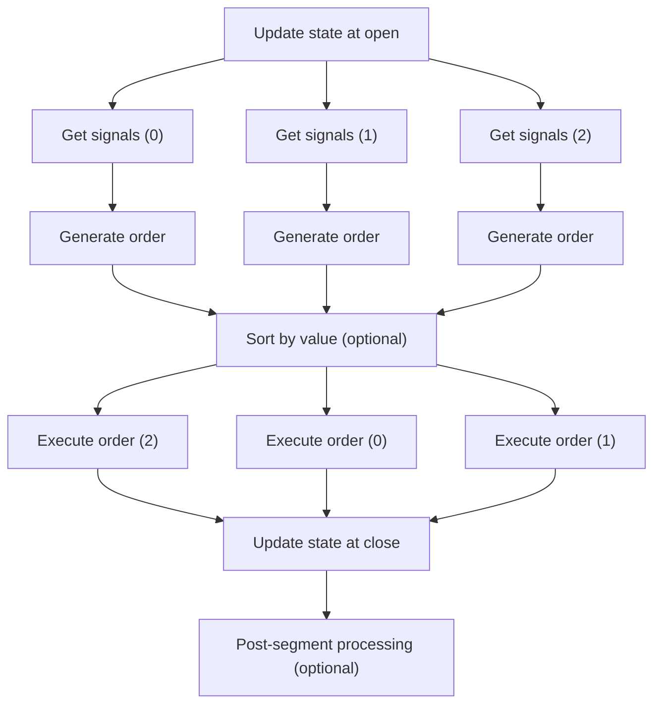
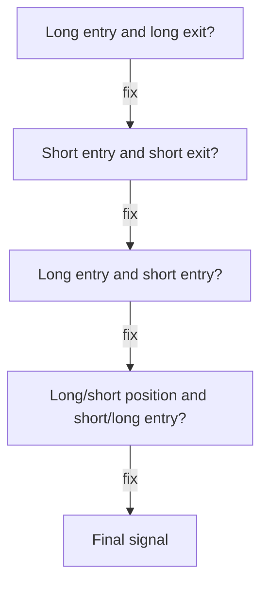
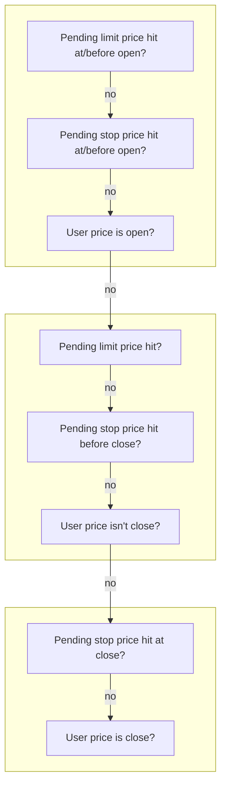

# :material-broadcast: From signals

The method [Portfolio.from_orders](/api/portfolio/base/#vectorbtpro.portfolio.base.Portfolio.from_orders) (FO),
which was discussed previously, is the most primitive simulation method; it takes order information
in form of multiple array-like arguments and broadcasts them to a single shape, such that we
know exactly what has to be ordered under each bar and asset. This method requires us
to have that information in advance, regardless of any events during the simulation. But what
if we wanted to create an order only given that we're not currently in the market, or in general,
to make an order dependable on the current simulation state? Such a conditional logic cannot be represented 
using orders alone - we either need to use a callback, or define more arrays. The former and the 
latter are both implemented in [Portfolio.from_signals](/api/portfolio/base/#vectorbtpro.portfolio.base.Portfolio.from_signals) (FS).

Before we dive deep into this method, make sure to learn more about signals [here](/tutorials/signal-development).
In a nutshell: signals are an abstraction layer over orders. Each signal consists of four boolean values:
:one: long entry, :two: long exit, :three: short entry, and :four: short exit. A combination of those 
values enables us to control the direction of the order relative to the current position. For example,
a short entry flag will reverse the current long position, or open a new short one if we're not in the market.
This way, position management can be abstracted away from order management, such that we can lean
back and only express our decision of whether we're currently bullish or bearish - a perfect playground
for ML models, by the way.

And there's another reason to love signals: statistically, in an entire universe of signal 
[permutations](https://en.wikipedia.org/wiki/Permutation), there is at least one permutation that beats 
the market all the time. This means that we can design a perfect trading algorithm using the above signal 
schema alone - we just need to guess the right timing and direction of each signal, which reduces
the number of factors we need to care about to just two (in a perfect world, of course, because in the
real world you also need to take into account the risk, execution modalities, etc.). For example, if the price 
of any security is $21 at day 1, $20 at day 2, and $22 at day 3, we can short entry at day 1 and long entry 
at day 2 to get positive-only returns. That's why trading systems (and their backtesting components as well) 
shouldn't necessarily scream from complexity in order to be profitable - they just need a robust signal 
generator as their algorithmic backbone and a trading infrastructure that closely matches the backtesting one.

!!! example
    Here are all the signal permutations for a price series with 4 points and their total return:

    ```pycon
    >>> import numpy as np
    >>> from itertools import product
    
    >>> price = np.array([21, 20, 22, 21])
    >>> returns = (price[1:] - price[:-1]) / price[:-1]
    >>> permutations = list(product([False, True], repeat=len(returns)))
    >>> total_return = np.prod(1 + np.where(permutations, returns, -returns), axis=1) - 1
    >>> pd.Series(total_return, index=permutations).sort_values(ascending=False)
    (False, True, False)     0.204762
    (False, True, True)      0.100000
    (True, True, False)      0.095238
    (True, True, True)       0.000000
    (False, False, False)   -0.014286
    (False, False, True)    -0.100000
    (True, False, False)    -0.103896
    (True, False, True)     -0.181818
    dtype: float64
    ```

    Don't run this on longer price series since the number of permutations grows exponentially 
    with the number of data points - `2^n`. That is, a year of daily history would require checking 
    `2^365` or `7.515336e+109` permutations.

## Mechanics

Similarly to FO, this method is also a class method of [Portfolio](/api/portfolio/base/#vectorbtpro.portfolio.base.Portfolio)
and has a Numba-compiled core function - [simulate_from_signal_func_nb](/api/portfolio/nb/from_signals/#vectorbtpro.portfolio.nb.from_signals.simulate_from_signal_func_nb).
In fact, FS shares many arguments with FO, especially those used to set up the simulation, such as `init_cash`, 
and those carrying order information, such as `size`. For instance, if we look at the API documentation 
of the argument `size` under [Portfolio.from_signals](/api/portfolio/base/#vectorbtpro.portfolio.base.Portfolio.from_signals), 
we'll see *"See `Portfolio.from_orders`"*. But also the simulation procedure of FS itself is very similar
to that of FO: while looping over all columns and rows, at each iteration, it resolves the current order 
and executes it by appending information on the filled order to the order records and updating the current 
simulation state. That's where the similarities end.

### Framework

Here's an abstract visualization of the framework of FS run on three rows and 
two groups with two and one column respectively:


If you worked with vectorbt long enough, you have likely noticed that the framework of
[Portfolio.from_signals](/api/portfolio/base/#vectorbtpro.portfolio.base.Portfolio.from_signals)
follows that of [Portfolio.from_orders](/api/portfolio/base/#vectorbtpro.portfolio.base.Portfolio.from_signals)
and [Portfolio.from_order_func](/api/portfolio/base/#vectorbtpro.portfolio.base.Portfolio.from_order_func).
Like most things in the vectorbt's universe, the simulation with FS is done by iterating over a 
so-called "target shape". This shape consists of two dimensions: rows representing time and columns 
representing assets or, generally, configurations. Columns are further divided into groups: if multiple 
columns share the same cash, they are put into the same group (see the blue rectangle on the left), while 
columns without cash sharing or grouping are isolated and appear as a group with exactly one column 
(see the blue rectangle on the right). Groups are considered to be separate, atomic backtests that aren't 
connected by any means, that is, splitting the shape by groups shouldn't affect the final result.
This, by the way, is why chunking is generally performed on groups rather than columns :bulb:

The actual iteration over the rows and groups happens in the 
[column-major order](https://en.wikipedia.org/wiki/Row-_and_column-major_order):
the simulator starts moving over the rows in the first group, and once finished, continues with
the second group. Every time it hits a new row when processing a group, all the assets at this row
are called a "segment" because they together compete for the same resources at the same time.
For example, an account with `BTC-USD` and `ETH-USD` on the date `2020-01-01` is considered a segment
because the value of both assets adds to the total value of the group at this date. Each asset
within a segment is called an "element", which is the smallest simulation unit. An
element in FS can host only one order, such that the number of filled orders is effectively capped
by the number of rows times the number of columns. For example, a year of the daily `BTC-USD` and `ETH-USD` 
history can generate at most `365 * 2 = 730` orders, or one order per bar and asset.

#### Segment workflow

Segment is where the major part of the simulation takes place:



### Signal function

Remember how in FO we had to provide everything as arrays and could neither dynamically change the 
provided information nor affect the execution in any way? FS is much more flexible than that: it expects 
most information to be defined beforehand (acting as a cascade), while signals are generated dynamically. 
This is implemented by accepting a user-defined callback function, `signal_func_nb`. Whenever the main 
simulation loop hits a new row (bar), it asks each asset in the current group to generate signals 
using this callback function. For this, it packs all the information that might be useful to the user, 
such as the current cash balance and the group value, into a named tuple of the type 
[SignalContext](/api/portfolio/enums/#vectorbtpro.portfolio.enums.SignalContext). In return, it expects 
the function to return four signals, which will be used to create an order for that asset.

Here's how a dead-simple signal function that orders nothing looks like:

```pycon
>>> import pandas as pd
>>> from numba import njit
>>> import vectorbtpro as vbt

>>> @njit
... def signal_func_nb(c):
...     return False, False, False, False

>>> close = pd.DataFrame({
...     "BTC-USD": [20594.29, 20719.41, 19986.60, 21084.64], 
...     "ETH-USD": [1127.51, 1125.37, 1051.32, 1143.20],
...     "DOT-USD": [7.88, 7.74, 7.41, 7.78], 
...     "BNB-USD": [216.90, 219.67, 214.23, 228.92]
... })

>>> pf = vbt.Portfolio.from_signals(
...     close=close, 
...     signal_func_nb=signal_func_nb
... )
>>> pf.order_records
array([], dtype={...})
```

!!! hint
    To avoid waiting for the function to compile, remove the `@njit` decorator from `signal_func_nb` 
    and pass `jitted=False` to `from_signals` in order to disable Numba for this method completely.
    Do this only if the amount of input data is small (< 1000).

To better understand when the function is called, let's expand our data to two assets and print out 
the current column and row:

```pycon
>>> @njit
... def signal_func_nb(c):
...     print(c.col, c.i)
...     return False, False, False, False

>>> pf = vbt.Portfolio.from_signals(
...     close=close[["BTC-USD", "ETH-USD"]], 
...     signal_func_nb=signal_func_nb
... )
0 0
0 1
0 2
0 3
1 0
1 1
1 2
1 3
```

We see that the function was called at each row, first in the column `BTC-USD`, then in the column `ETH-USD`.
Here, both assets are acting as isolated tests, thus the simulator processes one column after another.
But once we introduce a grouping with cash sharing, which binds columns semantically, 
the simulator will process the columns group-wise, that is, it will move over the groups, then over the 
rows, and finally over the columns in the current group and at the current row. Let's demonstrate this
by introducing two groups with two assets sharing the same cash:

```pycon
>>> @njit
... def signal_func_nb(c):
...     print(c.group, c.col, c.i)
...     return False, False, False, False

>>> pf = vbt.Portfolio.from_signals(
...     close=close, 
...     signal_func_nb=signal_func_nb,
...     group_by=[0, 0, 1, 1],
...     cash_sharing=True
... )
0 0 0
0 1 0
0 0 1
0 1 1
0 0 2
0 1 2
0 0 3
0 1 3
1 2 0
1 3 0
1 2 1
1 3 1
1 2 2
1 3 2
1 2 3
1 3 3
```

!!! info
    Without cash sharing, the columns are processed the same way as without grouping.

The context tuple passed to the signal function contains all the necessary information to
identify the position of the call in the simulation. For example, we can use `c.index[c.i]` with
[SignalContext.index](/api/portfolio/enums/#vectorbtpro.portfolio.enums.SignalContext.index)
and [SignalContext.i](/api/portfolio/enums/#vectorbtpro.portfolio.enums.SignalContext.i)
to get the timestamp of the current bar. We can also change the current state of any pending limit
or stop order before it's processed since the signal function is conceptually executed
right before the beginning of the bar.

Thanks to the strict processing of groups from left to right and storing the state of each group globally, 
we can access the order records and, generally, the latest simulation state of all the groups 
that were processed earlier. For example, [SignalContext.last_cash](/api/portfolio/enums/#vectorbtpro.portfolio.enums.SignalContext.last_cash)
has the same number of elements as there are groups. This is powerful and dangerous at the same time:
we can introduce complex inter-group relationships if wanted, or accidentally access the wrong group 
if not paying enough attention.

### Signal resolution

Signals are just an additional level of abstraction over orders, meaning there needs to be some kind of 
logic in place that translates them into order instructions. Indeed, whenever the simulator receives a new 
set of four signals at each row and column, it first resolves them into a single signal, which then 
gets converted into an order. The resolution step checks whether the provided signals have conflicts. 
Mostly, the signals are expected to have only one `True` value and three `False` values, but sometimes
multiple signals are `True`, especially when the signal function is forwarding data from multiple boolean arrays.
In such a case, the simulator goes through the following procedure consisting of multiple checks and fixes:



It first checks whether there are multiple `True` values within the same direction,
for example, when the long entry and long exit are both set. To decide which one in the long direction to keep,
it looks at the argument `upon_long_conflict` of the type [ConflictMode](/api/portfolio/enums/#vectorbtpro.portfolio.enums.ConflictMode)
provided by the user. For example, the option "adjacent" will pick the signal adjacent to 
the position we are currently in such that only the long entry will remain active if we're in a long position.
This is done by calling the function [resolve_signal_conflict_nb](/api/portfolio/nb/from_signals/#vectorbtpro.portfolio.nb.from_signals.resolve_signal_conflict_nb):

```pycon
>>> vbt.pf_nb.resolve_signal_conflict_nb(
...     position_now=20,
...     is_entry=True,
...     is_exit=True,
...     direction=vbt.pf_enums.Direction.LongOnly,
...     conflict_mode=vbt.pf_enums.ConflictMode.Adjacent
... )
(True, False)
```

After deciding for at most one signal in both directions, the simulator checks whether both the long 
and short entry are active and uses the function [resolve_dir_conflict_nb](/api/portfolio/nb/from_signals/#vectorbtpro.portfolio.nb.from_signals.resolve_dir_conflict_nb)
based on the argument `upon_dir_conflict` of the type [DirectionConflictMode](/api/portfolio/enums/#vectorbtpro.portfolio.enums.DirectionConflictMode) 
to select the winner. For example, we can choose to always go short when there is any uncertainty:

```pycon
>>> vbt.pf_nb.resolve_dir_conflict_nb(
...     position_now=20,
...     is_long_entry=True,
...     is_short_entry=True,
...     upon_dir_conflict=vbt.pf_enums.DirectionConflictMode.Short,
... )
(False, True)
```

Finally, it calls the function [resolve_opposite_entry_nb](/api/portfolio/nb/from_signals/#vectorbtpro.portfolio.nb.from_signals.resolve_opposite_entry_nb)
if there is an entry signal that is opposite to the direction of the current position. For example,
if we're in a long position and the short entry signal is set, the simulator will use the argument
`upon_opposite_entry` of the type [OppositeEntryMode](/api/portfolio/enums/#vectorbtpro.portfolio.enums.OppositeEntryMode) 
to decide whether to reduce, close, or completely reverse the current long position.
Let's make the short entry signal behave like the long exit signal:

```pycon
>>> vbt.pf_nb.resolve_opposite_entry_nb(
...     position_now=20,
...     is_long_entry=False,
...     is_long_exit=False,
...     is_short_entry=True,
...     is_short_exit=False,
...     upon_opposite_entry=vbt.pf_enums.OppositeEntryMode.Close,
...     accumulate=False,  # (1)!
... )
(False, True, False, False, 0)
```

1. This argument can be `True`, `False`, or any of [AccumulationMode](/api/portfolio/enums/#vectorbtpro.portfolio.enums.AccumulationMode) 

In the end, only one active signal out of four will remain :railway_track:

### Signal conversion

We have our one signal, now what? It's time to convert it into an order! And this is the easiest step
in the pipeline, done by the function [signal_to_size_nb](/api/portfolio/nb/from_signals/#vectorbtpro.portfolio.nb.from_signals.signal_to_size_nb),
which takes the four signals (three of which are now deactivated) and the size requirement under this row
and column (i.e., for this element), and returns the order size, size type, and direction to be requested.
For example, being in a position of 20 shares and receiving the long exit signal, the 
size becomes minus 20 shares, the size type becomes [SizeType.Amount](/api/portfolio/enums/#vectorbtpro.portfolio.enums.SizeType.Amount),
and the direction becomes [Direction.LongOnly](/api/portfolio/enums/#vectorbtpro.portfolio.enums.Direction.LongOnly):

```pycon
>>> vbt.pf_nb.signal_to_size_nb(
...     position_now=20,
...     val_price_now=20594.29,  # (1)!
...     value_now=411885.80,  # (2)!
...     is_long_entry=False,
...     is_long_exit=True,
...     is_short_entry=False,
...     is_short_exit=False,
...     size=0.1,  # (3)!
...     size_type=vbt.pf_enums.SizeType.ValuePercent,  # (4)!
...     accumulate=False  # (5)!
... )
(-20.0, 0, 0)
```

1. The latest asset price known
2. The latest group value known
3. Default value for this element
4. Default value for this element
5. Default value for this element

Even though we provided the function with the default order specification for the current element, 
such as `size`, the function didn't use it because it isn't required for closing the current position.
On the other hand, if we wanted to reverse the current position (that is, close it and then order
using the default specification), those inputs would suddenly become effective:

```pycon
>>> vbt.pf_nb.signal_to_size_nb(
...     position_now=20,
...     val_price_now=20594.29,
...     value_now=411885.80,
...     is_long_entry=False,
...     is_long_exit=False,
...     is_short_entry=True,  # (1)!
...     is_short_exit=False,
...     size=0.1,
...     size_type=vbt.pf_enums.SizeType.ValuePercent,
...     accumulate=False
... )
(-22.0, 0, 2)
```

1. Reverse the long position

The size is calculated as follows: reduce the number of shares by 20 to close out the long position,
and, given that we're operating with a percentage of the current group value, open a new short position 
of `size * value_now / val_price_now = 2.0` shares. The size type is [SizeType.Amount](/api/portfolio/enums/#vectorbtpro.portfolio.enums.SizeType.Amount)
while the direction is [Direction.Both](/api/portfolio/enums/#vectorbtpro.portfolio.enums.Direction.Both)
because the operation now involves two directions.

### Main order resolution

The simulator called the signal function, resolved the incoming signals, and converted them into
an order instruction. But this is not the only order that competes for the current bar: there may be 
also pending limit and stop orders. Since the FS simulation function can process at most one order at 
each bar, it has to decide for a winner, which should always be an order that executes first.
But how do we know which one comes first if we don't have any intra-bar data? We can
still divide each bar into three "zones": opening (first rectangle below), somewhere in-between
(second rectangle below), and closing (third rectangle below). For example, if a stop order was hit at or 
before the opening of the current bar and the user order should execute at the close price, then clearly the 
stop order should be first on the line. Here's the full decision chain:



As we see, limit orders have priority over stop orders, while stop orders have priority 
over user orders, but only if they are triggered within the same zone of the bar.

### Limit management

#### Creation

Whenever a stop or user-defined order goes through and its order type provided via `order_type` 
is [OrderType.Limit](/api/portfolio/enums/#vectorbtpro.portfolio.enums.OrderType.Limit), 
the simulator first determines what kind of limit price the order should be executed at: open, close, or 
something else? And this is a very important concept to grasp: the argument `price` gives
vectorbt hints on where in the bar the operation should take place. If the limit price is the open price
(provided as either [PriceType.Open](/api/portfolio/enums/#vectorbtpro.portfolio.enums.PriceType.Open)
or `-np.inf`), the simulator is allowed to use the entire candle for its checks and execute the order right
upon detecting the price being hit, at the same bar. If the limit price is not the close price but 
something in-between, the simulator is allowed to use the close price only. If the limit 
price is the close price (provided as either [PriceType.Close](/api/portfolio/enums/#vectorbtpro.portfolio.enums.PriceType.Close) or `np.inf`),
the simulator is not allowed to execute the limit order right away - it's forced to postpone its 
very first check to the next bar.

If the limit order couldn't be executed at the same bar as it was created, the order is marked as 
pending and all the relevant information becomes stored in a record array of the type 
[limit_info_dt](/api/portfolio/enums/#vectorbtpro.portfolio.enums.limit_info_dt),
which is structured by asset. This array can keep only one instance per asset, thus FS allows
only one limit order to be active at a time.

#### Expiration

Once the simulator hits the next bar, it first uses [check_limit_expired_nb](/api/portfolio/nb/from_signals/#vectorbtpro.portfolio.nb.from_signals.check_limit_expired_nb)
to check whether the pending limit order expired at the beginning or somewhere in the middle of the bar.
If the former, the order is thrown away. If the latter, the simulator also checks whether the order 
was hit at the beginning of the bar (and execute it), and if not, throw it away because there is no
guarantee that the order was hit before the deadline. For example, let's assume that the order can be 
at most 36 hours in force, it was issued at the day `2020-01-01`, and now is the day `2020-01-02`:

```pycon
>>> vbt.pf_nb.check_limit_expired_nb(
...     creation_i=0,
...     i=1,
...     tif=pd.Timedelta("36h").to_timedelta64().astype(int),  # (1)!
...     index=pd.date_range("2020-01-01", periods=3).values.astype(int),
...     freq=pd.Timedelta("1d").to_timedelta64().astype(int)
... )
(False, True)
```

1. Index and timedeltas must be converted into nanoseconds

We see that the function marked the order as expired, but not at the beginning of the bar
such that it can still be executed using the open price. But if the lifespan of the order was 24 hours, 
the function would also raise the first flag and disallow any execution:

```pycon
>>> vbt.pf_nb.check_limit_expired_nb(
...     creation_i=0,
...     i=1,
...     tif=pd.Timedelta("24h").to_timedelta64().astype(int),
...     index=pd.date_range("2020-01-01", periods=3).values.astype(int),
...     freq=pd.Timedelta("1d").to_timedelta64().astype(int)
... )
(True, True)
```

!!! info
    The lifespan is calculated by subtracting any time from the opening time of the creation bar,
    even if the order was placed at the very end of the creation bar.

#### Activation

Once we're sure that the order **can** be executed at this bar (i.e., it won't expire), the simulator uses 
[check_limit_hit_nb](/api/portfolio/nb/from_signals/#vectorbtpro.portfolio.nb.from_signals.check_limit_hit_nb)
to check whether the order **should** be executed by determining whether its target price has been hit. 
This is implemented through comparison of the price against the current candle. For example, if we have a 
pending buy limit order with a target price of 9.5, the function will check whether the low price went 
below the target price:

```pycon
>>> vbt.pf_nb.check_limit_hit_nb(
...     curr_open=10.0,
...     curr_high=11.0,
...     curr_low=9.0,
...     curr_close=10.5,
...     price=9.5,
...     size=2.0
... )
(9.5, False, True)
```

If the target price was 11, the function would notify us about the price being hit already 
at the beginning of the bar; in such a case, the order will be executed right away using the open price:

```pycon
>>> vbt.pf_nb.check_limit_hit_nb(
...     curr_open=10.0,
...     curr_high=11.0,
...     curr_low=9.0,
...     curr_close=10.5,
...     price=11.0,
...     size=2.0
... )
(10.0, True, True)
```

#### Cancellation

If the target price hasn't been hit, the limit order remains pending. It can still be cancelled
manually in the signal function called before all the checks above, or in the post-segment function
called after processing the entire segment. The pending order will also be cancelled automatically 
once any stop order gets executed since the latter may change the simulation state and potentially pull 
the resources required to execute the former in the future. 

Finally, the four signals returned by the signal function and resolved into a single signal also can affect 
the pending order, regardless of whether the final signal gets executed or not. Consider the example where 
we have a pending buy limit order and the user decides to issue the long exit or short entry signal; in this case, 
the most intuitive reaction would be cancelling the pending order since the user have changed their mind. 
Exactly this is happening by default. Such "pending conflicts" are resolved using the function 
[resolve_pending_conflict_nb](/api/portfolio/nb/from_signals/#vectorbtpro.portfolio.nb.from_signals.resolve_pending_conflict_nb),
which uses the arguments `upon_adj_limit_conflict` and `upon_opp_limit_conflict`,
both of the type [PendingConflictMode](/api/portfolio/enums/#vectorbtpro.portfolio.enums.PendingConflictMode),
to decide what to do if the direction of the pending order is adjacent and opposite respectively 
to the direction of the resolved user-defined signal.

```pycon
>>> vbt.pf_nb.resolve_pending_conflict_nb(
...     is_pending_long=True,
...     is_user_long=False,
...     upon_adj_conflict=vbt.pf_enums.PendingConflictMode.KeepIgnore,
...     upon_opp_conflict=vbt.pf_enums.PendingConflictMode.CancelIgnore,
... )
(False, False)
```

Here, the function decided to cancel the limit order and to ignore the user-defined signal.

### Stop management

*[FO]: From-orders simulation method
*[FS]: From-signals simulation method

