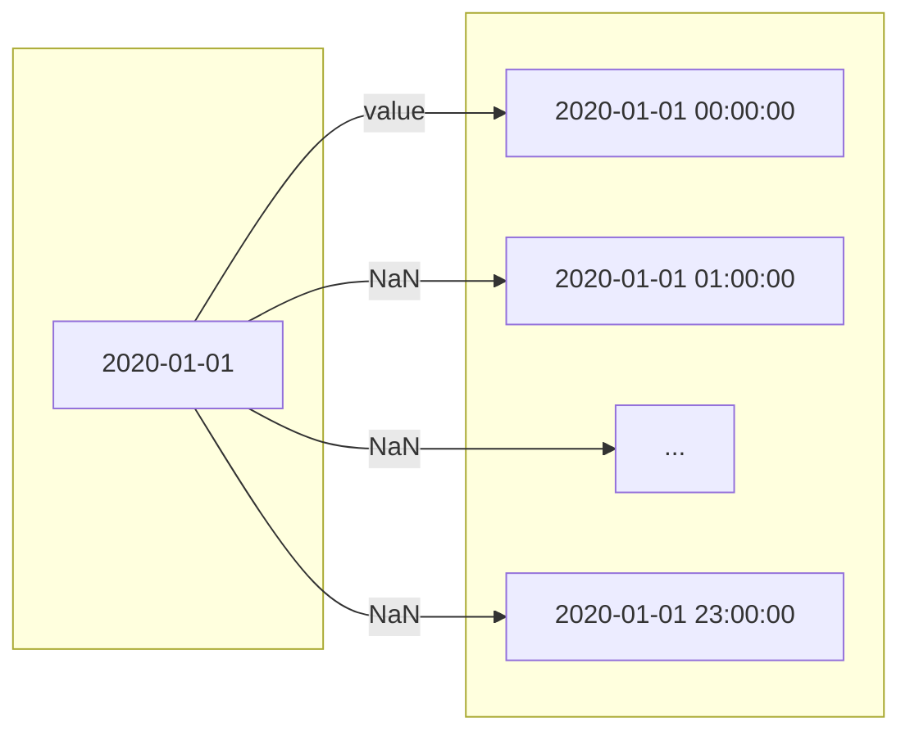
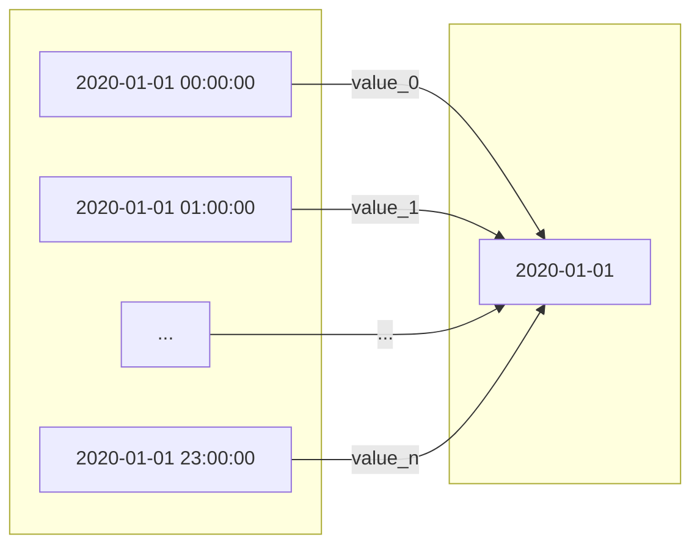
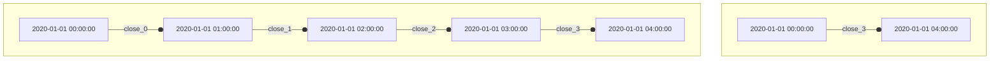

# :material-lock-open: MTF analysis

By limiting ourselves to only one time frame, we may lose sight of the larger trend, miss clear 
levels of support and resistance, and overlook high probability entry and stop levels. Monitoring 
the same pair under different time frames (or time compressions) can help us identify the overall 
flow of an asset ([the trend is your friend](https://www.investopedia.com/articles/forex/05/050505.asp), 
after all) and key chart patterns. In fact, all technical indicators will show different results when 
used in certain times, and all those results combined can make us draw a more complete picture of the 
market we're participating in.

## Resampling

Since vectorbt is all about time series, the main operation that allows us to switch between different 
time frames is called _resampling_. There are two types of resampling: upsampling and downsampling.

[Upsampling](https://en.wikipedia.org/wiki/Upsampling) brings a time series to a shorter time frame (i.e., 
a higher frequency), such as by converting a daily price to an hourly price. The prefix "up" here means
an increase in the number of data points. This operation isn't associated with any information loss since 
none of the data is removed, just re-indexed: the value at each day appears at the very first hour in 
the upsampled array, while all other hours contain NaN. By forward-filling those NaN values, we would 
be able to compare any daily time series with an hourly time series!



(Reload the page if the diagram doesn't show up)

[Downsampling](https://en.wikipedia.org/wiki/Downsampling_(signal_processing)), on the other hand,
brings a time series to a longer time frame (i.e., a lower frequency), such as by converting an hourly
price to a daily price. The prefix "down" here means a decrease in the number of data points. In contrast to 
upsampling, downsampling **results in information loss** since multiple pieces of information are 
aggregated into a single one. That's why time frames are also referred to as time compressions. But even 
though we lose some information, we can now observe a bigger trend!



!!! hint
    Downsampling is a similar concept to a moving average, which aggregates information at each time 
    step to reveal a bigger trend.

## Data

Before pulling any data, we need to ask ourselves: _"What is the shortest time frame we want to analyze?"_
Once this question is answered, we need to pull the data of this exact granularity. For example,
to be able to work with the time frames `H1` (1 hour), `H4` (4 hours), and `D1` (1 day), we need data 
with at least the time frame `H1`, which can be later downsampled to derive the `H4` and `D1` time frames.

!!! note
    This wouldn't work the other way around: we cannot upsample `H4` or `D1` to derive `H1` since
    most data points would just become NaN.

```pycon
>>> import vectorbtpro as vbt

>>> h1_data = vbt.BinanceData.fetch(
...     "BTCUSDT", 
...     start="2020-01-01 UTC", 
...     end="2021-01-01 UTC",
...     timeframe="1h"
... )
```

[=100% "Period 18/18"]{: .candystripe}

Let's persist the data locally to avoid re-fetching it every time we start a new runtime:

```pycon
>>> h1_data.to_hdf()
```

We can then access the saved data easily using [HDFData](/api/data/custom/#vectorbtpro.data.custom.HDFData):

```pycon
>>> h1_data = vbt.HDFData.fetch("BinanceData.h5")
```

Let's take a look at the index of the data:

```pycon
>>> h1_data.wrapper.index  # (1)!
DatetimeIndex(['2020-01-01 00:00:00+00:00', '2020-01-01 01:00:00+00:00',
               '2020-01-01 02:00:00+00:00', '2020-01-01 03:00:00+00:00',
               '2020-01-01 04:00:00+00:00', '2020-01-01 05:00:00+00:00',
               ...
               '2020-12-31 18:00:00+00:00', '2020-12-31 19:00:00+00:00',
               '2020-12-31 20:00:00+00:00', '2020-12-31 21:00:00+00:00',
               '2020-12-31 22:00:00+00:00', '2020-12-31 23:00:00+00:00'],
              dtype='datetime64[ns, UTC]', name='Open time', length=8767, freq=None)
```

1. [Data](/api/data/base/#vectorbtpro.data.base.Data), like many other vectorbt classes,
holds a wrapper, which contains useful metadata about index and columns

As expected, the index starts at midnight of 1st January and ends at 11 PM on December 31.
But what about `freq=None`? Pandas wasn't able to derive the frequency of data because some data 
points seem to be missing. This happens relatively often and indicates that the exchange was down.
To get all the missing indices, we need to create a resampler of type 
[Resampler](/api/base/resampling/base/#vectorbtpro.base.resampling.base.Resampler) and then
use [Resampler.index_difference](/api/base/resampling/base/#vectorbtpro.base.resampling.base.Resampler.index_difference)
with `reverse=True`:

```pycon
>>> h1_resampler = h1_data.wrapper.create_resampler("1h")  # (1)!
>>> h1_resampler.index_difference(reverse=True)  # (2)!
DatetimeIndex(['2020-02-09 02:00:00+00:00', '2020-02-19 12:00:00+00:00',
               '2020-02-19 13:00:00+00:00', '2020-02-19 14:00:00+00:00',
               '2020-02-19 15:00:00+00:00', '2020-02-19 16:00:00+00:00',
               '2020-03-04 10:00:00+00:00', '2020-04-25 02:00:00+00:00',
               '2020-04-25 03:00:00+00:00', '2020-06-28 02:00:00+00:00',
               '2020-06-28 03:00:00+00:00', '2020-06-28 04:00:00+00:00',
               '2020-11-30 06:00:00+00:00', '2020-12-21 15:00:00+00:00',
               '2020-12-21 16:00:00+00:00', '2020-12-21 17:00:00+00:00',
               '2020-12-25 02:00:00+00:00'],
              dtype='datetime64[ns, UTC]', name='Open time', freq=None)
```

1. Resampler is simply a mapper between the index in the wrapper (source index) 
and the resampled index (target index)
2. Get all indices in the target index not present in the source index

Those are the time periods when Binance was supposedly down. The good news is: we don't need
to set those data points to NaN since vectorbt accepts missing indices just fine. In fact, marking 
those points as missing would only inflate the data and make working with indicators that don't like 
missing data much, such as TA-Lib, prune to errors.

Now, how do we downsample that data to `H4` and `D1`? If we look at the columns stored in the data 
instance, we'd see very familiar column names `Open`, `High`, `Low`, `Close`, and `Volume`:

```pycon
>>> h1_data.wrapper.columns
Index(['Open', 'High', 'Low', 'Close', 'Volume', 'Close time', 'Quote volume',
       'Number of trades', 'Taker base volume', 'Taker quote volume'],
      dtype='object')
```

First, let's remove columns that aren't much interesting to us right now:

```pycon
>>> h1_ohlcv_data = h1_data[["Open", "High", "Low", "Close", "Volume"]]
```

The most conventional way to resample any OHLCV data is by using Pandas:

```pycon
>>> h4_ohlcv = h1_ohlcv_data.get().resample("4h").agg({  # (1)!
...     "Open": "first",
...     "High": "max",
...     "Low": "min",
...     "Close": "last",
...     "Volume": "sum"
... })
>>> h4_ohlcv
                               Open      High       Low     Close  \\
Open time                                                           
2020-01-01 00:00:00+00:00   7195.24   7245.00   7175.46   7225.01   
2020-01-01 04:00:00+00:00   7225.00   7236.27   7199.11   7209.83   
2020-01-01 08:00:00+00:00   7209.83   7237.73   7180.00   7197.20   
...                             ...       ...       ...       ...   
2020-12-31 12:00:00+00:00  28910.29  28989.03  27850.00  28770.00   
2020-12-31 16:00:00+00:00  28782.01  29000.00  28311.00  28897.83   
2020-12-31 20:00:00+00:00  28897.84  29169.55  28780.00  28923.63   

                                 Volume  
Open time                                
2020-01-01 00:00:00+00:00   2833.749180  
2020-01-01 04:00:00+00:00   2061.295051  
2020-01-01 08:00:00+00:00   3166.654361  
...                                 ...  
2020-12-31 12:00:00+00:00  19597.147389  
2020-12-31 16:00:00+00:00  10279.179141  
2020-12-31 20:00:00+00:00   7875.879035  

[2196 rows x 5 columns]
```

1. See [Resampler.aggregate](https://pandas.pydata.org/docs/reference/api/pandas.core.resample.Resampler.aggregate.html)

We see that the time interval has increased from 1 hour to 4 hours; in fact, we just built 1 bigger 
bar out of 4 smaller ones:

```pycon
>>> h1_ohlcv_data.get().iloc[:4]
                              Open     High      Low    Close      Volume
Open time                                                                
2020-01-01 00:00:00+00:00  7195.24  7196.25  7175.46  7177.02  511.814901
2020-01-01 01:00:00+00:00  7176.47  7230.00  7175.71  7216.27  883.052603
2020-01-01 02:00:00+00:00  7215.52  7244.87  7211.41  7242.85  655.156809
2020-01-01 03:00:00+00:00  7242.66  7245.00  7220.00  7225.01  783.724867

>>> h4_ohlcv.iloc[[0]]
                              Open    High      Low    Close      Volume
Open time                                                               
2020-01-01 00:00:00+00:00  7195.24  7245.0  7175.46  7225.01  2833.74918
```

Great! But as with everything, vectorbt deploys special methods that either do such things more 
efficiently or more flexibly (mostly both). 

Remember how most classes in vectorbt subclass [Analyzable](/api/generic/analyzable/#vectorbtpro.generic.analyzable.Analyzable)? 
In turn, this class subclasses [Wrapping](/api/base/wrapping/#vectorbtpro.base.wrapping.Wrapping), which 
is designed for managing all the Pandas objects stored in a class instance. Since it also contains the 
Pandas metadata such as index and columns, we can use that index for resampling. Particularly, any 
subclass of [Wrapping](/api/base/wrapping/#vectorbtpro.base.wrapping.Wrapping) has an abstract method 
[Wrapping.resample](/api/base/wrapping/#vectorbtpro.base.wrapping.Wrapping.resample),
which can be overridden to resample complex vectorbt objects, such as instances of
[Data](/api/data/base/#vectorbtpro.data.base.Data) and 
[Portfolio](/api/portfolio/base/#vectorbtpro.portfolio.base.Portfolio).

Luckily for us, vectorbt has implemented this method in most classes that can actually be resampled.
In most cases, it forwards most arguments and keyword arguments to 
[Wrapping.create_resampler](/api/base/wrapping/#vectorbtpro.base.wrapping.Wrapping.create_resampler)
to build a resampler, and then applies this resampler on all Pandas objects stored in a vectorbt object. 
Continuing with data, [Data.resample](/api/data/base/#vectorbtpro.data.base.Data.resample) looks for 
any OHLCV columns in a data instance and resamples them automatically. But what happens with other columns, 
such as `Number of trades`? Their resampling function can be defined in the column config 
[Data.column_config](/api/data/base/#vectorbtpro.data.base.Data.column_config). Even better:
vectorbt has defined resampling functions for all columns of all remote data classes!

Let's take a look at the column config of [BinanceData](/api/data/custom/#vectorbtpro.data.custom.BinanceData):

```pycon
>>> print(vbt.prettify(vbt.BinanceData.column_config))
Config({
    'Close time': {
        'resample_func': <function BinanceData.<lambda> at 0x7fd2d60c4378>
    },
    'Quote volume': {
        'resample_func': <function BinanceData.<lambda> at 0x7fd2d60c4400>
    },
    'Number of trades': {
        'resample_func': <function BinanceData.<lambda> at 0x7fd2d60c4488>
    },
    'Taker base volume': {
        'resample_func': <function BinanceData.<lambda> at 0x7fd2d60c4510>
    },
    'Taker quote volume': {
        'resample_func': <function BinanceData.<lambda> at 0x7fd2d60c4598>
    }
})
```

Each of those lambda functions takes the Pandas object and the resampler, and performs the operation using 
[GenericAccessor.resample_apply](/api/generic/accessors/#vectorbtpro.generic.accessors.GenericAccessor.resample_apply).

!!! hint
    There is no need to define resampling functions for OHLCV columns as vectorbt already knows what to do.

Let's downsample `H1` to `H4` and `D1` with a single line of code:

```pycon
>>> h1_data.use_column_config_of(vbt.BinanceData) # (1)!

>>> h4_data = h1_data.resample("4h")
>>> d1_data = h1_data.resample("1d")
```

1. [HDFData](/api/data/custom/#vectorbtpro.data.custom.HDFData) stores information from Binance
but doesn't know about it, thus let's use the column config from 
[BinanceData](/api/data/custom/#vectorbtpro.data.custom.BinanceData). Note that this is only
required for data classes that aren't tied to a specific column layout.

That's it!

```pycon
>>> d1_data.get().iloc[[0, -1]]  # (1)!
                               Open     High       Low     Close  \\
Open time                                                          
2020-01-01 00:00:00+00:00   7195.24   7255.0   7175.15   7200.85   
2020-12-31 00:00:00+00:00  28875.55  29300.0  27850.00  28923.63   

                                 Volume                          Close time  \\
Open time                                                                     
2020-01-01 00:00:00+00:00  16792.388165 2020-01-01 23:59:59.999000064+00:00   
2020-12-31 00:00:00+00:00  75508.505152 2020-12-31 23:59:59.999000064+00:00   

                           Quote volume  Number of trades  Taker base volume  \\
Open time                                                                      
2020-01-01 00:00:00+00:00  1.212145e+08            194010        8946.955535   
2020-12-31 00:00:00+00:00  2.173600e+09           1552793       36431.622080   

                           Taker quote volume  
Open time                                      
2020-01-01 00:00:00+00:00        6.459779e+07  
2020-12-31 00:00:00+00:00        1.049389e+09 
```

1. Get the first and the last row of the downsampled data

We can validate the results from resampling by comparing them against the same time frame 
fetched directly from Binance:

```pycon
>>> vbt.BinanceData.fetch(
...     "BTCUSDT", 
...     start="2020-01-01 UTC", 
...     end="2021-01-01 UTC",
...     timeframe="1d"
... ).get().iloc[[0, -1]]
```

[=100% "100%"]{: .candystripe}

```pycon
                               Open     High       Low     Close  \\
Open time                                                          
2020-01-01 00:00:00+00:00   7195.24   7255.0   7175.15   7200.85   
2020-12-31 00:00:00+00:00  28875.55  29300.0  27850.00  28923.63   

                                 Volume                       Close time  \\
Open time                                                                  
2020-01-01 00:00:00+00:00  16792.388165 2020-01-01 23:59:59.999000+00:00   
2020-12-31 00:00:00+00:00  75508.505152 2020-12-31 23:59:59.999000+00:00   

                           Quote volume  Number of trades  Taker base volume  \\
Open time                                                                      
2020-01-01 00:00:00+00:00  1.212145e+08            194010        8946.955535   
2020-12-31 00:00:00+00:00  2.173600e+09           1552793       36431.622080   

                           Taker quote volume  
Open time                                      
2020-01-01 00:00:00+00:00        6.459779e+07  
2020-12-31 00:00:00+00:00        1.049389e+09  
```

Our data instance just resampled itself the same way as done by Binance :fire:

## Alignment

Comparing time series with different time frames is tricky to say the least. Consider an example 
where we want to calculate the ratio between the close price in `H1` and `H4`.

### Pandas

Comparing both time series using Pandas yields the following results:

```pycon
>>> h1_close = h1_data.get("Close")
>>> h4_close = h4_data.get("Close")

>>> h1_close.iloc[:4]
Open time
2020-01-01 00:00:00+00:00    7177.02
2020-01-01 01:00:00+00:00    7216.27
2020-01-01 02:00:00+00:00    7242.85
2020-01-01 03:00:00+00:00    7225.01
Name: Close, dtype: float64

>>> h4_close.iloc[:1]
Open time
2020-01-01 00:00:00+00:00    7225.01
Freq: 4H, Name: Close, dtype: float64

>>> h1_h4_ratio = h1_close / h4_close
>>> h1_h4_ratio.iloc[:4]
Open time
2020-01-01 00:00:00+00:00    0.993358
2020-01-01 01:00:00+00:00         NaN
2020-01-01 02:00:00+00:00         NaN
2020-01-01 03:00:00+00:00         NaN
Name: Close, dtype: float64
```

If you think the result is right, you're wrong :upside_down_face: 

Here, only the timestamp `2020-01-01 00:00:00` in both time series is getting compared, while other 
timestamps become NaN. This is understandable since Pandas compares values by their index labels. 
So far so good. The actual problem lies in the fact that each timestamp is the **open time** and holds 
information all the way up to the next timestamp. In reality, the close price stored at `2020-01-01 00:00:00` 
happens right before `2020-01-01 01:00:00` in `h1_close` and right before `2020-01-01 04:00:00` in `h4_close`.
This means that we are comparing information from the past with information from the future, 
effectively exposing ourselves to a look-ahead bias!



As we can take from the diagram above, we are only allowed to compare `close_3` between both time frames.
Comparing `close_0` and `close_3` won't cause any errors (!), but you will get burned hard in production
without having any idea why the backtesting results are so much off.

If we want a more fair comparison of the close price, we should compare each timestamp in `h1_close`
with the **previous** timestamp in `h4_close`:

```pycon
>>> h4_close_shifted = h4_close.shift()
>>> h1_h4_ratio = h1_close / h4_close_shifted
>>> h1_h4_ratio.iloc[:8]
Open time
2020-01-01 00:00:00+00:00         NaN
2020-01-01 01:00:00+00:00         NaN
2020-01-01 02:00:00+00:00         NaN
2020-01-01 03:00:00+00:00         NaN
2020-01-01 04:00:00+00:00    0.998929
2020-01-01 05:00:00+00:00         NaN
2020-01-01 06:00:00+00:00         NaN
2020-01-01 07:00:00+00:00         NaN
Name: Close, dtype: float64
```

This comparison makes more sense, since any timestamp before `2020-01-01 04:00:00` doesn't
know about the close price at the end of `2020-01-01 03:00:00` yet. But even this comparison can be further 
improved because the close price at `2020-01-01 03:00:00` in `h1_close` is the same close price
as at `2020-01-01 00:00:00` in `h4_close`. Thus, we can safely shift the resulting series backward:

```pycon
>>> h1_h4_ratio.shift(-1).iloc[:8]
Open time
2020-01-01 00:00:00+00:00         NaN
2020-01-01 01:00:00+00:00         NaN
2020-01-01 02:00:00+00:00         NaN
2020-01-01 03:00:00+00:00    1.001032
2020-01-01 04:00:00+00:00         NaN
2020-01-01 05:00:00+00:00         NaN
2020-01-01 06:00:00+00:00         NaN
2020-01-01 07:00:00+00:00    1.000478
Name: Close, dtype: float64
```

What about all those NaNs, why aren't they compared as well? For this, we need to upsample
the `h4_close` to `H1` and forward-fill NaN values:

```pycon
>>> h4_h1_close = h4_close.shift(1).resample("1h").last().shift(-1).ffill()
>>> h4_h1_close.iloc[:8]
Open time
2020-01-01 00:00:00+00:00        NaN
2020-01-01 01:00:00+00:00        NaN
2020-01-01 02:00:00+00:00        NaN
2020-01-01 03:00:00+00:00    7225.01  << first close
2020-01-01 04:00:00+00:00    7225.01
2020-01-01 05:00:00+00:00    7225.01
2020-01-01 06:00:00+00:00    7225.01
2020-01-01 07:00:00+00:00    7209.83  << second close
Freq: H, Name: Close, dtype: float64
```

!!! note
    Don't forward and backward shift when downsampling, only when upsampling.

Let's plot the first 16 points of both time series for validation:

```pycon
>>> fig = h1_close.rename("H1").iloc[:16].vbt.plot()
>>> h4_h1_close.rename("H4_H1").iloc[:16].vbt.plot(fig=fig).show_svg()
```


As we see, at each hour, `H4_H1` contains the latest available information from the previous 4 hours.
We can now compare both time frames safely:

```pycon
>>> h1_h4_ratio = h1_close / h4_h1_close
>>> h1_h4_ratio
Open time
2020-01-01 00:00:00+00:00         NaN
2020-01-01 01:00:00+00:00         NaN
2020-01-01 02:00:00+00:00         NaN
2020-01-01 03:00:00+00:00    1.000000
2020-01-01 04:00:00+00:00    0.998929
...                               ...
2020-12-31 19:00:00+00:00    1.000000
2020-12-31 20:00:00+00:00    1.007920
2020-12-31 21:00:00+00:00         NaN
2020-12-31 22:00:00+00:00         NaN
2020-12-31 23:00:00+00:00         NaN
Name: Close, Length: 8784, dtype: float64
```

The same goes for high and low price since their information is also available only at the end 
of each bar. Open price, on the other hand, is already available at the beginning of each bar,
so we don't need to shift `H4` forward and backward:

```pycon
>>> h1_open = h1_data.get("Open")
>>> h4_open  = h4_data.get("Open")

>>> h1_open.iloc[:8]
Open time
2020-01-01 00:00:00+00:00    7195.24
2020-01-01 01:00:00+00:00    7176.47
2020-01-01 02:00:00+00:00    7215.52
2020-01-01 03:00:00+00:00    7242.66
2020-01-01 04:00:00+00:00    7225.00
2020-01-01 05:00:00+00:00    7217.26
2020-01-01 06:00:00+00:00    7224.24
2020-01-01 07:00:00+00:00    7225.88
Name: Open, dtype: float64

>>> h4_h1_open = h4_open.resample("1h").first().ffill()
>>> h4_h1_open.iloc[:8]
Open time
2020-01-01 00:00:00+00:00    7195.24  << first open
2020-01-01 01:00:00+00:00    7195.24
2020-01-01 02:00:00+00:00    7195.24
2020-01-01 03:00:00+00:00    7195.24
2020-01-01 04:00:00+00:00    7225.00  << second open
2020-01-01 05:00:00+00:00    7225.00
2020-01-01 06:00:00+00:00    7225.00
2020-01-01 07:00:00+00:00    7225.00
Freq: H, Name: Open, dtype: float64
```

### VBT

Seems like a lot of work is required to do everything right? But don't worry, vectorbt has got your back!
To resample an array safely, we can use [GenericAccessor.resample_closing](/api/generic/accessors/#vectorbtpro.generic.accessors.GenericAccessor.resample_closing)
for information available only at the end of each bar, and [GenericAccessor.resample_opening](/api/generic/accessors/#vectorbtpro.generic.accessors.GenericAccessor.resample_opening)
for information available already at the beginning of each bar:

```pycon
>>> h4_close.vbt.resample_closing("1h")
Open time
2020-01-01 00:00:00+00:00         NaN
2020-01-01 01:00:00+00:00         NaN
2020-01-01 02:00:00+00:00         NaN
2020-01-01 03:00:00+00:00     7225.01
2020-01-01 04:00:00+00:00     7225.01
...                               ...
2020-12-31 16:00:00+00:00    28770.00
2020-12-31 17:00:00+00:00    28770.00
2020-12-31 18:00:00+00:00    28770.00
2020-12-31 19:00:00+00:00    28897.83
2020-12-31 20:00:00+00:00    28897.83
Freq: H, Name: Close, Length: 8781, dtype: float64

>>> h4_open.vbt.resample_opening("1h")
Open time
2020-01-01 00:00:00+00:00     7195.24
2020-01-01 01:00:00+00:00     7195.24
2020-01-01 02:00:00+00:00     7195.24
2020-01-01 03:00:00+00:00     7195.24
2020-01-01 04:00:00+00:00     7225.00
...                               ...
2020-12-31 16:00:00+00:00    28782.01
2020-12-31 17:00:00+00:00    28782.01
2020-12-31 18:00:00+00:00    28782.01
2020-12-31 19:00:00+00:00    28782.01
2020-12-31 20:00:00+00:00    28897.84
Freq: H, Name: Open, Length: 8781, dtype: float64
```

!!! important
    Use `resample_opening` only if information in the array happens exactly at the beginning of the bar
    (such as open price), and `resample_closing` if information happens after that (such as high, 
    low, and close price).

That's it - the results above can now be safely combined with any `H1` data :partying_face:

#### Resampler

If you want to gain a deeper understanding of the inner workings of those two functions,
let's first discuss what does "resampler" mean in vectorbt. Resampler is an instance of 
the [Resampler](/api/base/resampling/base/#vectorbtpro.base.resampling.base.Resampler) class,
which simply stores a source index and frequency, and a target index and frequency:

```pycon
>>> h4_h1_resampler = h4_close.vbt.wrapper.create_resampler("1h")  # (1)!
>>> h4_h1_resampler.source_index
DatetimeIndex(['2020-01-01 00:00:00+00:00', '2020-01-01 04:00:00+00:00',
               '2020-01-01 08:00:00+00:00', '2020-01-01 12:00:00+00:00',
               '2020-01-01 16:00:00+00:00', '2020-01-01 20:00:00+00:00',
               ...
               '2020-12-31 00:00:00+00:00', '2020-12-31 04:00:00+00:00',
               '2020-12-31 08:00:00+00:00', '2020-12-31 12:00:00+00:00',
               '2020-12-31 16:00:00+00:00', '2020-12-31 20:00:00+00:00'],
              dtype='datetime64[ns, UTC]', name='Open time', length=2196, freq='4H')

>>> h4_h1_resampler.target_index
DatetimeIndex(['2020-01-01 00:00:00+00:00', '2020-01-01 01:00:00+00:00',
               '2020-01-01 02:00:00+00:00', '2020-01-01 03:00:00+00:00',
               '2020-01-01 04:00:00+00:00', '2020-01-01 05:00:00+00:00',
               ...
               '2020-12-31 15:00:00+00:00', '2020-12-31 16:00:00+00:00',
               '2020-12-31 17:00:00+00:00', '2020-12-31 18:00:00+00:00',
               '2020-12-31 19:00:00+00:00', '2020-12-31 20:00:00+00:00'],
              dtype='datetime64[ns, UTC]', name='Open time', length=8781, freq='H')

>>> h4_h1_resampler.source_freq
Timedelta('0 days 04:00:00')

>>> h4_h1_resampler.target_freq
Timedelta('0 days 01:00:00')
```

1. Using [Wrapping.create_resampler](/api/base/wrapping/#vectorbtpro.base.wrapping.Wrapping.create_resampler)

Having just those two pieces of information is enough to perform most resampling tasks, all we have 
to do is to iterate over both indexes and track which element in one index belongs to which element in 
the other one, which is done efficiently using Numba. This also means that, in contrast to Pandas, 
vectorbt accepts an arbitrary target index for resampling. In fact, 
[Resampler](/api/base/resampling/base/#vectorbtpro.base.resampling.base.Resampler) has a bunch
of convenient class methods to construct an instance out of various Pandas objects and functions.
For example, to create a resampler out of a [Pandas Resampler](https://pandas.pydata.org/docs/reference/resampling.html):

```pycon
>>> pd_resampler = h4_close.resample("1h")
>>> vbt.Resampler.from_pd_resampler(pd_resampler, source_freq="4h")
<vectorbtpro.base.resampling.base.Resampler at 0x7ff518c3f358>
```

Or, we can use [Resampler.from_pd_date_range](/api/base/resampling/base/#vectorbtpro.base.resampling.base.Resampler.from_pd_date_range)
to build our custom hourly index starting from 10 AM and ending at 10 PM:

```pycon
>>> resampler = vbt.Resampler.from_pd_date_range(
...     source_index=h4_close.index,
...     source_freq="4h",
...     start="2020-01-01 10:00:00",
...     end="2020-01-01 22:00:00",
...     freq="1h",
... )
```

We can then pass the resampler directly to 
[GenericAccessor.resample_closing](/api/generic/accessors/#vectorbtpro.generic.accessors.GenericAccessor.resample_closing)
to fill the latest information from the `H4` time frame:

```pycon
>>> h4_close.vbt.resample_closing(resampler)
2020-01-01 10:00:00    7209.83
2020-01-01 11:00:00    7197.20
2020-01-01 12:00:00    7197.20
2020-01-01 13:00:00    7197.20
2020-01-01 14:00:00    7197.20
2020-01-01 15:00:00    7234.19
2020-01-01 16:00:00    7234.19
2020-01-01 17:00:00    7234.19
2020-01-01 18:00:00    7234.19
2020-01-01 19:00:00    7229.48
2020-01-01 20:00:00    7229.48
2020-01-01 21:00:00    7229.48
2020-01-01 22:00:00    7229.48
Freq: H, Name: Close, dtype: float64
```

#### Custom index

We can also specify our target index directly. For instance, let's get the latest information on 
`H4` at the beginning of each month (= downsampling). Note that without providing the target frequency
explicitly, vectorbt will infer it from the target index, which is `MonthBegin` of type 
[DateOffset](https://pandas.pydata.org/docs/reference/api/pandas.tseries.offsets.DateOffset.html)
in our case. Date offsets like this cannot be converted into a timedelta required by the underlying
Numba function - Numba accepts only numeric and `np.timedelta64` for frequency 
(see [this](https://pandas.pydata.org/pandas-docs/stable/user_guide/timeseries.html#overview) overview).
To prevent inferring the frequency, we can set it to False. In this case, vectorbt will calculate
the right bound for each index value using the next index value, as opposed to a fixed frequency.

```pycon
>>> import pandas as pd

>>> target_index = pd.Index([
...     "2020-01-01",
...     "2020-02-01",
...     "2020-03-01",
...     "2020-04-01",
...     "2020-05-01",
...     "2020-06-01",
...     "2020-07-01",
...     "2020-08-01",
...     "2020-09-01",
...     "2020-10-01",
...     "2020-11-01",
...     "2020-12-01",
...     "2021-01-01"
... ])
>>> resampler = vbt.Resampler(h4_close.index, target_index, target_freq=False)
>>> h4_close.vbt.resample_closing(resampler)
2020-01-01     9352.89
2020-02-01     8523.61
2020-03-01     6410.44
2020-04-01     8620.00
2020-05-01     9448.27
2020-06-01     9138.55
2020-07-01    11335.46
2020-08-01    11649.51
2020-09-01    10776.59
2020-10-01    13791.00
2020-11-01    19695.87
2020-12-01    28923.63
2021-01-01    28923.63
Name: Close, dtype: float64
```

To make sure that the output is correct, let's validate the close value for `2020-08-01`, which must be
the latest value for that month:

```pycon
>>> h4_close[h4_close.index < "2020-09-01"].iloc[-1]
11649.51
```

!!! hint
    Disabling the frequency is only required for offsets that cannot be translated to 
    timedelta. Other offsets, such as for daily data, are converted automatically and without issues.

One major drawback of disabling or not being able to infer the frequency of a target index
is that the bounds of each index value are not fixed anymore, but variable. Consider the following
scenario where we want to downsample `H4` to two dates, `2020-01-01` and `2020-02-01`,
knowing that they are months. If we do not specify the target frequency, vectorbt uses the latest
close price after each of those dates:

```pycon
>>> target_index = pd.Index([
...     "2020-01-01",
...     "2020-02-01",
... ])
>>> resampler = vbt.Resampler(h4_close.index, target_index, target_freq=False)
>>> h4_close.vbt.resample_closing(resampler)
2020-01-01     9352.89
2020-02-01    28923.63
Name: Close, dtype: float64
```

The value for `2020-02-01` is the latest value in `H4`, which is clearly not intended. To limit
the bounds of all index values, set the target frequency:

```pycon
>>> resampler = vbt.Resampler(h4_close.index, target_index, target_freq="30d")
>>> h4_close.vbt.resample_closing(resampler)
2020-01-01    9513.21
2020-02-01    8531.88
Name: Close, dtype: float64
```

Much better, but even this is wrong because a month may also be more or less than 30 days long.
Since we cannot use date offsets, we need to specify the bounds for each index value. 
This is possible by using [GenericAccessor.latest_at_index](/api/generic/accessors/#vectorbtpro.generic.accessors.GenericAccessor.latest_at_index),
which is the base method for both `resample_closing` and `resample_opening` we used above. This method 
is a true powerhouse that allows specifying every bit of information manually. The main idea is simple: 
return the latest available information from an array at each position in a target index.

For example, let's get the latest information on `H4` on some specific time:

```pycon
>>> h4_open.vbt.latest_at_index("2020-06-07 12:15:00")  # (1)!
9576.57

>>> h4_close.vbt.latest_at_index(
...     "2020-06-07 12:15:00", 
...     source_rbound=True  # (2)!
... )
9575.59
```

1. Open price happens at the beginning of each source bar, hence `source_rbound=False` (default)
2. High/low/close price happens at the end of each source bar, hence `source_rbound=True`

Note that the target datetime we provided is an exact point in time when information should
become available. Let's get the latest highest value at the beginning of two months in `target_index`:

```pycon
>>> h4_high = h4_data.get("High")
>>> h4_high.vbt.latest_at_index(
...     target_index, 
...     source_rbound=True
... )
2020-01-01       NaN
2020-02-01    9430.0
Name: High, dtype: float64
```

Here, `2020-01-01` means exactly `2020-01-01 00:00:00` when there is no information yet, hence NaN.
On `2020-02-01` though, we can use the information from `2020-01-31 20:00:00`:

```pycon
>>> h4_high.index[h4_high.index < "2020-02-01"][-1]
Timestamp('2020-01-31 20:00:00+0000', tz='UTC', freq='4H')
```

To make the target index behave like bars instead of exact points in time, we can turn on
the right bound for it too:

```pycon
>>> h4_high.vbt.latest_at_index(
...     target_index, 
...     source_rbound=True,
...     target_rbound=True
... )
UserWarning: Using right bound of target index without frequency. Set target_freq.
2020-01-01     9430.00
2020-02-01    29169.55
Name: High, dtype: float64
```

We received a warning stating that vectorbt couldn't infer the frequency of `target_index`.
But to not make the same mistake we did with a frequency of `30d` (a month has a variable length after all),
let's specify the right bound manually instead of enabling `target_rbound`. Thankfully,
vectorbt has a nice method for doing that:

```pycon
>>> resampler = vbt.Resampler(h4_high.index, target_index)
>>> resampler.target_rbound_index  # (1)!
DatetimeIndex([
    '2020-01-31 23:59:59.999999999', 
    '2262-04-11 23:47:16.854775807'
], dtype='datetime64[ns]', freq=None)

>>> resampler = vbt.Resampler(
...     h4_high.index, 
...     target_index, 
...     target_freq=pd.offsets.MonthBegin(1))
>>> resampler.target_rbound_index  # (2)!
DatetimeIndex([
    '2020-01-31 23:59:59.999999999', 
    '2020-02-29 23:59:59.999999999'
], dtype='datetime64[ns]', freq=None)
```

1. Without frequency, the right bound is variable and ends at the next index (or infinity)
2. With frequency, the right bound is fixed

We can now use this right bound as the target index:

```pycon
>>> h4_high.vbt.latest_at_index(
...     resampler.replace(
...         target_index=resampler.target_rbound_index, 
...         target_freq=False
...     ),  # (1)!
...     wrap_kwargs=dict(index=target_index)  # (2)!
... )
2020-01-01    9430.00
2020-02-01    8671.61
Name: High, dtype: float64
```

1. Use [Configured.replace](/api/utils/config/#vectorbtpro.utils.config.Configured.replace) to replace
information in any configured vectorbt object
2. Use the original `target_index` for wrapping the returned array

Or conveniently using `target_rbound="pandas"` in 
[GenericAccessor.latest_at_index](/api/generic/accessors/#vectorbtpro.generic.accessors.GenericAccessor.latest_at_index):

```pycon
>>> h4_high.vbt.latest_at_index(
...     target_index, 
...     target_freq=pd.offsets.MonthBegin(1),
...     target_rbound="pandas"
... )
2020-01-01    9430.00
2020-02-01    8671.61
Name: High, dtype: float64
```

Let's validate the output using Pandas:

```pycon
>>> h4_high[h4_high.index < "2020-03-01"].resample("MS").last()
Open time
2020-01-01 00:00:00+00:00    9430.00
2020-02-01 00:00:00+00:00    8671.61
Freq: MS, Name: High, dtype: float64
```

A clear advantage of vectorbt over Pandas in this regard is:

1. Being able to resample not only to frequencies, but also to custom indexes
2. High efficiency, since vectorbt iterates over data only once, at the speed of C

#### Numeric index

And we haven't even mentioned the ability to do resampling on numeric indexes. Below, we are getting 
the latest information at each 6th element from the `H4` time frame, which is just another way
of downsampling to the daily frequency (as long as there are no gaps):

```pycon
>>> import numpy as np

>>> resampler = vbt.Resampler(
...     source_index=np.arange(len(h4_high)),
...     target_index=np.arange(len(h4_high))[::6],
...     source_freq=1,
...     target_freq=6
... )
>>> h4_high.vbt.latest_at_index(
...     resampler, 
...     source_rbound=True,
...     target_rbound=True
... )
0        7242.98
6        6985.00
12       7361.00
...          ...
2178    27410.00
2184    28996.00
2190    29169.55
Name: High, Length: 366, dtype: float64
```

Good luck doing the same with Pandas.

## Indicators

So, how do we use the resampling logic from above in constructing indicators that combine
multiple time frames? Quite easily:

1. Run each indicator on its particular time frame
2. Resample the arrays to a single index (usually to the highest frequency)
3. Combine the resampled arrays

Let's demonstrate this by calculating the crossover of two moving averages on the time frames `H4` and `D1`.
First, we will run the TA-Lib's SMA indicator on the close price of both time frames:

```pycon
>>> h4_sma = vbt.talib("SMA").run(
...     h4_data.get("Close"), 
...     skipna=True  # (1)!
... ).real
>>> d1_sma = vbt.talib("SMA").run(
...     d1_data.get("Close"), 
...     skipna=True
... ).real

>>> h4_sma = h4_sma.ffill()  # (2)!
>>> d1_sma = d1_sma.ffill()
```

1. Some of the values are Nan, and since TA-Lib hates NaN, let's run the indicator on valid values only
2. Forward-fill NaN values after running an indicator (not before!)

Then, upsample `D1` to `H4` such that both indicators have the same index:

```pycon
>>> resampler = vbt.Resampler(
...     d1_sma.index,  # (1)!
...     h4_sma.index,  # (2)!
...     source_freq="1d",
...     target_freq="4h"
... )
>>> d1_h4_sma = d1_sma.vbt.resample_closing(resampler)  # (3)!
```

1. The source time frame is `D1`
2. The target time frame is `H1` -> upsampling
3. SMA was run on the close price in both time frames, thus use 
[GenericAccessor.resample_closing](/api/generic/accessors/#vectorbtpro.generic.accessors.GenericAccessor.resample_closing)

Let's validate the result of resampling:

```pycon
>>> d1_sma["2020-12-30":]
Open time
2020-12-30 00:00:00+00:00    21746.412000
2020-12-31 00:00:00+00:00    22085.034333
Freq: D, Name: Close, dtype: float64

>>> d1_h4_sma["2020-12-30":]
Open time
2020-12-30 00:00:00+00:00    21440.423000
2020-12-30 04:00:00+00:00    21440.423000
2020-12-30 08:00:00+00:00    21440.423000
2020-12-30 12:00:00+00:00    21440.423000
2020-12-30 16:00:00+00:00    21440.423000
2020-12-30 20:00:00+00:00    21746.412000  << first value available
2020-12-31 00:00:00+00:00    21746.412000
2020-12-31 04:00:00+00:00    21746.412000
2020-12-31 08:00:00+00:00    21746.412000
2020-12-31 12:00:00+00:00    21746.412000
2020-12-31 16:00:00+00:00    21746.412000
2020-12-31 20:00:00+00:00    22085.034333  << second value available
Freq: 4H, Name: Close, dtype: float64
```

Finally, as usually, compare the new time series to produce entries and exits:

```pycon
>>> entries = h4_sma.vbt.crossed_above(d1_h4_sma)
>>> exits = h4_sma.vbt.crossed_below(d1_h4_sma)

>>> def plot_date_range(date_range):
...     fig = h4_sma[date_range].rename("H4").vbt.plot()
...     d1_h4_sma[date_range].rename("D1_H4").vbt.plot(fig=fig)
...     entries[date_range].rename("Entry").vbt.signals.plot_as_entry_markers(
...         y=h4_sma[date_range], fig=fig)
...     exits[date_range].rename("Exit").vbt.signals.plot_as_exit_markers(
...         y=h4_sma[date_range], fig=fig)
...     return fig

>>> plot_date_range(slice("2020-02-01", "2020-03-01"))
```


In case any calculation was performed on the open price, we can account for that by directly using 
[GenericAccessor.latest_at_index](/api/generic/accessors/#vectorbtpro.generic.accessors.GenericAccessor.latest_at_index)
and disabling the right bound of the affected index:

```pycon
>>> d1_open_sma = vbt.talib("SMA").run(
...     d1_data.get("Open"),  # (1)!
...     skipna=True
... ).real
>>> d1_open_sma = d1_open_sma.ffill()

>>> d1_h4_open_sma = d1_open_sma.vbt.latest_at_index(
...     resampler, 
...     source_rbound=False,  # (2)!
...     target_rbound=True,  # (3)!
... )
```

1. Use the open price instead of the close price
2. Disable the right bound for the source index (`D1`) since it contains only opening information
3. Enable the right bound for the target index (`H4`) since it contains closing information

Let's validate the result of resampling:

```pycon
>>> d1_open_sma["2020-12-30":]
Open time
2020-12-30 00:00:00+00:00    21440.420333
2020-12-31 00:00:00+00:00    21746.409667
Freq: D, Name: Open, dtype: float64

>>> d1_h4_open_sma["2020-12-30":]
Open time
2020-12-30 00:00:00+00:00    21440.420333  << first value available
2020-12-30 04:00:00+00:00    21440.420333
2020-12-30 08:00:00+00:00    21440.420333
2020-12-30 12:00:00+00:00    21440.420333
2020-12-30 16:00:00+00:00    21440.420333
2020-12-30 20:00:00+00:00    21440.420333
2020-12-31 00:00:00+00:00    21746.409667  << second value available
2020-12-31 04:00:00+00:00    21746.409667
2020-12-31 08:00:00+00:00    21746.409667
2020-12-31 12:00:00+00:00    21746.409667
2020-12-31 16:00:00+00:00    21746.409667
2020-12-31 20:00:00+00:00    21746.409667
Freq: 4H, Name: Open, dtype: float64
```

Let's do something more fun: calculate the bandwidth of the Bollinger Bands indicator on 
a set of arbitrary frequencies and pack everything into a single DataFrame:

```pycon
>>> def generate_bandwidths(freqs):
...     bandwidths = {}
...     for freq in freqs:
...         close = h1_data.resample(freq).get("Close")  # (1)!
...         bbands = vbt.talib("BBANDS").run(close, skipna=True)
...         upperband = bbands.upperband.ffill()
...         middleband = bbands.middleband.ffill()
...         lowerband = bbands.lowerband.ffill()
...         bandwidth = (upperband - lowerband) / middleband
...         bandwidths[freq] = bandwidth.vbt.resample_closing("1h")  # (2)!
...     return pd.DataFrame(bandwidths).ffill()  # (3)!

>>> bandwidths = generate_bandwidths(["1h", "4h", "1d", "7d"])
>>> bandwidths
                                 1h        4h        1d        7d
Open time                                                        
2020-01-01 00:00:00+00:00       NaN       NaN       NaN       NaN
2020-01-01 01:00:00+00:00       NaN       NaN       NaN       NaN
2020-01-01 02:00:00+00:00       NaN       NaN       NaN       NaN
2020-01-01 03:00:00+00:00       NaN       NaN       NaN       NaN
2020-01-01 04:00:00+00:00  0.011948       NaN       NaN       NaN
...                             ...       ...       ...       ...
2020-12-31 19:00:00+00:00  0.027320  0.017939  0.134607  0.652958
2020-12-31 20:00:00+00:00  0.036515  0.017939  0.134607  0.652958
2020-12-31 21:00:00+00:00  0.025027  0.017939  0.134607  0.652958
2020-12-31 22:00:00+00:00  0.014318  0.017939  0.134607  0.652958
2020-12-31 23:00:00+00:00  0.012875  0.017939  0.134607  0.652958

[8784 rows x 4 columns]
```

1. Downsample
2. Upsample back to `H1`
3. When upsampled back to `H1`, the new index may be longer than the original `H1` index.
To produce the exactly same target index, use [GenericAccessor.latest_at_index](/api/generic/accessors/#vectorbtpro.generic.accessors.GenericAccessor.latest_at_index)
instead of [GenericAccessor.resample_closing](/api/generic/accessors/#vectorbtpro.generic.accessors.GenericAccessor.resample_closing) 
(it's your homework!)

We can then plot the entire thing as a heatmap:

```pycon
>>> bandwidths.loc[:, ::-1].vbt.ts_heatmap()  # (1)!
```

1. Reverse the order of columns such that the lowest frequency appears on top, and plot a heatmap
using [GenericDFAccessor.ts_heatmap](/api/generic/accessors/#vectorbtpro.generic.accessors.GenericDFAccessor.ts_heatmap)


We just created such a badass visualization in 10 lines of code! :guitar:

## Aggregation

Aggregation plays a central role in downsampling. Consider a use case where we want to know
the maximum drawdown (MDD) of each month of data. Let's do this using various different techniques
available in vectorbt. The first approach involves resampling the data and then manipulating it:

```pycon
>>> ms_data = h1_data.resample("MS")
>>> ms_data.get("Low") / ms_data.get("High") - 1
Open time
2020-01-01 00:00:00+00:00   -0.282623
2020-02-01 00:00:00+00:00   -0.195714
2020-03-01 00:00:00+00:00   -0.588362
2020-04-01 00:00:00+00:00   -0.349883
2020-05-01 00:00:00+00:00   -0.193702
2020-06-01 00:00:00+00:00   -0.149037
2020-07-01 00:00:00+00:00   -0.222909
2020-08-01 00:00:00+00:00   -0.156360
2020-09-01 00:00:00+00:00   -0.184705
2020-10-01 00:00:00+00:00   -0.264255
2020-11-01 00:00:00+00:00   -0.335702
2020-12-01 00:00:00+00:00   -0.400262
Freq: MS, dtype: float64
```

The same can be done by resampling only the arrays that are needed for the calculation:

```pycon
>>> h1_high = h1_data.get("High")
>>> h1_low = h1_data.get("Low")
>>> ms_high = h1_high.resample("MS").max()
>>> ms_low = h1_low.resample("MS").min()
>>> ms_low / ms_high - 1
Open time
2020-01-01 00:00:00+00:00   -0.282623
2020-02-01 00:00:00+00:00   -0.195714
2020-03-01 00:00:00+00:00   -0.588362
2020-04-01 00:00:00+00:00   -0.349883
2020-05-01 00:00:00+00:00   -0.193702
2020-06-01 00:00:00+00:00   -0.149037
2020-07-01 00:00:00+00:00   -0.222909
2020-08-01 00:00:00+00:00   -0.156360
2020-09-01 00:00:00+00:00   -0.184705
2020-10-01 00:00:00+00:00   -0.264255
2020-11-01 00:00:00+00:00   -0.335702
2020-12-01 00:00:00+00:00   -0.400262
Freq: MS, dtype: float64
```

And now using the vectorbt's superfast [GenericAccessor.resample_apply](/api/generic/accessors/#vectorbtpro.generic.accessors.GenericAccessor.resample_apply),
which uses Numba:

```pycon
>>> ms_high = h1_high.vbt.resample_apply("MS", vbt.nb.max_reduce_nb)
>>> ms_low = h1_low.vbt.resample_apply("MS", vbt.nb.min_reduce_nb)
>>> ms_low / ms_high - 1
Open time
2020-01-01 00:00:00+00:00   -0.282623
2020-02-01 00:00:00+00:00   -0.195714
2020-03-01 00:00:00+00:00   -0.588362
2020-04-01 00:00:00+00:00   -0.349883
2020-05-01 00:00:00+00:00   -0.193702
2020-06-01 00:00:00+00:00   -0.149037
2020-07-01 00:00:00+00:00   -0.222909
2020-08-01 00:00:00+00:00   -0.156360
2020-09-01 00:00:00+00:00   -0.184705
2020-10-01 00:00:00+00:00   -0.264255
2020-11-01 00:00:00+00:00   -0.335702
2020-12-01 00:00:00+00:00   -0.400262
Freq: MS, dtype: float64
```

!!! hint
    See available reduce functions ending with `reduce_nb` in [nb.apply_reduce](/api/generic/nb/apply_reduce/).
    If you cannot find some function, you can always write it yourself :wink:

### Custom index

Using rules such as `MS` is very convenient but still not enough for many use cases. Consider a scenario
where we already have a target index we would want to resample to: none of Pandas functions allow
for such flexibility, unless we can somehow express the operation using 
[pandas.DataFrame.groupby](https://pandas.pydata.org/docs/reference/api/pandas.DataFrame.groupby.html).
Luckily, vectorbt allows for a variety of inputs and options to make this possible.

#### Using target index

The method [GenericAccessor.resample_apply](/api/generic/accessors/#vectorbtpro.generic.accessors.GenericAccessor.resample_apply) 
has two different modes: the one that uses the target index (see [GenericAccessor.resample_to_index](/api/generic/accessors/#vectorbtpro.generic.accessors.GenericAccessor.resample_to_index)), 
and the one that uses a Pandas resampler and vectorbt's grouping mechanism 
(see [GenericAccessor.groupby_apply](/api/generic/accessors/#vectorbtpro.generic.accessors.GenericAccessor.groupby_apply)). 
The first one is the default mode: it's very fast but requires careful handling of bounds. 
The second one is guaranteed to produce the same results as Pandas but is (considerably) slower,
and can be enabled by passing `use_groupby_apply=True` to [GenericAccessor.resample_apply](/api/generic/accessors/#vectorbtpro.generic.accessors.GenericAccessor.resample_apply).

Talking about the first mode, it actually works in a similar fashion to [GenericAccessor.latest_at_index](/api/generic/accessors/#vectorbtpro.generic.accessors.GenericAccessor.latest_at_index) 
by taking the source and target index, and aggregating all the array elements located between each
two timestamps in the target index. This is done in one pass for best efficiency. And also similar to
`latest_at_index`, we can pass a [Resampler](/api/base/resampling/base/#vectorbtpro.base.resampling.base.Resampler)
instance and so provide our own custom index, even a numeric one. But in contrast to `latest_at_index`, 
there is no argument to specify frequencies or bounds - the left/right bound is always the previous/next element in 
the target index (or infinity). This is best illustrated in the following example:

```pycon
>>> target_index = pd.Index([
...     "2020-01-01",
...     "2020-02-01",
... ])
>>> h1_high.vbt.resample_to_index(
...     target_index, 
...     vbt.nb.max_reduce_nb
... )
2020-01-01     9578.0
2020-02-01    29300.0
Name: High, dtype: float64
```

!!! info
    You should only think about this whenever passing a custom index. Passing a frequency like `MS`
    will produce results identical to that of Pandas with default arguments.

We see that the second value takes the maximum out of all values coming after `2020-02-01`,
which is not intended since we want the aggregation to be performed strictly per month.
To solve this, let's add another index value that will act as the rightmost bound:

```pycon
>>> target_rbound_index = vbt.Resampler.get_rbound_index(  # (1)!
...     target_index, 
...     pd.offsets.MonthBegin(1)
... )
>>> h1_high.vbt.resample_to_index(
...     target_index.append(target_rbound_index[[-1]]), 
...     vbt.nb.max_reduce_nb
... ).iloc[:-1]
2020-01-01     9578.0
2020-02-01    10500.0
Name: High, dtype: float64

>>> h1_high[:"2020-03-01"].resample("MS").max().iloc[:-1]  # (2)!
Open time
2020-01-01 00:00:00+00:00     9578.0
2020-02-01 00:00:00+00:00    10500.0
Freq: MS, Name: High, dtype: float64
```

1. Get the right bound index for `target_index` using 
[Resampler.get_rbound_index](/api/base/resampling/base/#vectorbtpro.base.resampling.base.Resampler.get_rbound_index)
(class method)
2. Validate the output using Pandas

#### Using group-by

The second mode has a completely different implementation: it creates or takes a 
[Pandas Resampler](https://pandas.pydata.org/docs/reference/resampling.html) or a
[Pandas Grouper](https://pandas.pydata.org/docs/reference/api/pandas.Grouper.html), and parses 
them to build a [Grouper](/api/base/grouping/#vectorbtpro.base.grouping.base.Grouper) instance.
The grouper stores a map linking each group of elements in the source index to the respective elements 
in the target index. This map is then passed to a Numba-compiled function for aggregation per group.

Enough theory! Let's perform our resampling procedure using the grouping mechanism:

```pycon
>>> pd_resampler = h1_high.resample("MS")
>>> ms_high = h1_high.vbt.groupby_apply(pd_resampler, vbt.nb.max_reduce_nb)
>>> ms_low = h1_low.vbt.groupby_apply(pd_resampler, vbt.nb.min_reduce_nb)
>>> ms_low / ms_high - 1
2020-01-01 00:00:00+00:00   -0.282623
2020-02-01 00:00:00+00:00   -0.195714
2020-03-01 00:00:00+00:00   -0.588362
2020-04-01 00:00:00+00:00   -0.349883
2020-05-01 00:00:00+00:00   -0.193702
2020-06-01 00:00:00+00:00   -0.149037
2020-07-01 00:00:00+00:00   -0.222909
2020-08-01 00:00:00+00:00   -0.156360
2020-09-01 00:00:00+00:00   -0.184705
2020-10-01 00:00:00+00:00   -0.264255
2020-11-01 00:00:00+00:00   -0.335702
2020-12-01 00:00:00+00:00   -0.400262
dtype: float64
```

But since parsing a resampler or grouper object from Pandas is kinda slow, we can provide
our own grouper that can considerably speed the things up. Here we have two options:
either providing any `group_by` object, such as a Pandas Index, a NumPy array, or a level name
in a multi-index level, or a [Grouper](/api/base/grouping/#vectorbtpro.base.grouping.base.Grouper) instance itself.

Below, we will aggregate the data by month index:

```pycon
>>> h1_high.vbt.groupby_apply(h1_high.index.month, vbt.nb.max_reduce_nb)
Open time
1      9578.00
2     10500.00
3      9188.00
4      9460.00
5     10067.00
6     10380.00
7     11444.00
8     12468.00
9     12050.85
10    14100.00
11    19863.16
12    29300.00
Name: High, dtype: float64
```

Which is similar to calling [pandas.DataFrame.groupby](https://pandas.pydata.org/docs/reference/api/pandas.DataFrame.groupby.html):

```pycon
>>> h1_high.groupby(h1_high.index.month).max()
Open time
1      9578.00
2     10500.00
3      9188.00
4      9460.00
5     10067.00
6     10380.00
7     11444.00
8     12468.00
9     12050.85
10    14100.00
11    19863.16
12    29300.00
Name: High, dtype: float64
```

!!! hint
    Using built-in functions such as `max` when using Pandas resampling and grouping are already optimized
    and are on par with vectorbt regarding performance. Consider using vectorbt's functions mainly 
    when you have a custom function and you are forced to use `apply` - that's where vectorbt really shines :sunny:

#### Using bounds

We've just learned that [GenericAccessor.resample_to_index](/api/generic/accessors/#vectorbtpro.generic.accessors.GenericAccessor.resample_to_index)
aggregates all the array values that come after/before each element in the target index,
while [GenericAccessor.groupby_apply](/api/generic/accessors/#vectorbtpro.generic.accessors.GenericAccessor.groupby_apply)
aggregates all the array values that map to the same target index by binning. But the first method 
doesn't allow gaps and custom bounds, while the second method doesn't allow overlapping groups. 
Both of these limitations are solved by [GenericAccessor.resample_between_bounds](/api/generic/accessors/#vectorbtpro.generic.accessors.GenericAccessor.resample_between_bounds)!

This method takes the left and the right bound of the target index, and aggregates all the array values
that fall in between those two bounds:

```pycon
>>> target_lbound_index = pd.Index([
...     "2020-01-01",
...     "2020-02-01",
... ])
>>> target_rbound_index = pd.Index([
...     "2020-02-01",
...     "2020-03-01",
... ])
>>> h1_high.vbt.resample_between_bounds(  # (1)!
...     target_lbound_index, 
...     target_rbound_index,
...     vbt.nb.max_reduce_nb
... )
2020-01-01     9578.0
2020-02-01    10500.0
Name: High, dtype: float64
```

1. By default, the left bound is closed (included in the aggregation) and the right bound is open
(excluded from the aggregation). To change that, use `closed_lbound` and `closed_rbound`.

This opens some very interesting possibilities, such as custom-sized expanding windows. Let's calculate
the highest high up to the beginning of each month:

```pycon
>>> h1_high.vbt.resample_between_bounds(
...     "2020-01-01", 
...     pd.date_range("2020-01-02", "2021-01-01", freq="MS"),
...     vbt.nb.max_reduce_nb
... )  # (1)!
2020-02-01     9578.00
2020-03-01    10500.00
2020-04-01    10500.00
2020-05-01    10500.00
2020-06-01    10500.00
2020-07-01    10500.00
2020-08-01    11444.00
2020-09-01    12468.00
2020-10-01    12468.00
2020-11-01    14100.00
2020-12-01    19863.16
2021-01-01    29300.00
Freq: MS, Name: High, dtype: float64
```

1. The returned index contains the highest high before (and not including) each of the dates

Let's validate the output:

```pycon
>>> h1_high.expanding().max().resample("MS").max()
Open time
2020-01-01 00:00:00+00:00     9578.00
2020-02-01 00:00:00+00:00    10500.00
2020-03-01 00:00:00+00:00    10500.00
2020-04-01 00:00:00+00:00    10500.00
2020-05-01 00:00:00+00:00    10500.00
2020-06-01 00:00:00+00:00    10500.00
2020-07-01 00:00:00+00:00    11444.00
2020-08-01 00:00:00+00:00    12468.00
2020-09-01 00:00:00+00:00    12468.00
2020-10-01 00:00:00+00:00    14100.00
2020-11-01 00:00:00+00:00    19863.16
2020-12-01 00:00:00+00:00    29300.00
Freq: MS, Name: High, dtype: float64
```

### Meta methods

All the methods introduced above are great when the primary operation should be performed on **one** array.
But as soon as the operation involves multiple arrays (like `h1_high` and `h1_low` in our example),
we need to perform multiple resampling operations and make sure that the results align nicely. 
A cleaner approach would be to do a resampling operation that does the entire calculation
in one single pass, which is best for performance and consistency. Such operations can be performed
using meta methods. 

Meta methods are class methods that aren't bound to any particular array and that can take, 
broadcast, and combine more than one array of data. And the good thing is: most of the methods 
we used above are also available as meta methods! Let's calculate the MDD using a single resampling 
operation with [GenericAccessor.resample_apply](/api/generic/accessors/#vectorbtpro.generic.accessors.GenericAccessor.resample_apply):

```pycon
>>> from numba import njit

>>> @njit  # (1)!
... def mdd_nb(from_i, to_i, col, high, low):  # (2)!
...     highest = np.nanmax(high[from_i:to_i, col])  # (3)!
...     lowest = np.nanmin(low[from_i:to_i, col])
...     return lowest / highest - 1  # (4)!

>>> vbt.pd_acc.resample_apply(  # (5)!
...     'MS',
...     mdd_nb,
...     vbt.Rep('high'),  # (6)!
...     vbt.Rep('low'),
...     broadcast_named_args=dict(  # (7)!
...         high=h1_high,
...         low=h1_low
...     )
... )
Open time
2020-01-01 00:00:00+00:00   -0.282623
2020-02-01 00:00:00+00:00   -0.195714
2020-03-01 00:00:00+00:00   -0.588362
2020-04-01 00:00:00+00:00   -0.349883
2020-05-01 00:00:00+00:00   -0.193702
2020-06-01 00:00:00+00:00   -0.149037
2020-07-01 00:00:00+00:00   -0.222909
2020-08-01 00:00:00+00:00   -0.156360
2020-09-01 00:00:00+00:00   -0.184705
2020-10-01 00:00:00+00:00   -0.264255
2020-11-01 00:00:00+00:00   -0.335702
2020-12-01 00:00:00+00:00   -0.400262
Freq: MS, dtype: float64
```

1. Write a regular Python function and decorate it with `@njit` to compile with Numba
2. Since a meta method isn't bound to any array, the calculation function must accept the 
*meta*data of each selection, which is the index range `from_i` and `to_i`, and the column `col`
3. Select the respective elements from each array using the supplied metadata. Here, `highest`
is the highest price registered in this particular month, which starts at index `from_i` (inclusive)
and ends at index `to_i` (exclusive)
4. The reduction function should always return a single element
5. `vbt.pd_acc.resample_apply` is an alias for `pd.DataFrame.vbt.resample_apply`. Notice that we now call
`resample_apply` as a **class** method.
6. We want to take the high and low price as additional arguments after the metadata arguments.
Pass them right after the reduction function as templates, which get resolved after broadcasting.
7. Putting any arrays to this dict will broadcast them to the same shape and convert them to 
two-dimensional NumPy arrays

You can think of meta methods as flexible siblings of regular methods: they act as micro-pipelines
that take an arbitrary number of arrays and allow us to select the elements of those array as we wish.
If we place a print statement in `mdd_nb` to print out `from_i`, `to_i`, and `col`, we would get:

```pycon
0 744 0
744 1434 0
1434 2177 0
2177 2895 0
2895 3639 0
3639 4356 0
4356 5100 0
5100 5844 0
5844 6564 0
6564 7308 0
7308 8027 0
8027 8767 0
```

Each of those lines is a separate `mdd_nb` call, while the first two indices in each line denote
the absolute start and end index we should select from data. Since we used `MS` as a target frequency, 
`from_i` and `to_i` denote the start and end of the month respectively. We can actually prove this:

```pycon
>>> h1_high.iloc[0:744]  # (1)!
Open time
2020-01-01 00:00:00+00:00    7196.25
2020-01-01 01:00:00+00:00    7230.00
2020-01-01 02:00:00+00:00    7244.87
...                              ...
2020-01-31 21:00:00+00:00    9373.85
2020-01-31 22:00:00+00:00    9430.00
2020-01-31 23:00:00+00:00    9419.96
Name: High, Length: 744, dtype: float64

>>> h1_low.iloc[0:744].min() / h1_high.iloc[0:744].max() - 1
-0.28262267696805177
```

1. The first pair of indices corresponds to January 2020

The same example using [GenericAccessor.resample_between_bounds](/api/generic/accessors/#vectorbtpro.generic.accessors.GenericAccessor.resample_between_bounds):

```pycon
>>> target_lbound_index = pd.date_range("2020-01-01", "2020-12-01", freq="MS", tz="UTC")
>>> target_rbound_index = pd.date_range("2020-02-01", "2021-01-01", freq="MS", tz="UTC")
>>> vbt.pd_acc.resample_between_bounds(
...     target_lbound_index,
...     target_rbound_index,
...     mdd_nb,
...     vbt.Rep('high'),
...     vbt.Rep('low'),
...     broadcast_named_args=dict(
...         high=h1_high,
...         low=h1_low
...     )
... )
2020-01-01 00:00:00+00:00   -0.282623
2020-02-01 00:00:00+00:00   -0.195714
2020-03-01 00:00:00+00:00   -0.588362
2020-04-01 00:00:00+00:00   -0.349883
2020-05-01 00:00:00+00:00   -0.193702
2020-06-01 00:00:00+00:00   -0.149037
2020-07-01 00:00:00+00:00   -0.222909
2020-08-01 00:00:00+00:00   -0.156360
2020-09-01 00:00:00+00:00   -0.184705
2020-10-01 00:00:00+00:00   -0.264255
2020-11-01 00:00:00+00:00   -0.335702
2020-12-01 00:00:00+00:00   -0.400262
Freq: MS, dtype: float64
```

Sky is the limit when it comes to possibilities that vectorbt enables for analysis :milky_way:

### Numba

90% of functionality in vectorbt is compiled with Numba. To avoid using the high-level API and dive
deep into the world of Numba, just look up in the documentation the Numba-compiled function used by 
the accessor function you want to use. For example, [GenericAccessor.resample_between_bounds](/api/generic/accessors/#vectorbtpro.generic.accessors.GenericAccessor.resample_between_bounds)
uses [resample_between_bounds_nb](/api/generic/nb/resample/#vectorbtpro.generic.nb.resample.resample_between_bounds_nb)
for generic calls and [resample_between_bounds_meta_nb](/api/generic/nb/resample/#vectorbtpro.generic.nb.resample.resample_between_bounds_meta_nb)
for meta calls. Let's run the same meta function as above:

```pycon
>>> ms_mdd_arr = vbt.nb.resample_between_bounds_meta_nb(
...     1,
...     h1_high.index.values,
...     target_lbound_index.values,
...     target_rbound_index.values,
...     True,
...     False,
...     mdd_nb,
...     vbt.to_2d_array(h1_high),
...     vbt.to_2d_array(h1_low)
... )
>>> ms_mdd_arr
array([[-0.28262268],
       [-0.19571429],
       [-0.58836199],
       [-0.34988266],
       [-0.1937022 ],
       [-0.14903661],
       [-0.22290895],
       [-0.15636028],
       [-0.18470481],
       [-0.26425532],
       [-0.33570238],
       [-0.40026177]])
```

That's the fastest execution we can get. We can then wrap the array as follows:

```pycon
>>> pd.Series(ms_mdd_arr[:, 0], index=target_lbound_index)
2020-01-01 00:00:00+00:00   -0.282623
2020-02-01 00:00:00+00:00   -0.195714
2020-03-01 00:00:00+00:00   -0.588362
2020-04-01 00:00:00+00:00   -0.349883
2020-05-01 00:00:00+00:00   -0.193702
2020-06-01 00:00:00+00:00   -0.149037
2020-07-01 00:00:00+00:00   -0.222909
2020-08-01 00:00:00+00:00   -0.156360
2020-09-01 00:00:00+00:00   -0.184705
2020-10-01 00:00:00+00:00   -0.264255
2020-11-01 00:00:00+00:00   -0.335702
2020-12-01 00:00:00+00:00   -0.400262
Freq: MS, dtype: float64
```

### Caveats

As we already discussed in [Alignment](#alignment), each timestamp is the open time and information
at that timestamp happens somewhere between this timestamp and the next one. We shouldn't worry
about this if we downsample to a frequency that is an integer multiplier of the source frequency.
For example, consider downsampling two days of `H4` data to `D1` time frame:

```pycon
>>> h4_close_2d = h4_close.iloc[:12]
>>> h4_close_2d
Open time
2020-01-01 00:00:00+00:00    7225.01
2020-01-01 04:00:00+00:00    7209.83
2020-01-01 08:00:00+00:00    7197.20
2020-01-01 12:00:00+00:00    7234.19
2020-01-01 16:00:00+00:00    7229.48
2020-01-01 20:00:00+00:00    7200.85
2020-01-02 00:00:00+00:00    7129.61
2020-01-02 04:00:00+00:00    7110.57
2020-01-02 08:00:00+00:00    7139.79
2020-01-02 12:00:00+00:00    7130.98
2020-01-02 16:00:00+00:00    6983.27
2020-01-02 20:00:00+00:00    6965.71
Freq: 4H, Name: Close, dtype: float64

>>> h4_close_2d.resample("1d").last()
Open time
2020-01-01 00:00:00+00:00    7200.85
2020-01-02 00:00:00+00:00    6965.71
Freq: D, Name: Close, dtype: float64
```

This operation is correct: `7200.85` is the last value of `2020-01-01` and
`6965.71` is the last value of `2020-01-02`. But what happens if we change `H4` to `H5`? Nothing good:

```pycon
>>> h5_close = h1_close.resample("5h").last()
>>> h5_close_2d = h5_close.iloc[:10]
>>> h5_close_2d
Open time
2020-01-01 00:00:00+00:00    7217.27
2020-01-01 05:00:00+00:00    7188.77
2020-01-01 10:00:00+00:00    7221.43
2020-01-01 15:00:00+00:00    7229.48
2020-01-01 20:00:00+00:00    7211.02
2020-01-02 01:00:00+00:00    7138.93
2020-01-02 06:00:00+00:00    7161.83
2020-01-02 11:00:00+00:00    7130.98
2020-01-02 16:00:00+00:00    6948.49
2020-01-02 21:00:00+00:00    6888.85
Freq: 5H, Name: Close, dtype: float64

>>> h5_close_2d.resample("1d").last()
Open time
2020-01-01 00:00:00+00:00    7211.02
2020-01-02 00:00:00+00:00    6888.85
Freq: D, Name: Close, dtype: float64
```

Try spotting the issue and come back once you found it (or not)...

Pandas resampler thinks that information at each timestamp happens exactly at that timestamp,
and so it chose the latest value of the first day to be at the latest timestamp of that day - 
`2020-01-01 20:00:00`. But this is a no-go for us! The timestamp `2020-01-01 20:00:00` holds the 
close price, which happens right before the next timestamp, or `2020-01-02 01:00:00` on the next day. 
This value is still unavailable at the end of the first day. Using this information that early
means looking into the future, and producing unreliable backtesting results.

This happens only when the target frequency cannot be divided by the source frequency without a leftover:

```pycon
>>> pd.Timedelta("1d") % pd.Timedelta("1h")  # (1)!
Timedelta('0 days 00:00:00')

>>> pd.Timedelta("1d") % pd.Timedelta("4h")  # (2)!
Timedelta('0 days 00:00:00')

>>> pd.Timedelta("1d") % pd.Timedelta("5h")  # (3)!
Timedelta('0 days 04:00:00')
```

1. Won't cause issues
2. Won't cause issues
3. Needs adjustment

But the solution is rather simple: make each timestamp be the close time instead of the open time.
Logically, the close time is just the next timestamp minus one nanosecond (the smallest timedelta possible):

```pycon
>>> h5_close_time = h5_close_2d.index.shift("5h") - pd.Timedelta(nanoseconds=1)
>>> h5_close_time.name = "Close time"
>>> h5_close_2d.index = h5_close_time
>>> h5_close_2d
Close time
2020-01-01 04:59:59.999999999+00:00    7217.27
2020-01-01 09:59:59.999999999+00:00    7188.77
2020-01-01 14:59:59.999999999+00:00    7221.43
2020-01-01 19:59:59.999999999+00:00    7229.48
2020-01-02 00:59:59.999999999+00:00    7211.02
2020-01-02 05:59:59.999999999+00:00    7138.93
2020-01-02 10:59:59.999999999+00:00    7161.83
2020-01-02 15:59:59.999999999+00:00    7130.98
2020-01-02 20:59:59.999999999+00:00    6948.49
2020-01-03 01:59:59.999999999+00:00    6888.85
Freq: 5H, Name: Close, dtype: float64
```

Each timestamp is now guaranteed to produce a correct resampling operation:

```pycon
>>> h5_close_2d.resample("1d").last()
Close time
2020-01-01 00:00:00+00:00    7229.48
2020-01-02 00:00:00+00:00    6948.49
2020-01-03 00:00:00+00:00    6888.85
Freq: D, Name: Close, dtype: float64
```

!!! note
    Whenever using the close time, don't specify the right bound when resampling with vectorbt methods.
    For instance, instead of using [GenericAccessor.resample_closing](/api/generic/accessors/#vectorbtpro.generic.accessors.GenericAccessor.resample_closing),
    you're now safe to use [GenericAccessor.resample_opening](/api/generic/accessors/#vectorbtpro.generic.accessors.GenericAccessor.resample_opening).

## Testing

As with everything in vectorbt, time frames are just another dimension that can be tested 
by iteration (loop over frequencies and simulate each one independently) or by stacking columns. 
If you don't want to inflate the data by storing multiple time frames in a single array, use the 
first approach. If you want to make decisions based on multiple time frames, or you want to test them
from the same angle and using the same conditions (which is a prerequisite for a fair experiment), 
and you don't have much data to actually hit memory hard, use the second approach.

Let's demonstrate the second approach. Below, for each frequency, we are computing the SMA crossover 
on the open price of `H1`. We then align and concatenate all time frames, and simulate them as a single 
entity using the close price of `H1`and some stop loss. This way, we can test multiple time frames by 
keeping order execution as granular as possible.

```pycon
>>> def generate_signals(data, freq, fast_window, slow_window):
...     open_price = data.resample(freq).get("Open")  # (1)!
...     fast_sma = vbt.talib("SMA")\
...         .run(
...             open_price, 
...             fast_window, 
...             skipna=True, 
...             short_name="fast_sma"
...         )\
...         .real.ffill()\  # (2)!
...         .vbt.latest_at_index(data.wrapper.index)  # (3)!
...     slow_sma = vbt.talib("SMA")\
...         .run(
...             open_price, 
...             slow_window, 
...             skipna=True, 
...             short_name="slow_sma"
...         )\
...         .real.ffill()\
...         .vbt.latest_at_index(data.wrapper.index)
...     entries = fast_sma.vbt.crossed_above(slow_sma)  # (4)!
...     exits = fast_sma.vbt.crossed_below(slow_sma)
...     return entries, exits

>>> fast_window = [10, 20]  # (5)!
>>> slow_window = [20, 30]
>>> h1_entries, h1_exits = generate_signals(h1_data, "1h", fast_window, slow_window)
>>> h4_entries, h4_exits = generate_signals(h1_data, "4h", fast_window, slow_window)
>>> d1_entries, d1_exits = generate_signals(h1_data, "1d", fast_window, slow_window)

>>> entries = pd.concat(  # (6)!
...     (h1_entries, h4_entries, d1_entries), 
...     axis=1, 
...     keys=["1h", "4h", "1d"]
... )
>>> exits = pd.concat(
...     (h1_exits, h4_exits, d1_exits), 
...     axis=1, 
...     keys=["1h", "4h", "1d"]
... )

>>> (entries.astype(int) - exits.astype(int))\
...     .resample("1d").sum()\
...     .vbt.ts_heatmap(
...         trace_kwargs=dict(
...             colorscale=["#ef553b", "rgba(0, 0, 0, 0)", "#17becf"],
...             colorbar=dict(
...                 tickvals=[-1, 0, 1], 
...                 ticktext=["Exit", "", "Entry"]
...             )
...         )
...     )  # (7)!
```

1. Downsample to the target time frame and get the open price
2. Run the TA-Lib indicator on non-NA values and forward fill NaNs (if any) afterwards
3. Upsample the array back to the original time frame (`H1`). In contrast to the example
with Bollinger Bands, now we are resampling to the exact same index as in `h1_data`.
We also don't need to specify any bounds because we're using the open price.
4. Calculate the crossover on upsampled data (`H1`). Remember that signals must be generated on 
the most granular data.
5. Test multiple window combinations
6. Stack the generated entries/exits of all time frames into a single DataFrame, and create 
a separate column level to indicate which column belongs to which time frame
7. Merge entries and exits such that -1 is exit, 0 is no signal, and 1 is entry. Resample
the array to daily frequency, since Plotly doesn't like plotting too much data. 
Display everything as a time-series heatmap.


```pycon
>>> pf = vbt.Portfolio.from_signals(
...     h1_data.get("Close"),
...     entries,
...     exits,
...     sl_stop=0.1,
...     freq="1h"
... )

>>> pf.orders.count()
    fast_sma_timeperiod  slow_sma_timeperiod
1h  10                   20                     506
    20                   30                     379
4h  10                   20                     111
    20                   30                      85
1d  10                   20                      13
    20                   30                       7
Name: count, dtype: int64

>>> pf.sharpe_ratio
    fast_sma_timeperiod  slow_sma_timeperiod
1h  10                   20                     3.580050
    20                   30                     2.056220
4h  10                   20                     2.760600
    20                   30                     1.702170
1d  10                   20                     3.239854
    20                   30                     2.758857
Name: sharpe_ratio, dtype: float64
```

## Portfolio

Whenever working with portfolios, we must distinguish between two time frames: the one used 
during simulation and the one used during analysis (or reconstruction). By default, both time frames
are equal. But using a special command, we can execute the trading strategy using a more granular data 
and then downsample the simulated data for analysis. This brings two key advantages:

1. Using a shorter time frame during simulation, we can place a lot more orders more precisely
2. Using a longer time frame during analysis, we can cut down memory consumption and processing time

Let's simulate a simple crossover strategy on `H1` data:

```pycon
>>> fast_sma = vbt.talib("SMA").run(h1_close, timeperiod=vbt.Default(10))
>>> slow_sma = vbt.talib("SMA").run(h1_close, timeperiod=vbt.Default(20))
>>> entries = fast_sma.real_crossed_above(slow_sma.real)
>>> exits = fast_sma.real_crossed_below(slow_sma.real)

>>> pf = vbt.Portfolio.from_signals(h1_close, entries, exits)
>>> pf.plot()
```


Computing the returns of a portfolio involves reconstructing many attributes, including 
the cash flow, cash, asset flow, asset value, value, and finally returns. This cascade of 
reconstructions may become a bottleneck if the input data, such as tick data, is too granular.
Luckily, there is a brandnew method [Wrapping.resample](/api/base/wrapping/#vectorbtpro.base.wrapping.Wrapping.resample),
which allows us to resample vectorbt objects of arbitrary complexity (as long as resampling is 
possible and logically justifiable). Here, we are resampling the portfolio to the start of each month:

```pycon
>>> ms_pf = pf.resample("MS")
>>> ms_pf.plot()
```


The main artifacts of a simulation are the close price, order records, and additional inputs such as
cash deposits and earnings. Whenever we trigger a resampling job, the close price and those additional
inputs are resampled pretty easily using a bunch of `last` and `sum` operations. 

The order records, on the other hand, are more complex in nature: they are structured NumPy arrays 
(similar to a Pandas DataFrame) that hold order information at each row. The timestamp of each order 
is stored in a separate column of that array, such that we can have multiple orders at the same timestamp. 
This means that we can resample such records simply by re-indexing their timestamp column to the target index,
which is done using [Resampler.map_index](/api/base/resampling/base/#vectorbtpro.base.resampling.base.Resampler.map_index).

After resampling the artifacts, a new [Portfolio](/api/portfolio/base/#vectorbtpro.portfolio.base.Portfolio) 
instance is created, and the attributes such as returns are reconstructed on the new data.
This is a perfect example of why vectorbt reconstructs all attributes after the simulation 
and not during the simulation like many conventional backtesters do. 

To prove that we can trust the results:

```pycon
>>> pf.total_return
2.735083772113918

>>> ms_pf.total_return
2.735083772113918
```

Or by comparing the resampled returns of the original portfolio to the returns of the resampled portfolio:

```pycon
>>> (1 + pf.returns).resample("MS").apply(lambda x: x.prod() - 1)
Open time
2020-01-01 00:00:00+00:00    0.150774
2020-02-01 00:00:00+00:00    0.057471
2020-03-01 00:00:00+00:00   -0.005920
2020-04-01 00:00:00+00:00    0.144156
2020-05-01 00:00:00+00:00    0.165367
2020-06-01 00:00:00+00:00   -0.015025
2020-07-01 00:00:00+00:00    0.179079
2020-08-01 00:00:00+00:00    0.084451
2020-09-01 00:00:00+00:00   -0.018819
2020-10-01 00:00:00+00:00    0.064898
2020-11-01 00:00:00+00:00    0.322020
2020-12-01 00:00:00+00:00    0.331068
Freq: MS, Name: Close, dtype: float64

>>> ms_pf.returns
Open time
2020-01-01 00:00:00+00:00    0.150774
2020-02-01 00:00:00+00:00    0.057471
2020-03-01 00:00:00+00:00   -0.005920
2020-04-01 00:00:00+00:00    0.144156
2020-05-01 00:00:00+00:00    0.165367
2020-06-01 00:00:00+00:00   -0.015025
2020-07-01 00:00:00+00:00    0.179079
2020-08-01 00:00:00+00:00    0.084451
2020-09-01 00:00:00+00:00   -0.018819
2020-10-01 00:00:00+00:00    0.064898
2020-11-01 00:00:00+00:00    0.322020
2020-12-01 00:00:00+00:00    0.331068
Freq: MS, Name: Close, dtype: float64
```

!!! hint
    Actually, since returns are reconstructed all the way up from order records and involve 
    so many other attributes, having identical results like this shows that the entire 
    implementation of vectorbt is algorithmically correct :smirk:

BTW If you're wondering how to aggregate those P&L values on the graph, do the following:

```pycon
>>> ms_pf.trades.pnl.reduce_segments(
...     ms_pf.trades.idx_arr, 
...     vbt.nb.sum_reduce_nb
... ).to_pd()  # (1)!
Open time
2020-01-01 00:00:00+00:00     15.077357
2020-02-01 00:00:00+00:00      6.613564
2020-03-01 00:00:00+00:00     -0.113362
2020-04-01 00:00:00+00:00     16.831599
2020-05-01 00:00:00+00:00     22.888280
2020-06-01 00:00:00+00:00     -2.502485
2020-07-01 00:00:00+00:00     26.603047
2020-08-01 00:00:00+00:00     18.804921
2020-09-01 00:00:00+00:00     -6.180621
2020-10-01 00:00:00+00:00     10.133302
2020-11-01 00:00:00+00:00     35.891558
2020-12-01 00:00:00+00:00    129.461217
Freq: MS, Name: Close, dtype: float64
```

1. Extract the P&L values of all exit trade records 
(returned as a [MappedArray](/api/records/mapped_array/#vectorbtpro.records.mapped_array.MappedArray) instance), and 
use [MappedArray.reduce_segments](/api/records/mapped_array/#vectorbtpro.records.mapped_array.MappedArray.reduce_segments)
to aggregate each group of values that map to the same index

## Summary

We should keep in mind that when working with bars, any information stored under a timestamp 
doesn't usually happen exactly at that point in time - it happens somewhere in between this 
timestamp and the next one. This may sound very basic, but this fact changes the resampling logic 
drastically since now we have to be very careful to not catch a look-ahead bias when aligning 
multiple time frames. Gladly, vectorbt implements a range of highly-optimized functions 
that can take this into account and make our lives easier!

[:material-lock: Notebook](https://github.com/polakowo/vectorbt.pro/blob/main/locked-notebooks.md){ .md-button target="blank_" }