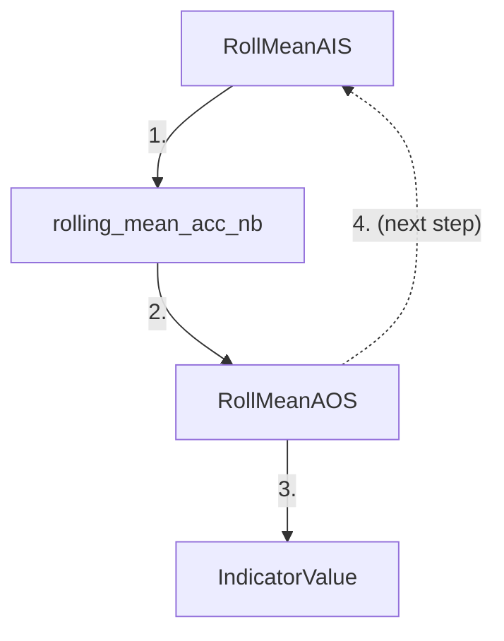

# :material-lock-open: Superfast SuperTrend - Streaming

If you look closely at the implementation of `faster_supertrend`, you will notice that 
it repeatedly iterates over the full length of the input data: multiple times in `get_med_price`, 
multiple times in `get_atr`, multiple times in `get_basic_bands`, and once in 
`get_final_bands_nb`. This modular computational approach can be tolerated if we have the complete 
data and all we care about is the final result. But what if we had to process a data stream where 
arrival of each new element would have to trigger the entire indicator pipeline just to append 
one SuperTrend value? Suddenly, our performance would suffer dramatically.

vectorbt tackles this problem by deploying a range of so-called accumulators - Numba-compiled 
functions that can run per time step and produce a single indicator value. An accumulator takes
an input state that contains all the required information collected up to this point in time,
and returns an output state that contains the current indicator value and all the variables 
required by the next time step. To lower memory consumption to the minimum, an input state usually 
contains no arrays - only constants. Since both input and output states are regular 
[named tuples](https://realpython.com/python-namedtuple/), we can save them at any time and 
continue from where we left off.

Let's take a look at the accumulator for the rolling mean: 
[rolling_mean_acc_nb](/api/generic/nb/#vectorbtpro.generic.nb.rolling_mean_acc_nb).
It takes an input state of type [RollMeanAIS](/api/generic/nb/#vectorbtpro.generic.enums.RollMeanAIS)
and returns an output state of type [RollMeanAOS](/api/generic/nb/#vectorbtpro.generic.enums.RollMeanAOS).
The main pieces of information required by this accumulator are the length of the window and the sum
of the elements contained in it (recall how the sum of the values divided by the number of values 
is the definition of the arithmetic mean).

The function [rolling_mean_1d_nb](/api/generic/nb/#vectorbtpro.generic.nb.rolling_mean_1d_nb) then implements
a simple for-loop that goes through all elements, and for each one:

1. Creates the input state and passes it to the accumulator
2. Receives the output state and updates local variables and the output array



(Reload the page if the diagram doesn't show up)

So, how about our SuperTrend function, can we make it also a 
[one-pass function](https://en.wikipedia.org/wiki/One-pass_algorithm)?
Yes! Most operations including the calculation of the median price, the TR, the basic bands, 
and the final bands are fairly easy to replicate on the per-element basis:

```pycon
>>> @njit(nogil=True)  # (1)!
... def get_tr_one_nb(high, low, prev_close):
...     tr0 = abs(high - low)
...     tr1 = abs(high - prev_close)
...     tr2 = abs(low - prev_close)
...     if np.isnan(tr0) or np.isnan(tr1) or np.isnan(tr2):
...         tr = np.nan
...     else:
...         tr = max(tr0, tr1, tr2)
...     return tr

>>> @njit(nogil=True)
... def get_med_price_one_nb(high, low):
...     return (high + low) / 2

>>> @njit(nogil=True)
... def get_basic_bands_one_nb(high, low, atr, multiplier):
...     med_price = get_med_price_one_nb(high, low)
...     matr = multiplier * atr
...     upper = med_price + matr
...     lower = med_price - matr
...     return upper, lower
    
>>> @njit(nogil=True)
... def get_final_bands_one_nb(close, upper, lower, 
...                            prev_upper, prev_lower, prev_dir_):
...     if close > prev_upper:
...         dir_ = 1
...     elif close < prev_lower:
...         dir_ = -1
...     else:
...         dir_ = prev_dir_
...         if dir_ > 0 and lower < prev_lower:
...             lower = prev_lower
...         if dir_ < 0 and upper > prev_upper:
...             upper = prev_upper
... 
...     if dir_ > 0:
...         trend = long = lower
...         short = np.nan
...     else:
...         trend = short = upper
...         long = np.nan
...     return upper, lower, trend, dir_, long, short
```

1. Set `nogil=True` to release the GIL and be able to do multithreading later

But the calculation of the ATR is a bit more tricky since it depends on the Wilder's EMA applied 
to the TR. Gladly, vectorbt implements an accumulator for it! :star_struck:

But let's define the input and output state for our future accumulator first:

```pycon
>>> class SuperTrendAIS(vbt.tp.NamedTuple):
...     i: int
...     high: float
...     low: float
...     close: float
...     prev_close: float
...     prev_upper: float
...     prev_lower: float
...     prev_dir_: float
...     nobs: int
...     weighted_avg: float
...     old_wt: float
...     period: int
...     multiplier: float
    
>>> class SuperTrendAOS(vbt.tp.NamedTuple):
...     nobs: int
...     weighted_avg: float
...     old_wt: float
...     upper: float
...     lower: float
...     trend: float
...     dir_: float
...     long: float
...     short: float
```

As you can see, the fields in both states are all constants. The fields from `i` to `prev_dir_` 
and `multiplier` in the input state will be used by our own accumulator, while the fields `nobs`, 
`weighted_avg`, `old_wt`, and `period` are required by the accumulator for EMA - 
[ewm_mean_acc_nb](/api/generic/nb/#vectorbtpro.generic.nb.ewm_mean_acc_nb). The output state
contains input fields that are updated by the accumulator, but also fields that might
be interesting to the user.

We can now put all puzzles together by implementing a SuperTrend accumulator:

```pycon
>>> @njit(nogil=True)
... def superfast_supertrend_acc_nb(in_state):
...     # (1)!
...     i = in_state.i
...     high = in_state.high
...     low = in_state.low
...     close = in_state.close
...     prev_close = in_state.prev_close
...     prev_upper = in_state.prev_upper
...     prev_lower = in_state.prev_lower
...     prev_dir_ = in_state.prev_dir_
...     nobs = in_state.nobs
...     weighted_avg = in_state.weighted_avg
...     old_wt = in_state.old_wt
...     period = in_state.period
...     multiplier = in_state.multiplier
...     
...     # (2)!
...     tr = get_tr_one_nb(high, low, prev_close)
... 
...     # (3)!
...     alpha = vbt.nb.alpha_from_wilder_nb(period)  # (4)!
...     ewm_mean_in_state = vbt.nb.EWMMeanAIS(
...         i=i,
...         value=tr,
...         old_wt=old_wt,
...         weighted_avg=weighted_avg,
...         nobs=nobs,
...         alpha=alpha,
...         minp=period,
...         adjust=False
...     )
...     ewm_mean_out_state = vbt.nb.ewm_mean_acc_nb(ewm_mean_in_state)
...     atr = ewm_mean_out_state.value
...     
...     # (5)!
...     upper, lower = get_basic_bands_one_nb(high, low, atr, multiplier)
...     
...     # (6)!
...     if i == 0:
...         trend, dir_, long, short = np.nan, 1, np.nan, np.nan
...     else:
...         upper, lower, trend, dir_, long, short = get_final_bands_one_nb(
...             close, upper, lower, prev_upper, prev_lower, prev_dir_)
...             
...     # (7)!
...     return SuperTrendAOS(
...         nobs=ewm_mean_out_state.nobs,
...         weighted_avg=ewm_mean_out_state.weighted_avg,
...         old_wt=ewm_mean_out_state.old_wt,
...         upper=upper,
...         lower=lower,
...         trend=trend,
...         dir_=dir_,
...         long=long,
...         short=short
...     )
```

1. Unpack the input state into local variables
2. Calculate the current TR value
3. Calculate the current ATR value by using the EMA accumulator
4. Get the smoothing factor [alpha](https://pandas.pydata.org/docs/reference/api/pandas.DataFrame.ewm.html) 
from the period by Wilder
5. Calculate the current basic SuperTrend bands
6. Calculate the current final SuperTrend bands
7. Pack the local variables into an output state

That's it, we can now use this accumulator in any streaming function!

Let's write a function similar to `faster_supertrend` but that computes the SuperTrend
values by passing across the whole data **only once**:

```pycon
>>> @njit(nogil=True)
... def superfast_supertrend_nb(high, low, close, period=7, multiplier=3):
...     trend = np.empty(close.shape, dtype=np.float_)  # (1)!
...     dir_ = np.empty(close.shape, dtype=np.int_)
...     long = np.empty(close.shape, dtype=np.float_)
...     short = np.empty(close.shape, dtype=np.float_)
...     
...     if close.shape[0] == 0:
...         return trend, dir_, long, short
... 
...     # (2)!
...     nobs = 0
...     old_wt = 1.
...     weighted_avg = np.nan
...     prev_upper = np.nan
...     prev_lower = np.nan
... 
...     for i in range(close.shape[0]):  # (3)!
...         in_state = SuperTrendAIS(
...             i=i,
...             high=high[i],
...             low=low[i],
...             close=close[i],
...             prev_close=close[i - 1] if i > 0 else np.nan,
...             prev_upper=prev_upper,
...             prev_lower=prev_lower,
...             prev_dir_=dir_[i - 1] if i > 0 else 1,
...             nobs=nobs,
...             weighted_avg=weighted_avg,
...             old_wt=old_wt,
...             period=period,
...             multiplier=multiplier
...         )
...         
...         out_state = superfast_supertrend_acc_nb(in_state)
...         
...         nobs = out_state.nobs
...         weighted_avg = out_state.weighted_avg
...         old_wt = out_state.old_wt
...         prev_upper = out_state.upper
...         prev_lower = out_state.lower
...         trend[i] = out_state.trend
...         dir_[i] = out_state.dir_
...         long[i] = out_state.long
...         short[i] = out_state.short
...         
...     return trend, dir_, long, short
```

1. No need to use `np.full` since we are overriding all elements anyway
2. Initial values for some input state fields
3. Only one for-loop

After writing a streaming algorithm, you should always compare its results to a
(semi-)vectorized solution that you trust:

```pycon
>>> superfast_out = superfast_supertrend_nb(
...     high['BTCUSDT'].values,
...     low['BTCUSDT'].values,
...     close['BTCUSDT'].values
... )

>>> faster_out = faster_supertrend(
...     high['BTCUSDT'].values,
...     low['BTCUSDT'].values,
...     close['BTCUSDT'].values
... )

>>> np.testing.assert_allclose(superfast_out[0], faster_out[0])
>>> np.testing.assert_allclose(superfast_out[1], faster_out[1])
>>> np.testing.assert_allclose(superfast_out[2], faster_out[2])
>>> np.testing.assert_allclose(superfast_out[3], faster_out[3])
```

There is nothing more satisfying than having no errors :wink:

!!! note
    If you compare the results to `faster_supertrend_talib`, they would differ because TA-Lib
    uses a slightly different EMA in its ATR implementation.

What about speed? Well, you can see it for yourself:

```pycon
>>> %%timeit
>>> superfast_supertrend_nb(
...     high['BTCUSDT'].values, 
...     low['BTCUSDT'].values, 
...     close['BTCUSDT'].values
... )
183 µs ± 1.22 µs per loop (mean ± std. dev. of 7 runs, 10000 loops each)
```

Our algorithm is 40% faster than `faster_supertrend_talib` and can effortlessly compete
with similar implementations in C or any other compiled language. Neat! 

!!! hint
    To avoid re-compilation each time you start a new Python session, add the `cache=True`
    flag to the `@njit` decorator. But make sure that you define the cachable function in 
    a Python file rather than in a cell of Jupyter Notebook.

We just hit the performance ceiling - let's move on with parameter optimization.

[:material-lock: Notebook](https://github.com/polakowo/vectorbt.pro/blob/main/locked-notebooks.md){ .md-button target="blank_" }
