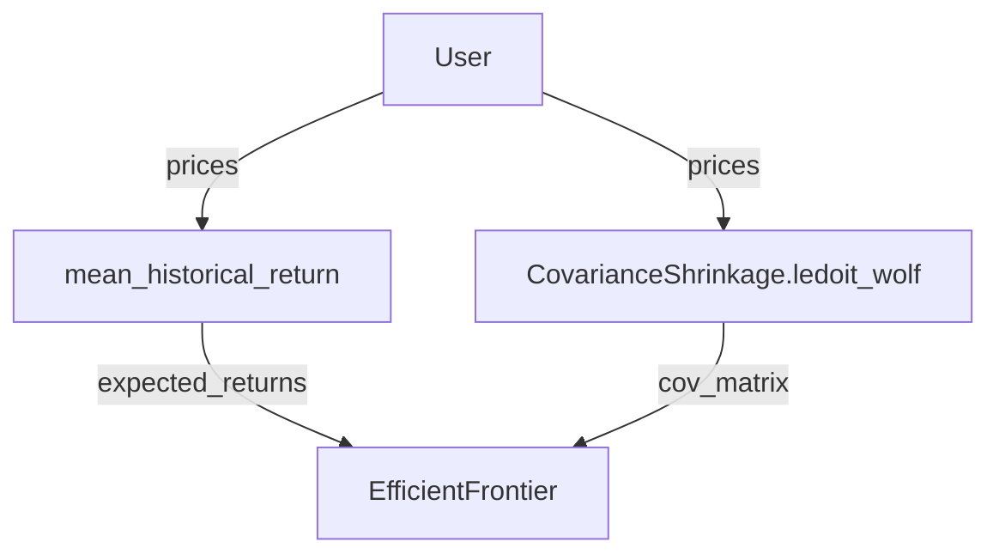

# :material-lock-open: Portfolio optimization - Integrations

[PortfolioOptimizer](/api/portfolio/pfopt/base/#vectorbtpro.portfolio.pfopt.base.PortfolioOptimizer) 
integrates nicely with various third-party libraries.

## PyPortfolioOpt

> [PyPortfolioOpt](https://pyportfolioopt.readthedocs.io/en/latest/) is a library that implements portfolio 
> optimization methods, including classical efficient frontier techniques and Black-Litterman allocation, 
> as well as more recent developments in the field like shrinkage and Hierarchical Risk Parity, along with 
> some novel experimental features like exponentially-weighted covariance matrices.

PyPortfolioOpt implements a range of optimization methods that are very easy to use. The optimization
procedure consists of several distinct steps (some of them may be skipped depending on the optimizer):

* Calculate the expected returns (mostly located in `pfopt.expected_returns`)
* Calculate the covariance matrix (mostly located in `pfopt.risk_models`)
* Initialize and set up an optimizer (mostly located in `pypfopt.efficient_frontier`, with the
base class located in `pypfopt.base_optimizer`) including objectives, constraints, and target
* Run the optimizer to get the weights
* Convert the weights into a discrete allocation (optional)

For example, let's perform the mean-variance optimization (MVO) for maximum Sharpe:

```pycon
>>> from pypfopt.expected_returns import mean_historical_return
>>> from pypfopt.risk_models import CovarianceShrinkage
>>> from pypfopt.efficient_frontier import EfficientFrontier

>>> expected_returns = mean_historical_return(data.get("Close"))
>>> cov_matrix = CovarianceShrinkage(data.get("Close")).ledoit_wolf()
>>> optimizer = EfficientFrontier(expected_returns, cov_matrix)
>>> weights = optimizer.max_sharpe()
>>> weights
OrderedDict([('ADAUSDT', 0.1165427361735328),
             ('BNBUSDT', 0.0),
             ('BTCUSDT', 0.0),
             ('ETHUSDT', 0.8834572638264673),
             ('XRPUSDT', 0.0)])
```

### Parsing

Thanks to an outstanding work done by @robertmartin8, the entire codebase of PyPortfolioOpt
(with a few exceptions) has consistent argument and function namings, such that we can build
a semantic web of functions acting as inputs to other functions. Why this is important?
Because the user just needs to provide the target function (let's say, `EfficientFrontier.max_sharpe`),
and we can programmatically figure out the entire call stack having the pricing data alone!
And if the user passes any additional keyword arguments, we can check which functions from the stack 
accept those arguments and automatically pass them.

For the example above, the web looks like this:



(Reload the page if the diagram doesn't show up)

And here comes vectorbt into play. First, it implements a function 
[resolve_pypfopt_func_kwargs](/api/portfolio/pfopt/base/#vectorbtpro.portfolio.pfopt.base.resolve_pypfopt_func_kwargs) 
that takes an arbitrary PyPortfolioOpt function, and resolves its arguments. Whenever
an argument passed by the user has been matched with an argument in the function's signature, 
it marks this argument to be passed to the function. Let's try it out on expected returns:

```pycon
>>> from vectorbtpro.portfolio.pfopt.base import resolve_pypfopt_func_kwargs

>>> print(vbt.format_func(mean_historical_return))  # (1)!
mean_historical_return(
    prices,
    returns_data=False,
    compounding=True,
    frequency=252,
    log_returns=False
):
    Calculate annualised mean (daily) historical return from input (daily) asset prices.
    Use ``compounding`` to toggle between the default geometric mean (CAGR) and the
    arithmetic mean.

>>> print(vbt.prettify(resolve_pypfopt_func_kwargs(
...     mean_historical_return, 
...     prices=data.get("Close"),  # (2)!
...     freq="1h",  # (3)!
...     year_freq="365d",
...     other_arg=100  # (4)!
... )))
{
    'prices': <pandas.core.frame.DataFrame object at 0x7f9428052c50 of shape (8767, 5)>,
    'returns_data': False,
    'compounding': True,
    'frequency': 8760.0,
    'log_returns': False
}
```

1. Get an idea what arguments does the function accept
2. Can be found in the signature - will be passed
3. Translates `freq` and `year_freq` into `frequency` (number of time periods in a year) - will be passed
4. Cannot be found in the signature - will be ignored

And now let's run it on `EfficientFrontier`:

```pycon
>>> print(vbt.prettify(resolve_pypfopt_func_kwargs(
...     EfficientFrontier, 
...     prices=data.get("Close")
... )))
{
    'expected_returns': <pandas.core.series.Series object at 0x7f9479927128 of shape (5,)>,
    'cov_matrix': <pandas.core.frame.DataFrame object at 0x7f94280528d0 of shape (5, 5)>,
    'weight_bounds': (
        0,
        1
    ),
    'solver': None,
    'verbose': False,
    'solver_options': None
}
```

We see that vectorbt magically resolved arguments `expected_returns` and `cov_matrix`
using [resolve_pypfopt_expected_returns](/api/portfolio/pfopt/base/#vectorbtpro.portfolio.pfopt.base.resolve_pypfopt_expected_returns)
and [resolve_pypfopt_cov_matrix](/api/portfolio/pfopt/base/#vectorbtpro.portfolio.pfopt.base.resolve_pypfopt_cov_matrix)
respectively. If we provided those two arguments manually, vectorbt would use them right away.
We can also provide those arguments as strings to change the function with which they are generated:

```pycon
>>> print(vbt.prettify(resolve_pypfopt_func_kwargs(
...     EfficientFrontier, 
...     prices=data.get("Close"),
...     expected_returns="ema_historical_return",
...     cov_matrix="sample_cov"
... )))
{
    'expected_returns': <pandas.core.series.Series object at 0x7f9428044cf8 of shape (5,)>,
    'cov_matrix': <pandas.core.frame.DataFrame object at 0x7f942805bf60 of shape (5, 5)>,
    'weight_bounds': (
        0,
        1
    ),
    'solver': None,
    'verbose': False,
    'solver_options': None
}
```

### Auto-optimization

Knowing how to parse and resolve function arguments, vectorbt implements a function 
[pypfopt_optimize](/api/portfolio/pfopt/base/#vectorbtpro.portfolio.pfopt.base.pypfopt_optimize),
which takes user requirements and translates them into function calls. The usage of this function 
cannot be easier!

```pycon
>>> vbt.pypfopt_optimize(prices=data.get("Close"))
OrderedDict([('ADAUSDT', 0.11654),
             ('BNBUSDT', 0.0),
             ('BTCUSDT', 0.0),
             ('ETHUSDT', 0.88346),
             ('XRPUSDT', 0.0)])
```

In short, [pypfopt_optimize](/api/portfolio/pfopt/base/#vectorbtpro.portfolio.pfopt.base.pypfopt_optimize)
first resolves the optimizer using [resolve_pypfopt_optimizer](/api/portfolio/pfopt/base/#vectorbtpro.portfolio.pfopt.base.resolve_pypfopt_optimizer),
which, in turn, triggers a waterfall of argument resolutions by [parsing arguments](#parsing), 
including the calculation of the expected returns and the risk model quantifying asset risk.
Then, it adds objectives and constraints to the optimizer instance. Finally, it calls
the target metric method (such as `max_sharpe`) or custom convex/non-convex objective using the 
same parsing procedure as we did above. If wanted, it can also translate continuous weights into 
discrete ones using `DiscreteAllocation`.

Since multiple PyPortfolioOpt functions can require the same argument that has to be pre-computed yet,
[pypfopt_optimize](/api/portfolio/pfopt/base/#vectorbtpro.portfolio.pfopt.base.pypfopt_optimize) deploys a
built-in caching mechanism. Additionally, if any of the arguments weren't used, it throws a warning
(which can be mitigated by setting `silence_warnings` to True) stating that an argument
wasn't required by any function in the call stack.

Below, we will demonstrate various optimizations done both using PyPortfolioOpt and vectorbt.
Optimizing a long/short portfolio to minimise total variance:

=== "PyPortfolioOpt"

    ```pycon
    >>> S = CovarianceShrinkage(data.get("Close")).ledoit_wolf()
    >>> ef = EfficientFrontier(None, S, weight_bounds=(-1, 1))
    >>> ef.min_volatility()
    >>> weights = ef.clean_weights()
    >>> weights
    OrderedDict([('ADAUSDT', -0.01119),
                 ('BNBUSDT', 0.09687),
                 ('BTCUSDT', 0.96235),
                 ('ETHUSDT', -0.10505),
                 ('XRPUSDT', 0.05702)])
    ```

=== "vectorbt"

    ```pycon
    >>> vbt.pypfopt_optimize(  # (1)!
    ...     prices=data.get("Close"),
    ...     expected_returns=None,
    ...     weight_bounds=(-1, 1),
    ...     target="min_volatility"
    ... )
    OrderedDict([('ADAUSDT', -0.01119),
                 ('BNBUSDT', 0.09687),
                 ('BTCUSDT', 0.96235),
                 ('ETHUSDT', -0.10505),
                 ('XRPUSDT', 0.05702)])
    ```

    1. `CovarianceShrinkage.ledoit_wolf` and `EfficientFrontier` are used by default

Optimizing a portfolio to maximise the Sharpe ratio, subject to sector constraints:

```pycon
>>> sector_mapper = {
...     "ADAUSDT": "DeFi",
...     "BNBUSDT": "DeFi",
...     "BTCUSDT": "Payment",
...     "ETHUSDT": "DeFi",
...     "XRPUSDT": "Payment"
... }
>>> sector_lower = {
...     "DeFi": 0.75
... }
>>> sector_upper = {}
```

=== "PyPortfolioOpt"

    ```pycon
    >>> from pypfopt.expected_returns import capm_return
    
    >>> mu = capm_return(data.get("Close"))
    >>> S = CovarianceShrinkage(data.get("Close")).ledoit_wolf()
    >>> ef = EfficientFrontier(mu, S)
    >>> ef.add_sector_constraints(sector_mapper, sector_lower, sector_upper)
    >>> adausdt_index = ef.tickers.index("ADAUSDT")
    >>> ef.add_constraint(lambda w: w[adausdt_index] == 0.10)
    >>> ef.max_sharpe()
    >>> weights = ef.clean_weights()
    >>> weights
    OrderedDict([('ADAUSDT', 0.1),
                 ('BNBUSDT', 0.27719),
                 ('BTCUSDT', 0.0524),
                 ('ETHUSDT', 0.37281),
                 ('XRPUSDT', 0.1976)])
    ```

=== "vectorbt"

    ```pycon
    >>> adausdt_index = list(sector_mapper.keys()).index("ADAUSDT")
    >>> vbt.pypfopt_optimize(  # (1)!
    ...     prices=data.get("Close"),
    ...     expected_returns="capm_return",
    ...     sector_mapper=sector_mapper,
    ...     sector_lower=sector_lower,
    ...     sector_upper=sector_upper,
    ...     constraints=[lambda w: w[adausdt_index] == 0.10]
    ... )
    OrderedDict([('ADAUSDT', 0.1),
                 ('BNBUSDT', 0.27719),
                 ('BTCUSDT', 0.0524),
                 ('ETHUSDT', 0.37281),
                 ('XRPUSDT', 0.1976)])
    ```

    1. `CovarianceShrinkage.ledoit_wolf`, `EfficientFrontier`, and `EfficientFrontier.max_sharpe` 
    are used by default

Optimizing a portfolio to maximise return for a given risk, subject to sector constraints, 
with an L2 regularisation objective:

=== "PyPortfolioOpt"

    ```pycon
    >>> from pypfopt.objective_functions import L2_reg
    
    >>> mu = capm_return(data.get("Close"))
    >>> S = CovarianceShrinkage(data.get("Close")).ledoit_wolf()
    >>> ef = EfficientFrontier(mu, S)
    >>> ef.add_sector_constraints(sector_mapper, sector_lower, sector_upper)
    >>> ef.add_objective(L2_reg, gamma=0.1)
    >>> ef.efficient_risk(0.15)
    >>> weights = ef.clean_weights()
    >>> weights
    OrderedDict([('ADAUSDT', 0.26004),
                 ('BNBUSDT', 0.24467),
                 ('BTCUSDT', 0.10778),
                 ('ETHUSDT', 0.2453),
                 ('XRPUSDT', 0.14222)])
    ```

=== "vectorbt"

    ```pycon
    >>> vbt.pypfopt_optimize(  # (1)!
    ...     prices=data.get("Close"),
    ...     expected_returns="capm_return",
    ...     sector_mapper=sector_mapper,
    ...     sector_lower=sector_lower,
    ...     sector_upper=sector_upper,
    ...     objectives=["L2_reg"],  # (2)!
    ...     gamma=0.1,  # (3)!
    ...     target="efficient_risk",
    ...     target_volatility=0.15  # (4)!
    ... )
    OrderedDict([('ADAUSDT', 0.26004),
                 ('BNBUSDT', 0.24467),
                 ('BTCUSDT', 0.10778),
                 ('ETHUSDT', 0.2453),
                 ('XRPUSDT', 0.14222)])
    ```

    1. `CovarianceShrinkage.ledoit_wolf` and `EfficientFrontier` are used by default
    2. Objective can be provided as an attribute of the `pypfopt.objective_functions` module
    3. Gets recognized as an argument of the objective function
    4. Gets recognized as an argument of the target metric method

Optimizing along the mean-semivariance frontier:

=== "PyPortfolioOpt"

    ```pycon
    >>> from pypfopt import EfficientSemivariance
    >>> from pypfopt.expected_returns import returns_from_prices
    
    >>> mu = capm_return(data.get("Close"))
    >>> returns = returns_from_prices(data.get("Close"))
    >>> returns = returns.dropna()
    >>> es = EfficientSemivariance(mu, returns)
    >>> es.efficient_return(0.01)
    >>> weights = es.clean_weights()
    >>> weights
    OrderedDict([('ADAUSDT', 0.0),
                 ('BNBUSDT', 0.0),
                 ('BTCUSDT', 1.0),
                 ('ETHUSDT', 0.0),
                 ('XRPUSDT', 0.0)])
    ```

=== "vectorbt"

    ```pycon
    >>> vbt.pypfopt_optimize(
    ...     prices=data.get("Close"),
    ...     expected_returns="capm_return",
    ...     optimizer="efficient_semivariance",  # (1)!
    ...     target="efficient_return",
    ...     target_return=0.01
    ... )
    OrderedDict([('ADAUSDT', 0.0),
                 ('BNBUSDT', 0.0),
                 ('BTCUSDT', 1.0),
                 ('ETHUSDT', 0.0),
                 ('XRPUSDT', 0.0)])
    ```

    1. The second argument of `EfficientSemivariance` is `returns`, which is recognized as such 
    by vectorbt and converted from prices automatically

Minimizing transaction costs:

```pycon
>>> initial_weights = np.array([1 / len(data.symbols)] * len(data.symbols))
```

=== "PyPortfolioOpt"

    ```pycon
    >>> from pypfopt.objective_functions import transaction_cost
    
    >>> mu = mean_historical_return(data.get("Close"))
    >>> S = CovarianceShrinkage(data.get("Close")).ledoit_wolf()
    >>> ef = EfficientFrontier(mu, S)
    >>> ef.add_objective(transaction_cost, w_prev=initial_weights, k=0.001)
    >>> ef.add_objective(L2_reg, gamma=0.05)
    >>> ef.min_volatility()
    >>> weights = ef.clean_weights()
    >>> weights
    OrderedDict([('ADAUSDT', 0.16025),
                 ('BNBUSDT', 0.2),
                 ('BTCUSDT', 0.27239),
                 ('ETHUSDT', 0.2),
                 ('XRPUSDT', 0.16736)])
    ```

=== "vectorbt"

    ```pycon
    >>> vbt.pypfopt_optimize(  # (1)!
    ...     prices=data.get("Close"),
    ...     objectives=["transaction_cost", "L2_reg"],
    ...     w_prev=initial_weights, 
    ...     k=0.001,
    ...     gamma=0.05,
    ...     target="min_volatility"
    ... )
    OrderedDict([('ADAUSDT', 0.16025),
                 ('BNBUSDT', 0.2),
                 ('BTCUSDT', 0.27239),
                 ('ETHUSDT', 0.2),
                 ('XRPUSDT', 0.16736)])
    ```

    1. `mean_historical_return`, `CovarianceShrinkage.ledoit_wolf`, and `EfficientFrontier` are used by default

Custom convex objective:

```pycon
>>> import cvxpy as cp

>>> def logarithmic_barrier_objective(w, cov_matrix, k=0.1):
...     log_sum = cp.sum(cp.log(w))
...     var = cp.quad_form(w, cov_matrix)
...     return var - k * log_sum
```

=== "PyPortfolioOpt"

    ```pycon
    >>> mu = mean_historical_return(data.get("Close"))
    >>> S = CovarianceShrinkage(data.get("Close")).ledoit_wolf()
    >>> ef = EfficientFrontier(mu, S, weight_bounds=(0.01, 0.3))
    >>> ef.convex_objective(logarithmic_barrier_objective, cov_matrix=S, k=0.001)
    >>> weights = ef.clean_weights()
    >>> weights
    OrderedDict([('ADAUSDT', 0.12214),
                 ('BNBUSDT', 0.22171),
                 ('BTCUSDT', 0.3),
                 ('ETHUSDT', 0.21857),
                 ('XRPUSDT', 0.13758)])
    ```

=== "vectorbt"

    ```pycon
    >>> vbt.pypfopt_optimize(  # (1)!
    ...     prices=data.get("Close"),
    ...     weight_bounds=(0.01, 0.3),
    ...     k=0.001,
    ...     target=logarithmic_barrier_objective  # (2)!
    ... )
    OrderedDict([('ADAUSDT', 0.12214),
                 ('BNBUSDT', 0.22171),
                 ('BTCUSDT', 0.3),
                 ('ETHUSDT', 0.21857),
                 ('XRPUSDT', 0.13758)])
    ```

    1. `mean_historical_return`, `CovarianceShrinkage.ledoit_wolf`, and `EfficientFrontier` are used by default
    2. The second argument of `logarithmic_barrier_objective` is `cov_matrix`, which is recognized 
    as such by vectorbt and calculated automatically (or retrieved from cache)

Custom non-convex objective:

```pycon
>>> def deviation_risk_parity(w, cov_matrix):
...     cov_matrix = np.asarray(cov_matrix)
...     n = cov_matrix.shape[0]
...     rp = (w * (cov_matrix @ w)) / cp.quad_form(w, cov_matrix)
...     return cp.sum_squares(rp - 1 / n).value
```

=== "PyPortfolioOpt"

    ```pycon
    >>> mu = mean_historical_return(data.get("Close"))
    >>> S = CovarianceShrinkage(data.get("Close")).ledoit_wolf()
    >>> ef = EfficientFrontier(mu, S)
    >>> ef.nonconvex_objective(deviation_risk_parity, ef.cov_matrix)
    >>> weights = ef.clean_weights()
    >>> weights
    OrderedDict([('ADAUSDT', 0.17421),
                 ('BNBUSDT', 0.19932),
                 ('BTCUSDT', 0.2515),
                 ('ETHUSDT', 0.1981),
                 ('XRPUSDT', 0.17687)])
    ```

=== "vectorbt"

    ```pycon
    >>> vbt.pypfopt_optimize(  # (1)!
    ...     prices=data.get("Close"),
    ...     target=deviation_risk_parity,  # (2)!
    ...     target_is_convex=False
    ... )
    OrderedDict([('ADAUSDT', 0.17421),
                 ('BNBUSDT', 0.19932),
                 ('BTCUSDT', 0.2515),
                 ('ETHUSDT', 0.1981),
                 ('XRPUSDT', 0.17687)])
    ```

    1. `mean_historical_return`, `CovarianceShrinkage.ledoit_wolf`, and `EfficientFrontier` are used by default
    2. The second argument of `deviation_risk_parity` is `cov_matrix`, which is recognized 
    as such by vectorbt and calculated automatically (or retrieved from cache)

Black-Litterman Allocation ([read more](https://pyportfolioopt.readthedocs.io/en/latest/BlackLitterman.html)):

```pycon
>>> sp500_data = vbt.YFData.fetch(
...     "^GSPC", 
...     start=data.wrapper.index[0], 
...     end=data.wrapper.index[-1]
... )
>>> market_caps = data.get("Close") * data.get("Volume")
>>> viewdict = {
...     "ADAUSDT": 0.20, 
...     "BNBUSDT": -0.30, 
...     "BTCUSDT": 0, 
...     "ETHUSDT": -0.2, 
...     "XRPUSDT": 0.15
... }
```

=== "PyPortfolioOpt"

    ```pycon
    >>> from pypfopt.black_litterman import (
    ...     market_implied_risk_aversion,
    ...     market_implied_prior_returns,
    ...     BlackLittermanModel
    ... )
    
    >>> S = CovarianceShrinkage(data.get("Close")).ledoit_wolf()
    >>> delta = market_implied_risk_aversion(sp500_data.get("Close"))
    >>> prior = market_implied_prior_returns(market_caps.iloc[-1], delta, S)
    >>> bl = BlackLittermanModel(S, pi=prior, absolute_views=viewdict)
    >>> rets = bl.bl_returns()
    >>> ef = EfficientFrontier(rets, S)
    >>> ef.min_volatility()
    >>> weights = ef.clean_weights()
    >>> weights
    OrderedDict([('ADAUSDT', 0.0),
                 ('BNBUSDT', 0.06738),
                 ('BTCUSDT', 0.89462),
                 ('ETHUSDT', 0.0),
                 ('XRPUSDT', 0.038)])
    ```

=== "vectorbt"

    ```pycon
    >>> vbt.pypfopt_optimize(  # (1)!
    ...     prices=data.get("Close"),
    ...     expected_returns="bl_returns",  # (2)!
    ...     market_prices=sp500_data.get("Close"),
    ...     market_caps=market_caps.iloc[-1],
    ...     absolute_views=viewdict,
    ...     target="min_volatility"
    ... )
    OrderedDict([('ADAUSDT', 0.0),
                 ('BNBUSDT', 0.06738),
                 ('BTCUSDT', 0.89462),
                 ('ETHUSDT', 0.0),
                 ('XRPUSDT', 0.038)])
    ```

    1. `mean_historical_return` and `EfficientFrontier` are used by default
    2. `BlackLittermanModel`, `delta`, `prior`, and `bl_returns` are all resolved automatically

Hierarchical Risk Parity ([read more](https://pyportfolioopt.readthedocs.io/en/latest/OtherOptimizers.html#hierarchical-risk-parity-hrp)):

=== "PyPortfolioOpt"

    ```pycon
    >>> from pypfopt import HRPOpt
    
    >>> rets = returns_from_prices(data.get("Close"))
    >>> hrp = HRPOpt(rets)
    >>> hrp.optimize()
    >>> weights = hrp.clean_weights()
    >>> weights
    OrderedDict([('ADAUSDT', 0.19415),
                 ('BNBUSDT', 0.24832),
                 ('BTCUSDT', 0.22827),
                 ('ETHUSDT', 0.15218),
                 ('XRPUSDT', 0.17708)])
    ```

=== "vectorbt"

    ```pycon
    >>> vbt.pypfopt_optimize(
    ...     prices=data.get("Close"),  # (1)!
    ...     optimizer="hrp",
    ...     target="optimize"
    ... )
    OrderedDict([('ADAUSDT', 0.19415),
                 ('BNBUSDT', 0.24832),
                 ('BTCUSDT', 0.22827),
                 ('ETHUSDT', 0.15218),
                 ('XRPUSDT', 0.17708)])
    ```

    1. Returns are recognized as such by vectorbt and converted from prices automatically

### Argument groups

In cases where two functions require an argument with the same name but you want to 
pass different values to them, pass the argument as an instance of [pypfopt_func_dict](/api/portfolio/pfopt/base/#vectorbtpro.portfolio.pfopt.base.pypfopt_func_dict)
where keys should be functions or their names, and values should be different argument values. 
Other than that, it behaves the same way as [pfopt_group_dict](/api/portfolio/pfopt/base/#vectorbtpro.portfolio.pfopt.base.pfopt_group_dict).

```pycon
>>> vbt.pypfopt_optimize(  
...     prices=data.get("Close"),
...     expected_returns="bl_returns",  
...     market_prices=sp500_data.get("Close"),
...     market_caps=market_caps.iloc[-1],
...     absolute_views=viewdict,
...     target="min_volatility",
...     cov_matrix=vbt.pypfopt_func_dict({
...         "EfficientFrontier": "sample_cov",  # (1)!
...         "_default": "ledoit_wolf"  # (2)!
...     })
... )
OrderedDict([('ADAUSDT', 0.0),
             ('BNBUSDT', 0.05008),
             ('BTCUSDT', 0.91912),
             ('ETHUSDT', 0.0),
             ('XRPUSDT', 0.0308)])
```

1. Calculate the annualised sample covariance matrix for the `EfficientFrontier` class
2. Calculate the Ledoit-Wolf shrinkage estimate for every other function

### Rebalancing

So, why does vectorbt implement a special parser for PyPortfolioOpt instead of using the 
original, modularly-built API of the library? 

Having a single function that rules them all makes it much easier to use as an optimization function. 
For example, vectorbt uses sensible defaults for expected returns and other variables, and knows 
exactly where those variables should be used. In addition, being able to pass arbitrary keyword 
arguments and letting vectorbt distribute them over functions enables easier testing of multiple 
argument combinations using groups. 

Let's demonstrate this by using [PortfolioOptimizer.from_pypfopt](/api/portfolio/pfopt/base/#vectorbtpro.portfolio.pfopt.base.PortfolioOptimizer.from_pypfopt),
which uses [pypfopt_optimize](/api/portfolio/pfopt/base/#vectorbtpro.portfolio.pfopt.base.pypfopt_optimize)
as `optimize_func`. Optimize for the maximum Sharpe in the previous week:

```pycon
>>> pf_opt = vbt.PortfolioOptimizer.from_pypfopt(
...     symbol_wrapper,
...     every="W",
...     prices=vbt.RepEval(  # (1)!
...         "close.iloc[index_slice]", 
...         context=dict(close=data.get("Close"))
...     ), 
...     ignore_opt_errors=True  # (2)!
... )

>>> pf_opt.plot()
```

1. Use an evaluation template to select the current week from the close price
2. Ignore optimization errors


And here's how easy it's to test multiple combinations of the argument `target`:

```pycon
>>> pf_opt = vbt.PortfolioOptimizer.from_pypfopt(
...     symbol_wrapper,
...     every="W",
...     prices=vbt.RepEval(
...         "close.iloc[index_slice]", 
...         context=dict(close=data.get("Close"))
...     ), 
...     ignore_opt_errors=True,
...     target=vbt.pfopt_group_dict({
...         "max_sharpe": "max_sharpe",
...         "min_volatility": "min_volatility",
...         "max_quadratic_utility": "max_quadratic_utility"
...     })
... )

>>> pf_opt.plot(column="min_volatility")  # (1)!
```

1. Only one group can be plotted. Note that `column` here means a group since every
[PortfolioOptimizer](/api/portfolio/pfopt/base/#vectorbtpro.portfolio.pfopt.base.PortfolioOptimizer) 
instance is always grouped

[=100% "Group 3/3"]{: .candystripe}


```pycon
>>> pf = vbt.Portfolio.from_optimizer(pf_opt, data.get("Close"), freq="1h")

>>> pf.sharpe_ratio
alloc_group
max_sharpe               2.778898
min_volatility           1.862970
max_quadratic_utility    2.352550
Name: sharpe_ratio, dtype: float64
```

We see that optimizing for the maximum Sharpe also yields the highest out-of-sample Sharpe. Great!

## Universal portfolios

> The purpose of [Universal Portfolios](https://github.com/Marigold/universal-portfolios) 
> is to put together different Online Portfolio Selection (OLPS) algorithms and provide 
> unified tools for their analysis.

In contrast to PyPortfolioOpt, where weights are generated based on a specific range in time,
the purpose of OLPS is to choose portfolio weights in every period to maximize its final wealth.
That is, the generated weights have always the shape of the original array.

Let's take a look at the uniform allocation (UCRP):

```pycon
>>> from universal import tools, algos

>>> algo = algos.CRP()
>>> algo_result = algo.run(data.get("Close"))
>>> algo_result.weights
symbol                     ADAUSDT  BNBUSDT  BTCUSDT  ETHUSDT  XRPUSDT  CASH
Open time                                                                   
2020-01-01 00:00:00+00:00      0.2      0.2      0.2      0.2      0.2   0.0
2020-01-01 01:00:00+00:00      0.2      0.2      0.2      0.2      0.2   0.0
2020-01-01 02:00:00+00:00      0.2      0.2      0.2      0.2      0.2   0.0
...                            ...      ...      ...      ...      ...   ...
2020-12-31 21:00:00+00:00      0.2      0.2      0.2      0.2      0.2   0.0
2020-12-31 22:00:00+00:00      0.2      0.2      0.2      0.2      0.2   0.0
2020-12-31 23:00:00+00:00      0.2      0.2      0.2      0.2      0.2   0.0

[8767 rows x 6 columns]
```

As we see, Universal Portfolios has generated and allocated weights at each single timestamp, which
is pretty unrealistic because rebalancing that frequently is unsustainable in practice, 
unless the frequency of data is low. Additionally, iterating over this amount of data with this 
library is usually **quite slow**.

To account for this, we should downsample the pricing array to a longer time frame, and then
upsample back to the original index. Let's try this out on the `DynamicCRP` algorithm
by downsampling to the daily frequency first:

```pycon
>>> algo = algos.DynamicCRP(
...     n=30, 
...     min_history=7, 
...     metric='sharpe', 
...     alpha=0.01
... )
>>> algo_result = algo.run(data.get("Close").resample("D").last())
>>> down_weights = algo_result.weights
>>> down_weights
symbol                          ADAUSDT       BNBUSDT   BTCUSDT       ETHUSDT  \\
Open time                                                                       
2020-01-01 00:00:00+00:00  2.000000e-01  2.000000e-01  0.200000  2.000000e-01   
2020-01-02 00:00:00+00:00  2.000000e-01  2.000000e-01  0.200000  2.000000e-01   
2020-01-03 00:00:00+00:00  2.000000e-01  2.000000e-01  0.200000  2.000000e-01   
...                                 ...           ...       ...           ...   
2020-12-29 00:00:00+00:00  8.475716e-09  8.176270e-09  0.664594  8.274986e-09   
2020-12-30 00:00:00+00:00  0.000000e+00  0.000000e+00  0.656068  0.000000e+00   
2020-12-31 00:00:00+00:00  0.000000e+00  0.000000e+00  0.655105  0.000000e+00   

symbol                          XRPUSDT  
Open time                                
2020-01-01 00:00:00+00:00  2.000000e-01  
2020-01-02 00:00:00+00:00  2.000000e-01  
2020-01-03 00:00:00+00:00  2.000000e-01  
...                                 ...  
2020-12-29 00:00:00+00:00  9.004152e-09  
2020-12-30 00:00:00+00:00  0.000000e+00  
2020-12-31 00:00:00+00:00  0.000000e+00  

[366 rows x 5 columns]
```

Notice how the calculation still takes a considerable amount of time, even by reducing the 
total number of re-allocation timestamps by 24 times.

Let's bring the weights back to the original time frame:

```pycon
>>> weights = down_weights.vbt.latest_at_index(
...     data.wrapper.index,
...     target_freq="1h",
...     source_rbound=True,  # (1)!
...     target_rbound=True,
...     ffill=False  # (2)!
... )
>>> weights
symbol                     ADAUSDT  BNBUSDT   BTCUSDT  ETHUSDT  XRPUSDT
Open time                                                              
2020-01-01 00:00:00+00:00      NaN      NaN       NaN      NaN      NaN
2020-01-01 01:00:00+00:00      NaN      NaN       NaN      NaN      NaN
2020-01-01 02:00:00+00:00      NaN      NaN       NaN      NaN      NaN
...                            ...      ...       ...      ...      ...
2020-12-31 21:00:00+00:00      NaN      NaN       NaN      NaN      NaN
2020-12-31 22:00:00+00:00      NaN      NaN       NaN      NaN      NaN
2020-12-31 23:00:00+00:00      0.0      0.0  0.655105      0.0      0.0

[8767 rows x 5 columns]
```

1. We're working with the close price, thus use the right bound of each bar
2. Do not forward-fill to avoid rebalancing at each timestamp

This array can now be used in simulation.

To simplify the workflow introduced above, vectorbt implements a class method [PortfolioOptimizer.from_universal_algo](/api/portfolio/pfopt/base/#vectorbtpro.portfolio.pfopt.base.PortfolioOptimizer.from_universal_algo),
which triggers the entire simulation with Universal Portfolios and, after done, picks the allocations
at specific dates from the resulting DataFrame. By default, it picks the timestamps of non-NA, 
non-repeating weights. The method itself takes the algorithm (`algo`) and the pricing data (`S`). 
The former can take many value types: from the name or instance of the algorithm class (must 
be a subclass of `universal.algo.Algo`), to the actual result of the algorithm (of type 
`universal.result.AlgoResult`).

Let's run the same algorithm as above, but now using 
[PortfolioOptimizer](/api/portfolio/pfopt/base/#vectorbtpro.portfolio.pfopt.base.PortfolioOptimizer).
We will also test multiple value combinations for `n`:

```pycon
>>> pf_opt = vbt.PortfolioOptimizer.from_universal_algo(
...     "DynamicCRP",
...     data.get("Close").resample("D").last(),
...     n=vbt.pfopt_group_dict({7: 7, 14: 14, 30: 30, 90: 90}), 
...     min_history=7, 
...     metric='sharpe', 
...     alpha=0.01
... )

>>> pf_opt.plot(column=90)
```

[=100% "Group 4/4"]{: .candystripe}


We can then upsample the optimizer back to the original time frame by constructing 
an instance of [Resampler](/api/base/resampling/base/#vectorbtpro.base.resampling.base.Resampler) and 
passing it to [PortfolioOptimizer.resample](/api/portfolio/pfopt/base/#vectorbtpro.portfolio.pfopt.base.PortfolioOptimizer.resample):

```pycon
>>> resampler = vbt.Resampler(
...     down_pf_opt.wrapper.index, 
...     data.wrapper.index, 
...     target_freq="1h"
... )
>>> pf_opt = down_pf_opt.resample(resampler)
```

!!! note
    An allocation at the end of a daily bar will be placed at the end of the first hourly bar on that day,
    which may be undesired if the allocation uses any information from that daily bar.
    To account for this, calculate and use the right bounds of both indexes with
    [Resampler.get_rbound_index](/api/base/resampling/base/#vectorbtpro.base.resampling.base.Resampler.get_rbound_index).

And finally, use the new optimizer in a simulation:

```pycon
>>> pf = vbt.Portfolio.from_optimizer(pf_opt, data.get("Close"), freq="1h")

>>> pf.sharpe_ratio
alloc_group
7     2.913033
14    3.455926
30    3.276730
90    2.176632
Name: sharpe_ratio, dtype: float64
```

### Custom algorithm

Let's create our own mean-reversion algorithm using Universal Portfolios. The idea is that badly 
performing stocks will revert to its mean and have higher returns than those above their mean.

```pycon
>>> from universal.algo import Algo

>>> class MeanReversion(Algo):
...     PRICE_TYPE = 'log'
...     
...     def __init__(self, n):
...         self.n = n
...         super().__init__(min_history=n)
...     
...     def init_weights(self, cols):
...         return pd.Series(np.zeros(len(cols)), cols)
...     
...     def step(self, x, last_b, history):
...         ma = history.iloc[-self.n:].mean()
...         delta = x - ma
...         w = np.maximum(-delta, 0.)
...         return w / sum(w)

>>> pf_opt = vbt.PortfolioOptimizer.from_universal_algo(
...     MeanReversion,
...     data.get("Close").resample("D").last(),  # (1)!
...     n=30,  # (2)!
...     every="W"  # (3)!
... )

>>> pf_opt.plot()
```

1. Data frequency is daily
2. Window length (in days)
3. Pick an allocation at the beginning of each week


Now it's your turn: create and implement a simple optimization strategy that would make sense in 
the real world - you'd be amazed how complex and interesting some strategies can become after 
starting with something really basic :slightly_smiling_face: 

[:material-lock: Notebook](https://github.com/polakowo/vectorbt.pro/blob/main/locked-notebooks.md){ .md-button target="blank_" }